# Integration Architecture Diagram

## Overview

This document illustrates the architecture and data flows for the Personal Database Assistant system, which connects an offline database (Raspberry Pi 3B) with an internet-accessible web application (Raspberry Pi 4).

## System Components

### High-Level Component Diagram

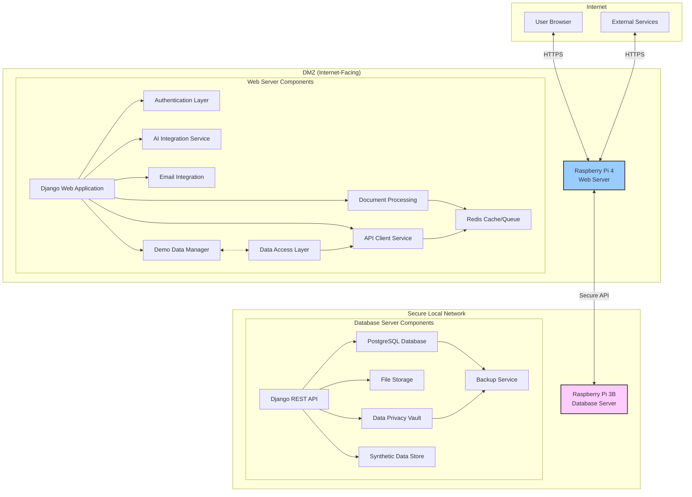

## Network Architecture

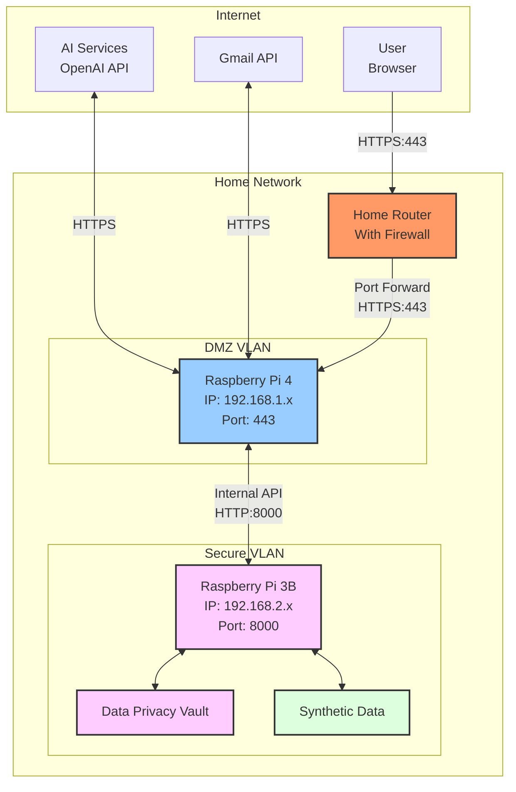

## Data Flow

### Authentication Process

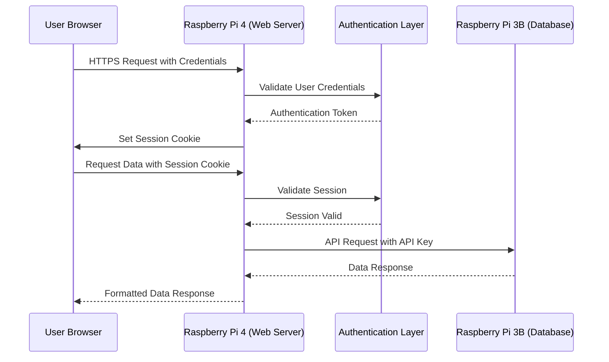

### Data Query Flow

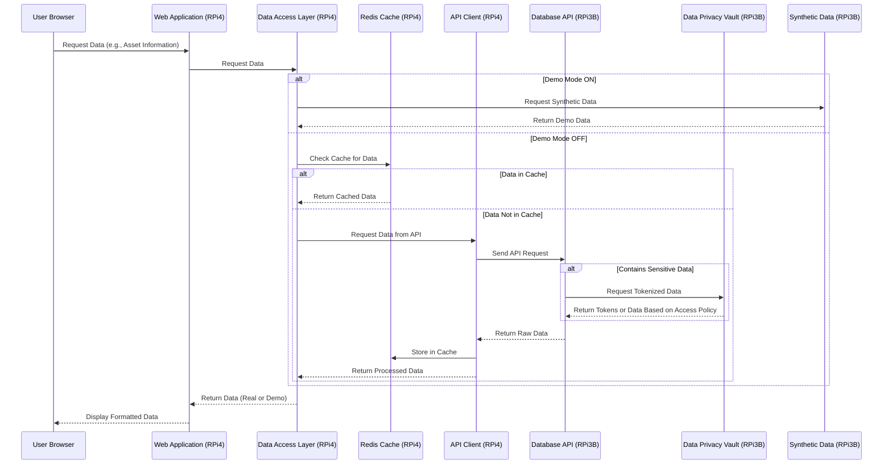

### Document Processing Flow

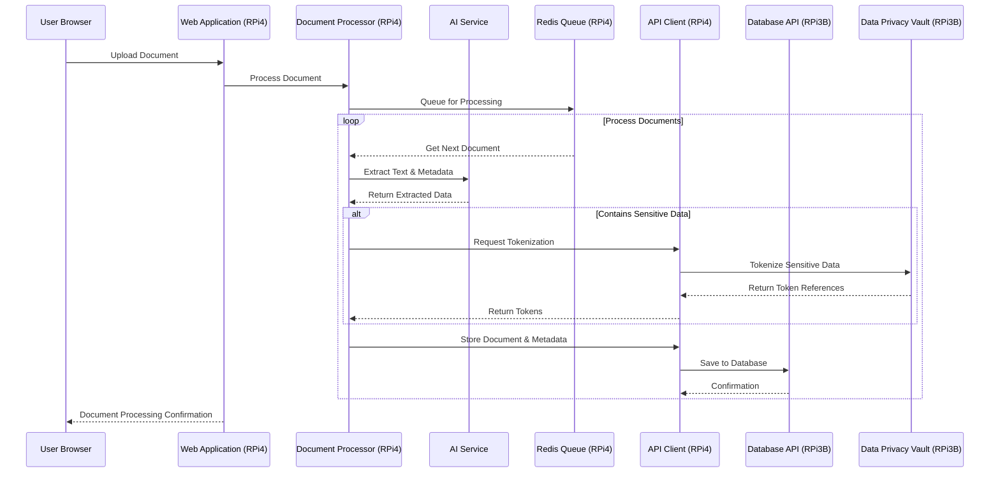

### Synthetic Data Generation Flow

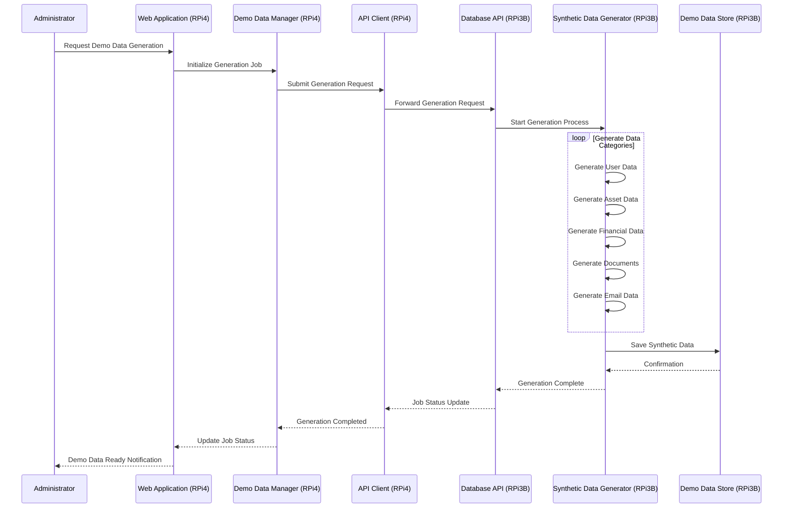

### Gmail Integration Flow

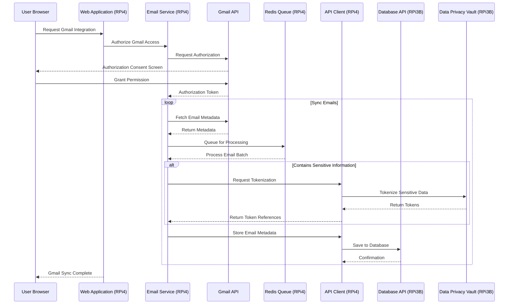

## Data Privacy Vault Architecture

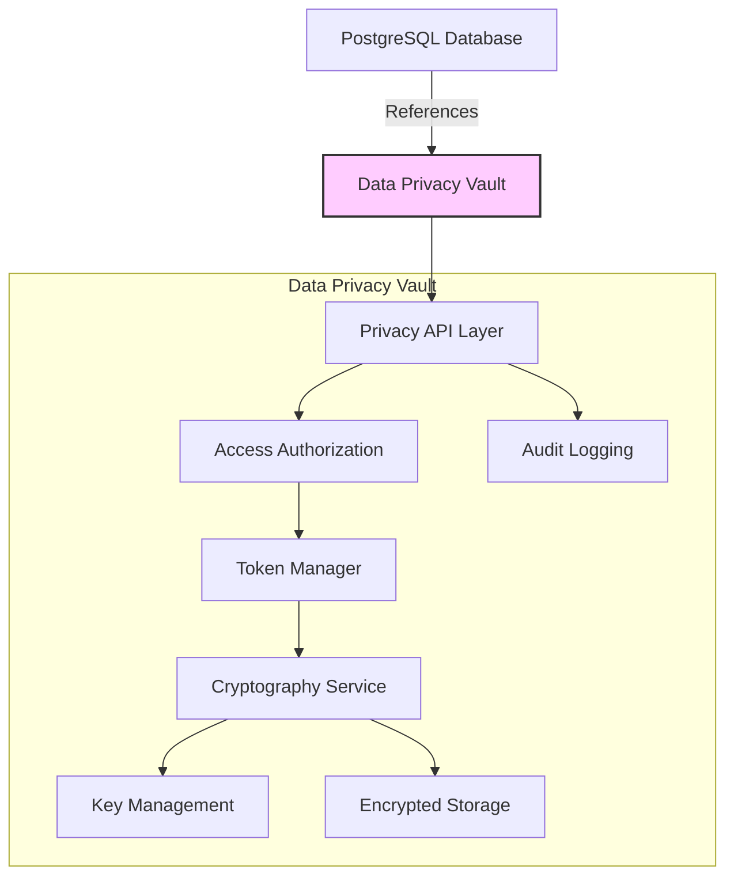

### Data Privacy Tokenization Flow

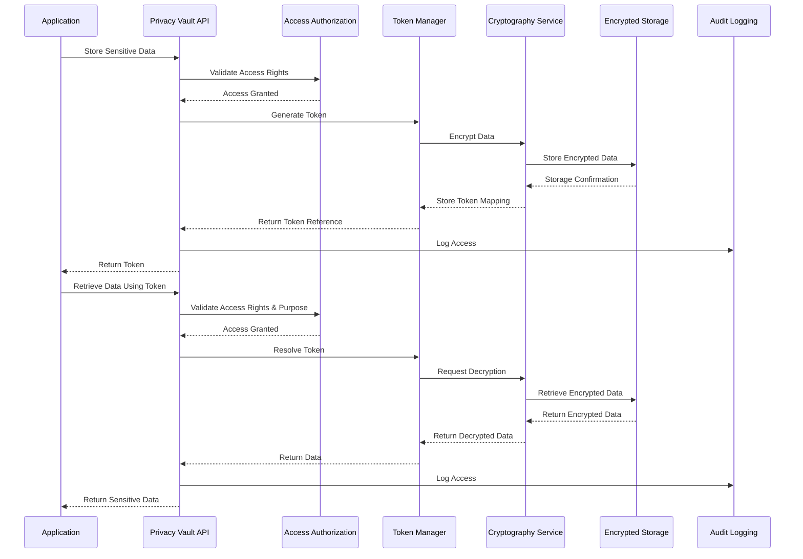

## Security Architecture

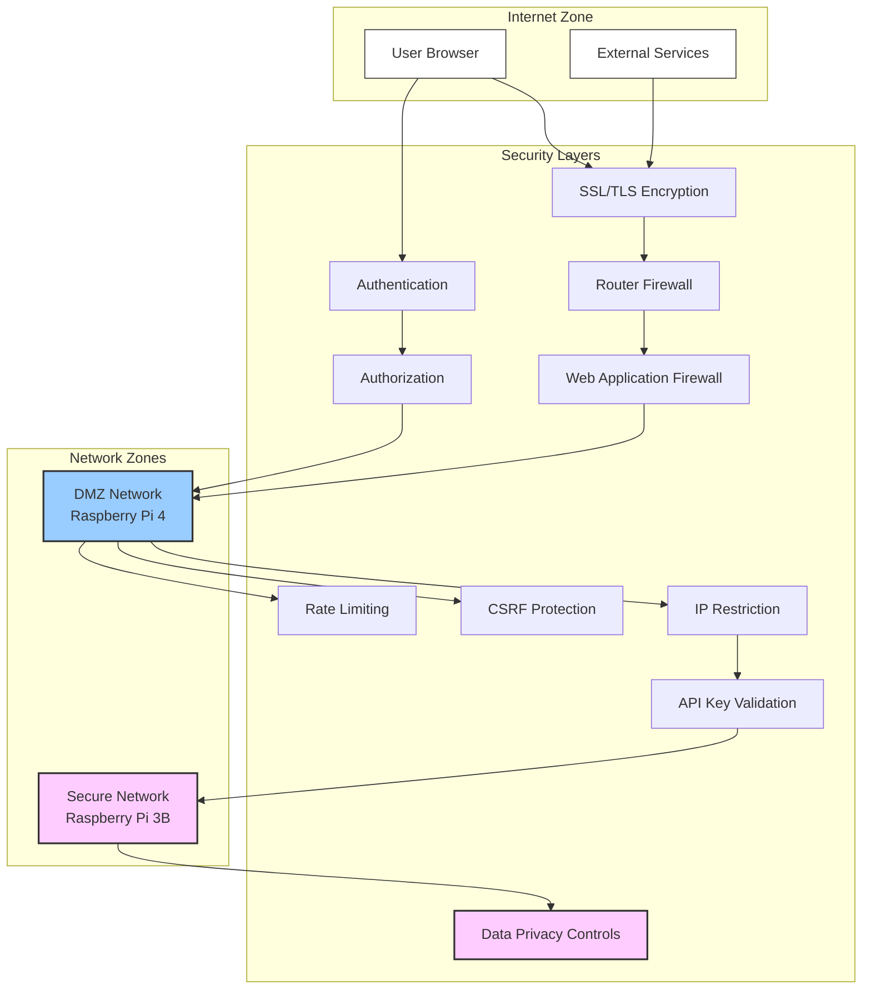

## Demo Mode Architecture

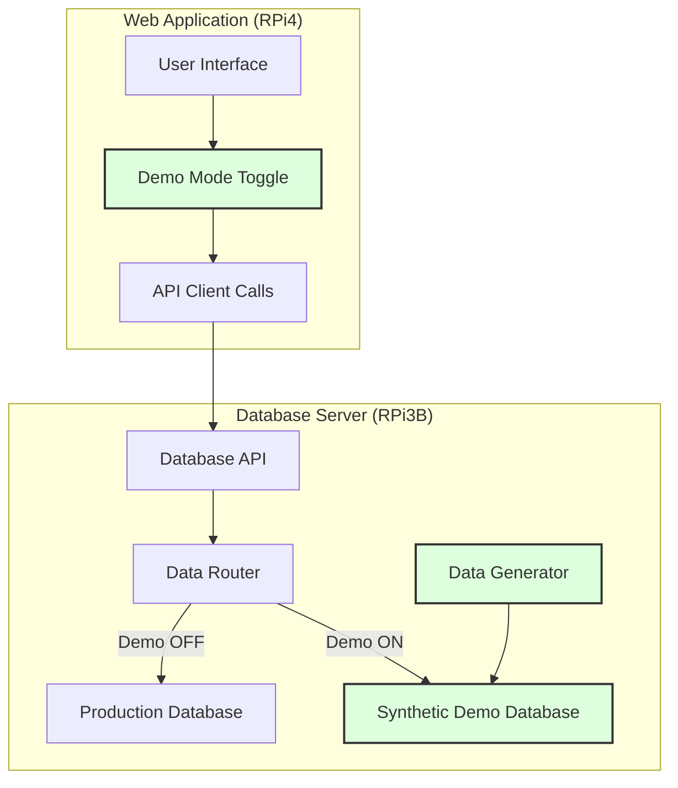

## Component Details

### Raspberry Pi 4 (Web Server)

- **Web Application**: Django-based web application with React frontend
- **API Client Service**: Handles communication with the database server
- **Document Processing**: OCR and document classification pipeline
- **AI Integration**: Interfaces with OpenAI/Hugging Face for natural language processing
- **Email Integration**: Connects to Gmail API for email retrieval and indexing
- **Redis**: Provides caching, message queue, and session storage
- **Authentication Layer**: JWT-based authentication system
- **Demo Data Manager**: Controls synthetic data generation and demo mode functionality
- **Data Access Layer**: Abstracts data source selection (real vs. demo data)

### Raspberry Pi 3B (Database Server)

- **Django REST API**: Provides secure API endpoints for the web server
- **PostgreSQL Database**: Stores all system data
- **File Storage**: Manages document files and attachments
- **Backup Service**: Handles regular database and file backups
- **Data Privacy Vault**: Secures sensitive personal information through tokenization
- **Synthetic Data Store**: Houses generated demo data separate from production data

## Data Privacy Vault Components

1. **Privacy API Layer**: Provides controlled access to sensitive data
2. **Access Authorization**: Enforces purpose-based access controls
3. **Token Manager**: Handles token generation and resolution
4. **Cryptography Service**: Manages encryption/decryption operations
5. **Encrypted Storage**: Secure database for sensitive information
6. **Audit Logging**: Records all access attempts and operations
7. **Key Management**: Handles encryption key rotation and security

## Synthetic Data Generation Components

1. **Data Generator**: Creates realistic synthetic data
2. **Generation Templates**: Defines data structure and relationships
3. **Demo Database**: Separate storage for synthetic data
4. **Demo Mode Toggle**: UI controls to switch between real and demo data
5. **Visual Indicators**: Clear UI markers when viewing synthetic data

## Communication Protocols

1. **Internet to Raspberry Pi 4**: HTTPS (Port 443)
2. **Raspberry Pi 4 to External Services**: HTTPS
3. **Raspberry Pi 4 to Raspberry Pi 3B**: HTTP over secure local network (Port 8000)
   - Authentication: API Key + IP Restriction
   - Data format: JSON
   - Communication pattern: REST API

## Deployment Considerations

- **Network Segmentation**: Database server (RPi3B) must be on a separate network segment from the web server (RPi4)
- **Firewall Rules**: Only allow specific ports and IP addresses for communication between components
- **VLANs**: Implement VLANs to isolate traffic between different network segments
- **Regular Updates**: Maintain security patches on both devices
- **Data Isolation**: Ensure privacy vault data is protected with additional security measures
- **Demo/Production Separation**: Maintain strict separation between demo and production data

## Integration Points

1. **User Interface ↔ Web Server**: Browser-based communication via HTTPS
2. **Web Server ↔ Database Server**: Internal API communication
3. **Web Server ↔ AI Services**: External API integration
4. **Web Server ↔ Gmail API**: OAuth-based integration
5. **Database Server ↔ Privacy Vault**: Internal encrypted communication
6. **Synthetic Data ↔ Demo Interface**: Controlled access for demonstrations

## Fallback and Recovery

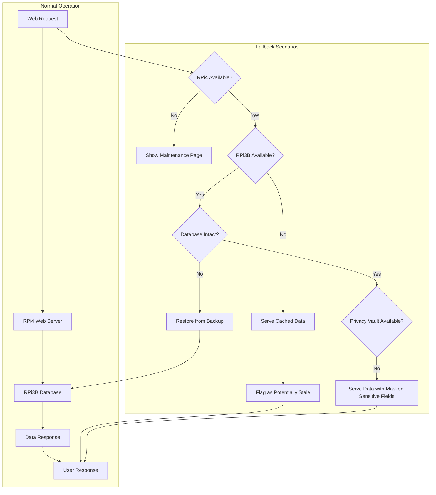

## Future Expansion

The architecture is designed to accommodate future enhancements:

1. **Mobile Application**: Additional client interfacing with the same API
2. **Multiple Database Nodes**: Scaling to include additional database servers
3. **Cloud Backup**: Optional secure backup to encrypted cloud storage
4. **Enhanced AI Capabilities**: Integration with more specialized AI models
5. **Additional Data Sources**: Integration with more external systems
6. **Advanced Privacy Controls**: Granular user-defined privacy settings
7. **Extended Demo Capabilities**: Interactive demonstration scenarios 