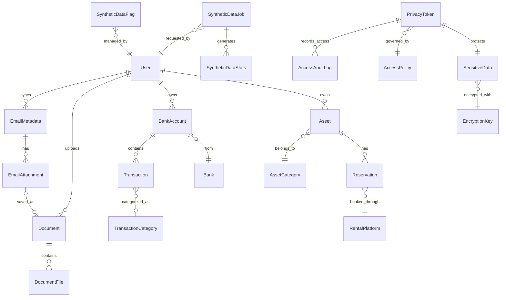

# Data Dictionary

## Overview

This document defines the data structures, entities, and relationships used within the Personal Database Assistant system. It serves as a reference for developers working on integrations and extensions to the system.

## Core Entities

### User

Represents a user account in the system.

| Field | Type | Required | Description |
|-------|------|----------|-------------|
| id | Integer | Yes | Unique identifier (primary key) |
| username | String (50) | Yes | Unique username for login |
| email | String (100) | Yes | User's email address |
| first_name | String (50) | No | User's first name |
| last_name | String (50) | No | User's last name |
| password_hash | String (128) | Yes | Hashed password (not directly accessible) |
| is_active | Boolean | Yes | Whether the account is active |
| created_at | DateTime | Yes | When the account was created |
| last_login | DateTime | No | When the user last logged in |
| profile_picture | String (255) | No | Path to profile picture file |
| preferences | JSON | No | User preferences as JSON |

### Asset

Represents a physical asset owned by a user.

| Field | Type | Required | Description |
|-------|------|----------|-------------|
| id | Integer | Yes | Unique identifier (primary key) |
| owner_id | Integer (FK) | Yes | Reference to User.id |
| category_id | Integer (FK) | Yes | Reference to AssetCategory.id |
| nickname | String (100) | Yes | User-friendly name for the asset |
| address | String (255) | Yes | Physical address of the asset |
| postal_code | String (20) | Yes | Postal/zip code |
| city | String (100) | Yes | City name |
| country | String (100) | Yes | Country name |
| buying_date | Date | Yes | When the asset was purchased |
| buying_price | Decimal(12,2) | Yes | Purchase price in user's currency |
| has_on_going_mortgage | Boolean | Yes | Whether there's an active mortgage |
| is_rented | Boolean | Yes | Whether the asset is currently rented |
| is_our_living_house | Boolean | Yes | Whether the asset is the user's primary residence |
| tax_management_id | Integer (FK) | No | Reference to TaxManagement.id |
| created_at | DateTime | Yes | When the record was created |
| updated_at | DateTime | Yes | When the record was last updated |
| details | JSON | No | Additional details as JSON |

### AssetCategory

Categorizes assets for organization and filtering.

| Field | Type | Required | Description |
|-------|------|----------|-------------|
| id | Integer | Yes | Unique identifier (primary key) |
| name | String (50) | Yes | Category name (e.g., Real Estate, Vehicle) |
| description | String (255) | No | Description of the category |
| parent_id | Integer (FK) | No | Reference to parent AssetCategory.id for hierarchical categories |

### Reservation

Represents a booking or rental period for an asset.

| Field | Type | Required | Description |
|-------|------|----------|-------------|
| id | Integer | Yes | Unique identifier (primary key) |
| asset_id | Integer (FK) | Yes | Reference to Asset.id |
| platform_id | Integer (FK) | Yes | Reference to RentalPlatform.id |
| reservation_number | String (50) | Yes | Platform-specific reservation identifier |
| entry_date | Date | Yes | Check-in date |
| number_of_nights | Integer | Yes | Duration of stay in nights |
| end_date | Date | Yes | Check-out date (computed) |
| renting_person_full_name | String (100) | Yes | Name of the tenant/guest |
| price | Decimal(10,2) | Yes | Total rental price before fees |
| cleaning | Decimal(8,2) | No | Cleaning fee |
| commission_platform | Decimal(9,2) | No | Platform commission |
| created_at | DateTime | Yes | When the record was created |
| updated_at | DateTime | Yes | When the record was last updated |

### RentalPlatform

Represents booking services like Airbnb, Booking.com, etc.

| Field | Type | Required | Description |
|-------|------|----------|-------------|
| id | Integer | Yes | Unique identifier (primary key) |
| name | String (50) | Yes | Platform name (e.g., Airbnb, Booking.com) |
| website | String (255) | No | Platform website URL |
| default_commission_rate | Decimal(5,2) | No | Standard commission percentage |

### BankAccount

Represents a user's bank account.

| Field | Type | Required | Description |
|-------|------|----------|-------------|
| id | Integer | Yes | Unique identifier (primary key) |
| bank_id | Integer (FK) | Yes | Reference to Bank.id |
| titular_id | Integer (FK) | Yes | Reference to User.id |
| name | String (100) | Yes | Account name/label |
| account_number_token | String (100) | Yes | Privacy token reference for account number |
| iban_token | String (100) | Yes | Privacy token reference for IBAN |
| bic_token | String (100) | No | Privacy token reference for BIC/SWIFT code |
| starting_date | Date | Yes | When the account was opened |
| is_account_open | Boolean | Yes | Whether the account is active |
| created_at | DateTime | Yes | When the record was created |
| updated_at | DateTime | Yes | When the record was last updated |

### Bank

Represents a banking institution.

| Field | Type | Required | Description |
|-------|------|----------|-------------|
| id | Integer | Yes | Unique identifier (primary key) |
| name | String (100) | Yes | Bank name |
| country | String (100) | Yes | Bank headquarters country |
| website | String (255) | No | Bank website URL |

### Transaction

Represents a financial transaction in a bank account.

| Field | Type | Required | Description |
|-------|------|----------|-------------|
| id | Integer | Yes | Unique identifier (primary key) |
| account_id | Integer (FK) | Yes | Reference to BankAccount.id |
| transaction_date | Date | Yes | When the transaction occurred |
| amount | Decimal(12,2) | Yes | Transaction amount (negative for expenses) |
| description | String (255) | Yes | Transaction description |
| category_id | Integer (FK) | No | Reference to TransactionCategory.id |
| is_recurring | Boolean | No | Whether this is a recurring transaction |
| reference | String (100) | No | Bank reference number |
| created_at | DateTime | Yes | When the record was created |
| updated_at | DateTime | Yes | When the record was last updated |

### TransactionCategory

Categorizes transactions for budgeting and reporting.

| Field | Type | Required | Description |
|-------|------|----------|-------------|
| id | Integer | Yes | Unique identifier (primary key) |
| name | String (50) | Yes | Category name (e.g., Groceries, Utilities) |
| type | String (20) | Yes | Type: Income, Expense, Transfer |
| parent_id | Integer (FK) | No | Reference to parent TransactionCategory.id |
| icon | String (50) | No | Icon identifier |
| color | String (20) | No | Color code for visual identification |

### Document

Represents a document stored in the system.

| Field | Type | Required | Description |
|-------|------|----------|-------------|
| id | Integer | Yes | Unique identifier (primary key) |
| user_id | Integer (FK) | Yes | Reference to User.id |
| name | String (100) | Yes | Document name |
| type | String (50) | Yes | Document type (e.g., contract, invoice, receipt) |
| entity_type | String (50) | No | Related entity type (asset, bank_account, etc.) |
| entity_id | Integer | No | ID of the related entity |
| created_at | DateTime | Yes | When the record was created |
| updated_at | DateTime | Yes | When the record was last updated |
| comment | JSON | No | Additional notes as JSON |

### DocumentFile

Represents a file attachment for a document.

| Field | Type | Required | Description |
|-------|------|----------|-------------|
| id | Integer | Yes | Unique identifier (primary key) |
| document_id | Integer (FK) | Yes | Reference to Document.id |
| filename | String (255) | Yes | Original filename |
| file_path | String (255) | Yes | Path to the stored file |
| file_size | Integer | Yes | File size in bytes |
| content_type | String (100) | Yes | MIME type |
| upload_date | DateTime | Yes | When the file was uploaded |
| extracted_text | Text | No | OCR-extracted text content |
| contains_sensitive_data | Boolean | No | Flag if file contains sensitive information |

### EmailMetadata

Stores metadata about emails without the full content.

| Field | Type | Required | Description |
|-------|------|----------|-------------|
| id | String (50) | Yes | Unique identifier (primary key, from email system) |
| user_id | Integer (FK) | Yes | Reference to User.id |
| account | String (100) | Yes | Email account address |
| subject | String (255) | Yes | Email subject |
| sender | String (255) | Yes | Sender email address |
| recipient | String (255) | Yes | Recipient email address |
| date | DateTime | Yes | Email date and time |
| snippet | Text | No | Brief preview of content |
| has_attachments | Boolean | Yes | Whether the email has attachments |
| labels | Array | No | Array of labels/folders |
| gmail_id | String (50) | No | Gmail-specific identifier |
| created_at | DateTime | Yes | When the record was created |

### EmailAttachment

Represents a file attached to an email.

| Field | Type | Required | Description |
|-------|------|----------|-------------|
| id | String (50) | Yes | Unique identifier (primary key) |
| email_id | String (50) (FK) | Yes | Reference to EmailMetadata.id |
| filename | String (255) | Yes | Attachment filename |
| file_path | String (255) | No | Path to saved file (if downloaded) |
| file_size | Integer | Yes | File size in bytes |
| content_type | String (100) | Yes | MIME type |
| download_date | DateTime | No | When the attachment was downloaded |
| document_id | Integer (FK) | No | Reference to Document.id if saved as document |

## Data Privacy Vault Entities

### PrivacyToken

Represents a tokenized reference to sensitive data.

| Field | Type | Required | Description |
|-------|------|----------|-------------|
| id | String (50) | Yes | Unique token identifier (primary key) |
| data_type | String (50) | Yes | Type of sensitive data (e.g., bank_account, ssn, address) |
| data_hash | String (64) | Yes | Hash of the sensitive data for integrity verification |
| access_policy_id | Integer (FK) | Yes | Reference to AccessPolicy.id |
| created_at | DateTime | Yes | When the token was created |
| expires_at | DateTime | No | When the token expires (null for no expiration) |
| owner_id | Integer (FK) | Yes | Reference to User.id of data owner |
| last_accessed | DateTime | No | When the token was last accessed |
| metadata | JSON | No | Additional metadata about the tokenized data |

### SensitiveData

Stores the actual encrypted sensitive information.

| Field | Type | Required | Description |
|-------|------|----------|-------------|
| id | Integer | Yes | Unique identifier (primary key) |
| token_id | String (50) (FK) | Yes | Reference to PrivacyToken.id |
| encrypted_data | Binary | Yes | Encrypted sensitive data |
| encryption_key_id | Integer | Yes | ID of the encryption key used |
| iv_vector | Binary | Yes | Initialization vector for decryption |
| created_at | DateTime | Yes | When the record was created |
| updated_at | DateTime | Yes | When the record was last updated |

### AccessPolicy

Defines who can access what sensitive data and for what purposes.

| Field | Type | Required | Description |
|-------|------|----------|-------------|
| id | Integer | Yes | Unique identifier (primary key) |
| name | String (50) | Yes | Policy name (e.g., standard, restricted, admin_only) |
| description | String (255) | No | Description of the policy |
| allowed_purposes | Array | Yes | Array of allowed access purposes |
| requires_approval | Boolean | Yes | Whether access requires explicit approval |
| max_access_count | Integer | No | Maximum number of times data can be accessed |
| created_at | DateTime | Yes | When the policy was created |
| updated_at | DateTime | Yes | When the policy was last updated |

### AccessAuditLog

Records all access attempts to sensitive data.

| Field | Type | Required | Description |
|-------|------|----------|-------------|
| id | Integer | Yes | Unique identifier (primary key) |
| token_id | String (50) (FK) | Yes | Reference to PrivacyToken.id |
| user_id | Integer (FK) | Yes | Reference to User.id making the request |
| timestamp | DateTime | Yes | When the access occurred |
| purpose | String (50) | Yes | Purpose for accessing the data |
| access_granted | Boolean | Yes | Whether access was granted |
| deny_reason | String (255) | No | Reason for denial if access was denied |
| client_ip | String (45) | Yes | IP address of the requester |
| user_agent | String (255) | Yes | User agent of the requester |
| response_time_ms | Integer | Yes | Time taken to process the request in milliseconds |

### EncryptionKey

Manages encryption keys for sensitive data.

| Field | Type | Required | Description |
|-------|------|----------|-------------|
| id | Integer | Yes | Unique identifier (primary key) |
| key_identifier | String (100) | Yes | External identifier for the key |
| data_type | String (50) | Yes | Type of data this key is used for |
| is_active | Boolean | Yes | Whether the key is currently active |
| created_at | DateTime | Yes | When the key was created |
| expires_at | DateTime | No | When the key will expire |
| rotation_date | DateTime | No | When the key was last rotated |
| key_metadata | JSON | No | Additional metadata about the key |

## Synthetic Data Entities

### SyntheticDataJob

Tracks synthetic data generation jobs.

| Field | Type | Required | Description |
|-------|------|----------|-------------|
| id | String (50) | Yes | Unique job identifier (primary key) |
| status | String (20) | Yes | Status: requested, processing, completed, failed |
| created_at | DateTime | Yes | When the job was created |
| started_at | DateTime | No | When processing began |
| completed_at | DateTime | No | When processing completed |
| requested_by | Integer (FK) | Yes | Reference to User.id who requested generation |
| parameters | JSON | Yes | Job parameters (data types, volume, etc.) |
| seed_value | Integer | No | Random seed for reproducible generation |
| error_message | Text | No | Error details if job failed |

### SyntheticDataFlag

Controls which tables are using synthetic data.

| Field | Type | Required | Description |
|-------|------|----------|-------------|
| id | Integer | Yes | Unique identifier (primary key) |
| table_name | String (100) | Yes | Database table name |
| is_using_synthetic | Boolean | Yes | Whether table is using synthetic data |
| synthetic_data_version | String (50) | No | Version identifier of synthetic dataset |
| updated_at | DateTime | Yes | When the flag was last updated |
| updated_by | Integer (FK) | Yes | Reference to User.id who changed the flag |

### SyntheticDataStats

Stores statistics about generated synthetic data.

| Field | Type | Required | Description |
|-------|------|----------|-------------|
| id | Integer | Yes | Unique identifier (primary key) |
| job_id | String (50) (FK) | Yes | Reference to SyntheticDataJob.id |
| entity_type | String (50) | Yes | Type of entity (e.g., user, asset, transaction) |
| count | Integer | Yes | Number of entities generated |
| min_date | Date | No | Earliest date in the dataset |
| max_date | Date | No | Latest date in the dataset |
| value_ranges | JSON | No | Statistics about value distributions |
| created_at | DateTime | Yes | When the record was created |

## Entity Relationships

The following diagram illustrates the main entity relationships:



## Data Privacy Classification

All data within the system is classified according to sensitivity:

### Public Data

General information with minimal privacy concerns.

- Asset nicknames
- Transaction categories
- Bank names
- Document types
- Email subjects and dates

### Protected Data

Information with moderate sensitivity that should be controlled.

- Asset addresses
- Transaction descriptions
- Document metadata
- Email snippets

### Sensitive Data (Stored in Privacy Vault)

High-risk personal or financial information requiring strong protection.

- Bank account numbers (IBAN, account numbers)
- Personal identification information
- Financial details (account balances, mortgage details)
- Complete transaction history
- Tax information

## Database Table Prefixes

Tables in the database use the following prefixes for organization:

- `core_`: Core system entities (User, etc.)
- `asset_`: Asset-related tables
- `finance_`: Financial tables (accounts, transactions)
- `doc_`: Document management tables
- `email_`: Email integration tables
- `privacy_`: Data Privacy Vault tables
- `syn_`: Synthetic data tables

## Data Types and Constraints

### String Length Guidelines

- **Short names/codes**: 50 characters
- **Titles/names**: 100 characters
- **Descriptions**: 255 characters
- **URLs/file paths**: 255 characters
- **Text content**: TEXT or LONGTEXT as appropriate

### Timestamps

All tables include:
- `created_at`: When the record was created
- `updated_at`: When the record was last updated (where applicable)

### Soft Delete

Many entities support soft delete through:
- `is_deleted`: Boolean flag
- `deleted_at`: When the record was marked as deleted

## Synthetic Data Naming Conventions

All synthetic data generated for demo purposes follows clear identification patterns:

1. **Usernames**: Always prefixed with "demo_" (e.g., "demo_john")
2. **Email addresses**: Always use domain "@example.com"
3. **Asset nicknames**: Contain the word "Demo" (e.g., "Demo Beach House")
4. **Financial values**: Include clear patterns (amounts usually rounded to significant values)
5. **Dates**: Often align with standard periods (months starting on the 1st, years simplified)

## Data Dictionary Updates

This data dictionary is a living document that should be updated when:

1. New entities or attributes are added to the system
2. Data types or constraints are modified
3. Relationships between entities change
4. New sensitivity classifications are applied

## Appendix: Sample Data Tokenization

### Example: Bank Account IBAN Tokenization

Original sensitive data:
```
IBAN: FR7630001007941234567890185
```

Tokenized representation in core database:
```
iban_token: "tkn_ba_7a8b9c0d1e2f3g"
```

Privacy Vault entry:
```json
{
  "token_id": "tkn_ba_7a8b9c0d1e2f3g",
  "data_type": "bank_account_iban",
  "masked_value": "FR76XXXXXXXXXXXX7890185",
  "access_policy": "standard",
  "expires_at": "2023-12-31T23:59:59+01:00"
}
```

## Appendix: Sample Synthetic Data Generation

### Example: Synthetic Asset Generation

Configuration parameters:
```json
{
  "entity_type": "asset",
  "count": 10,
  "type_distribution": {
    "real_estate": 0.7,
    "vehicle": 0.2,
    "other": 0.1
  },
  "date_range": {
    "min_purchase_date": "2018-01-01",
    "max_purchase_date": "2023-06-30"
  },
  "value_range": {
    "min_price": 50000,
    "max_price": 500000
  }
}
```

Generated data sample:
```json
{
  "id": "demo_asset_123",
  "nickname": "Demo Beach Apartment",
  "address": "123 Ocean Drive",
  "city": "Miami Beach",
  "country": "United States",
  "postal_code": "33139",
  "buying_date": "2020-04-15",
  "buying_price": 275000,
  "is_rented": true,
  "is_demo_data": true
}
``` 