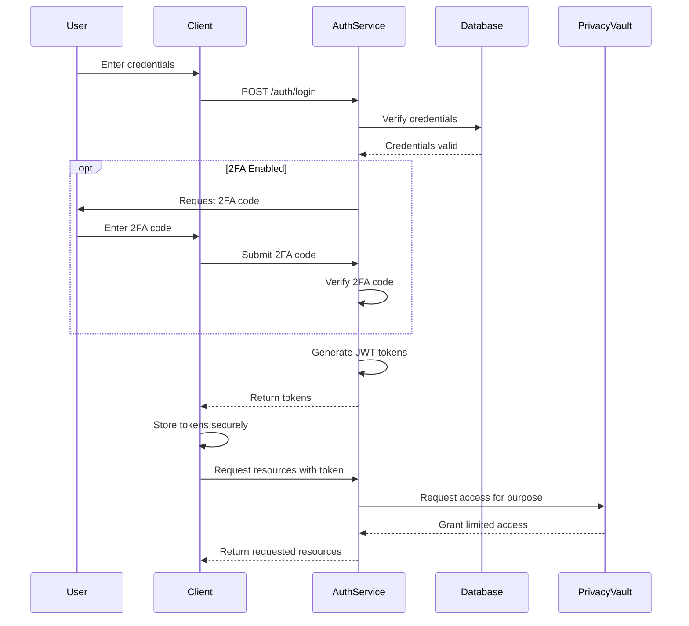
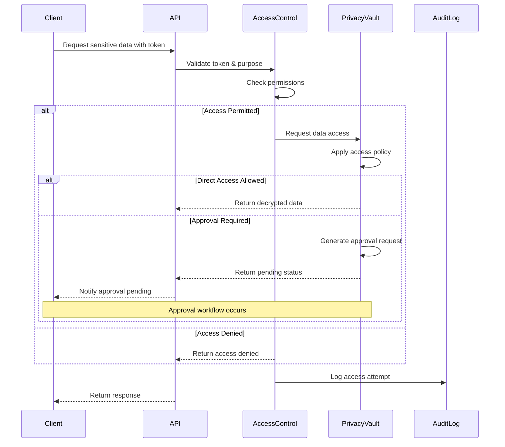
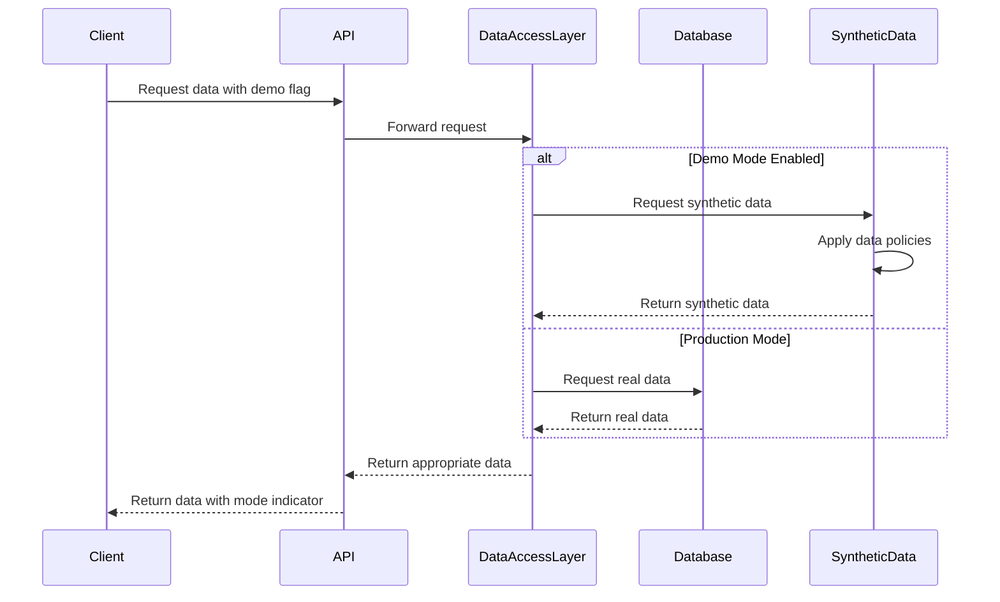

# Authentication and Authorization Guide

## Overview

This document outlines the authentication and authorization mechanisms for the Personal Database Assistant. It details the security model, access controls, and integration authentication requirements.

## Authentication Methods

### User Authentication

The Personal Database Assistant supports the following authentication methods:

1. **Username/Password Authentication**
   - Standard login form with username/password combination
   - Passwords must meet complexity requirements:
     - Minimum 12 characters
     - At least 1 uppercase letter, 1 lowercase letter
     - At least 1 number and 1 special character
     - No common dictionary words
   - Account lockout after 5 failed attempts with progressive timeouts

2. **Two-Factor Authentication (2FA)**
   - Optional but recommended for all users
   - Supported methods:
     - Time-based One-Time Password (TOTP) via authenticator apps
     - Email verification codes
   - Required for accessing sensitive data or performing privileged operations

3. **API Key Authentication**
   - Used for service-to-service communication
   - Keys are generated through the admin interface
   - Each key has specific permissions and expiration dates
   - Key rotation supported with overlap periods

### Session Management

- **JWT Tokens**
  - Used for maintaining authenticated sessions
  - Contains encoded user identity and permissions
  - Short-lived access tokens (15 minutes)
  - Longer-lived refresh tokens (24 hours)
  - Refresh token rotation on each use

- **Token Storage**
  - Access tokens stored in memory only
  - Refresh tokens stored in HttpOnly, Secure cookies with SameSite=Strict
  - No sensitive authentication data stored in localStorage

## Authorization Model

### Role-Based Access Control (RBAC)

The system uses a role-based access control model with the following predefined roles:

1. **Administrator**
   - Full system access
   - Can manage users, roles, and permissions
   - Can access all data including audit logs
   - Can configure system settings

2. **User**
   - Access to own data only
   - Cannot access other users' information
   - Basic CRUD operations on owned resources
   - Can use the assistant features on their own data

3. **Auditor**
   - Read-only access to audit logs and system metrics
   - Cannot modify any data
   - Used for compliance monitoring
   - Reports to administrators

4. **Support**
   - Limited access to troubleshoot issues
   - Can view metadata but not sensitive data
   - Temporary access with expiration
   - All actions are logged for review

### Permission Matrix

| Resource | Administrator | User | Auditor | Support |
|----------|--------------|------|---------|---------|
| User Management | Create, Read, Update, Delete | Read, Update (own) | Read | Read |
| Asset Data | Create, Read, Update, Delete | Create, Read, Update, Delete (own) | Read (anonymized) | Read (metadata) |
| Financial Data | Create, Read, Update, Delete | Create, Read, Update, Delete (own) | Read (anonymized) | Read (metadata) |
| Documents | Create, Read, Update, Delete | Create, Read, Update, Delete (own) | Read (metadata) | Read (metadata) |
| System Settings | Create, Read, Update, Delete | None | Read | Read |
| Audit Logs | Create, Read | Read (own) | Read | Read (filtered) |
| Privacy Vault Access | Manage, Read (with approval) | Request, Read (own with purpose) | Read (anonymized stats) | None |
| Synthetic Data | Generate, Configure, Read | Use (demo mode) | Read | Configure |

### Data Privacy Vault Authorization

The Data Privacy Vault implements a purpose-based access control system:

1. **Access Policies**
   - Each sensitive data type has defined access policies
   - Policies specify allowed purposes, approval requirements, and access limits
   - Example purposes: "payment_processing", "tax_calculation", "report_generation"

2. **Access Request Flow**
   1. Application requests token with specified purpose
   2. Privacy Vault validates request against policies
   3. If approved, returns data (or token) with scope and time limitations
   4. All access is recorded in audit logs

3. **Purpose Limitation**
   - Data accessed for a specific purpose cannot be used for other purposes
   - Purpose is encoded in the access token
   - System validates purpose against operation type

4. **Auto-Expiring Access**
   - All sensitive data access has a time limitation
   - Tokens expire after single use or short time window
   - Continuous access requires continuous validation

### Synthetic Data Controls

The system implements special authorization controls for synthetic data:

1. **Demo Mode Toggle**
   - Special permission to switch between real and synthetic data
   - UI indicator shows when using synthetic data
   - Admins can force demo mode for specific users

2. **Synthetic Data Generation Permissions**
   - Only administrators can generate new synthetic datasets
   - Generation jobs are rate-limited and audited
   - Parameters for generation require approval

3. **Data Boundaries**
   - Strict isolation between real and synthetic data
   - Synthetic data clearly marked in all contexts
   - Cannot mix real and synthetic in the same operation

## OAuth Integration

For external service integration, the system supports OAuth 2.0:

1. **OAuth 2.0 Flows**
   - Authorization Code flow for web applications
   - PKCE extension for mobile/SPA clients
   - Client Credentials for service-to-service
   - Refresh Token flow supported

2. **Scope-Based Access**
   - Fine-grained OAuth scopes for API access
   - Example scopes:
     - "assets:read" - Read access to asset data
     - "finances:read" - Read access to financial data
     - "user:profile" - Access to user profile information

3. **External Identity Providers**
   - Optional integration with external IdPs
   - OpenID Connect supported
   - Social login support configurable

## API Security

API endpoints implement several security measures:

1. **Authentication Requirements**
   - All API endpoints require authentication
   - Public endpoints limited to login and system status
   - API keys must be transmitted via Authorization header

2. **Rate Limiting**
   - All endpoints have rate limits based on user/API key
   - Limits vary by endpoint sensitivity and load impact
   - Progressive rate limiting with increasing response delay

3. **Input Validation**
   - All inputs strictly validated against schemas
   - Parameterized queries for database access
   - Content-Type validation and restrictions

## Security Headers and Protections

All responses include security headers:

- `Content-Security-Policy` - Restricts resource loading
- `X-Content-Type-Options: nosniff` - Prevents MIME type sniffing
- `X-Frame-Options: DENY` - Prevents clickjacking
- `Strict-Transport-Security` - Enforces HTTPS
- `X-XSS-Protection: 1; mode=block` - Browser XSS protection
- `Referrer-Policy: strict-origin-when-cross-origin` - Limits referrer information

## Network Segmentation

The system uses network segmentation for additional security:

1. **VLAN Architecture**
   - Web servers in DMZ VLAN
   - Database servers in protected database VLAN
   - Privacy Vault in isolated high-security VLAN
   - Synthetic data generation services in separate VLAN

2. **Firewall Rules**
   - Strict inbound/outbound rules for each server
   - Database access only from application servers
   - Privacy Vault access limited to specific services
   - External API access through API Gateway only

## Audit Logging

Comprehensive audit logging for security events:

1. **Log Coverage**
   - Authentication events (success, failure)
   - Authorization decisions
   - Resource access and modifications
   - Sensitive operations
   - Privacy Vault access attempts
   - Synthetic data usage

2. **Log Format**
   - Timestamp
   - User or service identity
   - Action performed
   - Resource affected
   - Request metadata (IP, user agent)
   - Success/failure status
   - Reason code for failures

3. **Log Protection**
   - Immutable logs
   - Secure transmission to log server
   - Log integrity verification
   - Retention based on compliance requirements

## Secure Integration Implementation

Follow these guidelines when implementing integrations:

1. **Authentication Flow**
   ```javascript
   // Example API authentication flow
   async function authenticateToAPI() {
     const apiKey = process.env.API_KEY;
     const response = await fetch('https://api.personaldb.example/auth/token', {
       method: 'POST',
       headers: {
         'Content-Type': 'application/json',
         'Authorization': `ApiKey ${apiKey}`
       },
       body: JSON.stringify({
         grant_type: 'client_credentials',
         scope: 'assets:read finances:read'
       })
     });
     
     const { access_token, expires_in } = await response.json();
     return { token: access_token, expiresIn: expires_in };
   }
   ```

2. **Making Authorized Requests**
   ```javascript
   // Example authorized API request
   async function getAssetData(assetId, token) {
     const response = await fetch(`https://api.personaldb.example/assets/${assetId}`, {
       method: 'GET',
       headers: {
         'Authorization': `Bearer ${token}`,
         'Accept': 'application/json'
       }
     });
     
     if (response.status === 401) {
       // Token expired, refresh and retry
       const { token: newToken } = await authenticateToAPI();
       return getAssetData(assetId, newToken);
     }
     
     return response.json();
   }
   ```

3. **Accessing Privacy Vault Data**
   ```javascript
   // Example Privacy Vault data access
   async function getAccountDetails(accountToken, purpose, token) {
     const response = await fetch('https://api.personaldb.example/privacy/data', {
       method: 'POST',
       headers: {
         'Authorization': `Bearer ${token}`,
         'Content-Type': 'application/json'
       },
       body: JSON.stringify({
         token: accountToken,
         purpose: purpose,
         justification: 'User requested account summary view'
       })
     });
     
     if (response.status === 403) {
       // Access denied for this purpose
       throw new Error('Access denied for requested purpose');
     }
     
     // Data with limited time validity
     return response.json();
   }
   ```

4. **Switching to Synthetic Data**
   ```javascript
   // Example for enabling demo mode with synthetic data
   async function enableDemoMode(token) {
     const response = await fetch('https://api.personaldb.example/system/demo-mode', {
       method: 'POST',
       headers: {
         'Authorization': `Bearer ${token}`,
         'Content-Type': 'application/json'
       },
       body: JSON.stringify({
         enabled: true,
         synthetic_data_version: 'latest'
       })
     });
     
     return response.json();
   }
   ```

## Security Best Practices

1. **API Key Management**
   - Store API keys in environment variables or secure vaults
   - Never hardcode keys in source code
   - Implement key rotation procedures
   - Use least-privilege keys for each integration

2. **Token Handling**
   - Never log or expose tokens in client-side code
   - Implement token expiration handling
   - Use short-lived tokens for sensitive operations
   - Validate tokens before use

3. **Error Handling**
   - Implement generic error messages to users
   - Log detailed errors securely
   - Don't expose system information in errors
   - Implement proper HTTP status codes

4. **Data Protection**
   - Always use HTTPS for all communications
   - Encrypt sensitive data at rest
   - Use Data Privacy Vault for sensitive information
   - Clear sensitive data from memory when not needed

5. **Privacy Controls**
   - Always specify purpose when requesting sensitive data
   - Implement data minimization (request only needed fields)
   - Honor user consent and purpose limitation
   - Use synthetic data for development and testing

## Compliance Requirements

The Personal Database Assistant implements security controls to support:

1. **GDPR Compliance**
   - Data portability through export APIs
   - Right to erasure (account deletion)
   - Data processing records
   - Purpose limitation via Privacy Vault

2. **Financial Data Protection**
   - Secure handling of financial records
   - Transaction data encryption
   - Audit trails for financial operations
   - Synthetic data for demonstrations

3. **Test and Development**
   - Never use production data for testing
   - Synthetic data generators for realistic testing
   - Isolated test environments
   - Data masking for development

## Emergency Access

The system provides emergency access procedures:

1. **Break-Glass Access**
   - Special emergency access for administrators
   - Requires multi-person authorization
   - Limited time window
   - Comprehensive logging of all actions
   - Post-access review requirement

2. **Account Recovery**
   - Self-service recovery with strong verification
   - Support-assisted recovery with identity verification
   - Recovery codes generated at account setup
   - Progressive timeouts on failed recovery attempts

## Appendix: Authentication Flows

### Standard Login Flow



### Privacy Vault Access Control Flow



### Synthetic Data Access Flow


