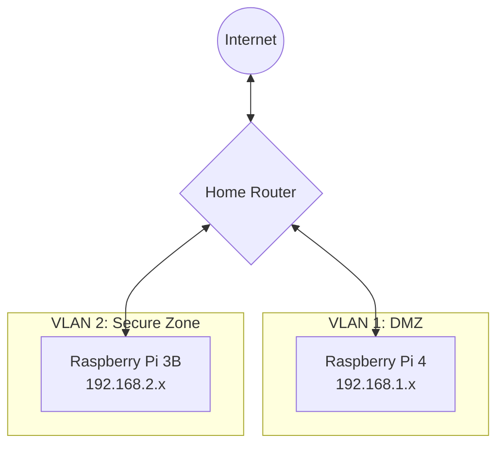

# Environment Configuration Guide

## Overview

This document outlines the environment configuration parameters, requirements, and setup procedures for the Personal Database Assistant system, which consists of a database server (Raspberry Pi 3B) and a web application server (Raspberry Pi 4).

## System Components

The complete system consists of the following components:

1. **Database Server** (Raspberry Pi 3B)
   - PostgreSQL database
   - Django REST API
   - Offline storage

2. **Web Application Server** (Raspberry Pi 4)
   - Django web application
   - React frontend
   - Redis cache/message queue
   - AI integration components
   - Email integration components

3. **Home Network Infrastructure**
   - Router with firewall capabilities
   - Network segmentation (VLANs)
   - Dynamic DNS service (optional)

## Hardware Requirements

### Raspberry Pi 3B (Database Server)

| Component | Minimum Specification | Recommended Specification |
|-----------|----------------------|--------------------------|
| CPU | 1.2 GHz quad-core ARM Cortex-A53 | - |
| RAM | 1 GB | - |
| Storage | 32 GB microSD card (Class 10) | 64 GB or larger microSD card |
| Power Supply | 5V/2.5A | 5V/3A with official power adapter |
| Cooling | Passive (heatsinks) | Active (small fan) |
| Ethernet | 100 Mbps | - |

### Raspberry Pi 4 (Web Application Server)

| Component | Minimum Specification | Recommended Specification |
|-----------|----------------------|--------------------------|
| CPU | 1.5 GHz quad-core Cortex-A72 | - |
| RAM | 4 GB | 8 GB |
| Storage | 32 GB microSD card (Class 10) | 128 GB or larger microSD card |
| Power Supply | 5V/3A USB-C | Official 5V/3A USB-C power adapter |
| Cooling | Active (fan) | Active (fan + heatsinks) |
| Ethernet | 1 Gbps | - |
| Optional | USB 3.0 SSD for database caching | - |

### Network Requirements

| Component | Specification |
|-----------|--------------|
| Router | Support for port forwarding, VLANs, and firewall rules |
| Local Network | Gigabit Ethernet recommended |
| Internet Connection | Minimum 10 Mbps download, 5 Mbps upload |
| Static IP | Static local IPs for both Raspberry Pi devices |
| Dynamic DNS | For internet access if ISP provides dynamic public IP |

## Software Components

### Operating System

Both Raspberry Pi devices should run Raspberry Pi OS (64-bit recommended for the Pi 4):

```
Raspberry Pi OS (Debian Bullseye or newer)
Kernel: 5.10 or newer
```

### Database Server Software Stack

| Software | Version | Purpose |
|----------|---------|---------|
| PostgreSQL | 13.x or newer | Database engine |
| Python | 3.9 or newer | Programming language |
| Django | 4.0 or newer | Web framework |
| Django REST Framework | 3.13 or newer | REST API framework |
| Gunicorn | 20.1 or newer | WSGI HTTP Server |
| Supervisor | 4.2 or newer | Process control system |

### Web Application Server Software Stack

| Software | Version | Purpose |
|----------|---------|---------|
| Python | 3.9 or newer | Programming language |
| Django | 4.0 or newer | Web framework |
| Django REST Framework | 3.13 or newer | REST API framework |
| Node.js | 16.x LTS or newer | JavaScript runtime |
| React | 18.x or newer | Frontend framework |
| Redis | 6.2 or newer | Cache and message broker |
| Nginx | 1.20 or newer | Web server / reverse proxy |
| Celery | 5.2 or newer | Task queue |
| Gunicorn | 20.1 or newer | WSGI HTTP Server |
| Supervisor | 4.2 or newer | Process control system |

## Network Configuration

### Network Diagram



### IP Address Configuration

#### Static IP Assignment

Both Raspberry Pi devices should have static IP addresses on your local network.

**Raspberry Pi 3B (Database Server)**:
```
IP Address: 192.168.2.10 (example)
Subnet Mask: 255.255.255.0
Gateway: 192.168.2.1
```

**Raspberry Pi 4 (Web Server)**:
```
IP Address: 192.168.1.10 (example)
Subnet Mask: 255.255.255.0
Gateway: 192.168.1.1
```

#### VLAN Configuration

Create two separate VLANs for network segmentation:

1. **VLAN 1 (DMZ)**
   - For the web server (Raspberry Pi 4)
   - Has internet access
   - IP range: 192.168.1.0/24

2. **VLAN 2 (Secure Zone)**
   - For the database server (Raspberry Pi 3B)
   - No direct internet access
   - IP range: 192.168.2.0/24

#### Firewall Rules

Configure your router's firewall with these rules:

1. **Inbound Traffic Rules**
   - Allow HTTPS (TCP 443) from Internet to Raspberry Pi 4
   - Block all other inbound connections from Internet

2. **Outbound Traffic Rules**
   - Allow outbound connections from Raspberry Pi 4 to Internet
   - Block outbound connections from Raspberry Pi 3B to Internet

3. **Internal Traffic Rules**
   - Allow TCP 8000 from Raspberry Pi 4 to Raspberry Pi 3B
   - Block all other connections from VLAN 1 to VLAN 2

### Port Forwarding

Configure port forwarding on your router:

| External Port | Internal IP | Internal Port | Protocol | Purpose |
|---------------|-------------|--------------|----------|---------|
| 443 | 192.168.1.10 | 443 | TCP | HTTPS Web Interface |

### Dynamic DNS Configuration (Optional)

If your ISP provides a dynamic public IP address, set up a dynamic DNS service:

1. Create an account with a provider (No-IP, DuckDNS, etc.)
2. Configure your chosen domain (e.g., yourname.duckdns.org)
3. Install the dynamic DNS client on the Raspberry Pi 4
4. Configure automatic updates

## Environment Variables

### Database Server (Raspberry Pi 3B)

Create a `.env` file in the project root directory with these variables:

```bash
# Django Configuration
DJANGO_SETTINGS_MODULE=config.settings.production
DJANGO_SECRET_KEY=<secure-random-string>
DEBUG=False
ALLOWED_HOSTS=192.168.2.10,localhost

# Database Configuration
DB_NAME=personal_database
DB_USER=db_user
DB_PASSWORD=<secure-password>
DB_HOST=localhost
DB_PORT=5432

# API Security
API_KEYS=<comma-separated-list-of-api-keys>
API_SECRETS=<comma-separated-list-of-api-secrets>
ALLOWED_API_IPS=192.168.1.10

# Storage Paths
MEDIA_ROOT=/path/to/media
STATIC_ROOT=/path/to/static
FILE_STORAGE_PATH=/path/to/file-storage

# Logging
LOG_LEVEL=INFO
LOG_FILE=/var/log/database_server/app.log
```

### Web Application Server (Raspberry Pi 4)

Create a `.env` file in the project root directory with these variables:

```bash
# Django Configuration
DJANGO_SETTINGS_MODULE=config.settings.production
DJANGO_SECRET_KEY=<secure-random-string>
DEBUG=False
ALLOWED_HOSTS=192.168.1.10,localhost,your-domain.duckdns.org

# Database API Connection
DATABASE_API_URL=http://192.168.2.10:8000/api/v1
DATABASE_API_KEY=<api-key>
DATABASE_API_SECRET=<api-secret>

# Redis Configuration
REDIS_HOST=localhost
REDIS_PORT=6379
REDIS_DB=0
REDIS_PASSWORD=<secure-password>

# External Services
OPENAI_API_KEY=<openai-api-key>
GMAIL_OAUTH_CLIENT_ID=<google-client-id>
GMAIL_OAUTH_CLIENT_SECRET=<google-client-secret>

# Storage Paths
MEDIA_ROOT=/path/to/media
STATIC_ROOT=/path/to/static
FILE_UPLOAD_TEMP_DIR=/path/to/temp

# SSL/TLS Certificates
SSL_CERT_PATH=/path/to/fullchain.pem
SSL_KEY_PATH=/path/to/privkey.pem

# Logging
LOG_LEVEL=INFO
LOG_FILE=/var/log/web_server/app.log
```

## Initial Setup Procedures

### Database Server Setup (Raspberry Pi 3B)

1. **Install Operating System**
   ```bash
   # Flash Raspberry Pi OS to microSD card using Raspberry Pi Imager
   # Enable SSH during the flashing process
   ```

2. **Basic Configuration**
   ```bash
   # Set hostname
   sudo hostnamectl set-hostname db-server
   
   # Update system
   sudo apt update && sudo apt upgrade -y
   
   # Install dependencies
   sudo apt install -y python3-pip python3-venv postgresql postgresql-contrib libpq-dev supervisor
   ```

3. **Configure PostgreSQL**
   ```bash
   # Initialize the database
   sudo -u postgres createuser db_user
   sudo -u postgres createdb personal_database
   sudo -u postgres psql -c "ALTER USER db_user WITH ENCRYPTED PASSWORD '<secure-password>';"
   sudo -u postgres psql -c "GRANT ALL PRIVILEGES ON DATABASE personal_database TO db_user;"
   
   # Configure PostgreSQL to listen only on localhost
   sudo nano /etc/postgresql/13/main/postgresql.conf
   # Set listen_addresses = 'localhost'
   
   # Restart PostgreSQL
   sudo systemctl restart postgresql
   ```

4. **Application Setup**
   ```bash
   # Create application directory
   mkdir -p /home/pi/database_server
   cd /home/pi/database_server
   
   # Clone application repository (if applicable)
   git clone <repository-url> .
   
   # Create virtual environment
   python3 -m venv venv
   source venv/bin/activate
   
   # Install requirements
   pip install -r requirements.txt
   
   # Create .env file with environment variables
   nano .env
   # Add variables as listed above
   
   # Apply database migrations
   python manage.py migrate
   
   # Create initial superuser
   python manage.py createsuperuser
   
   # Collect static files
   python manage.py collectstatic
   ```

5. **Configure Supervisor**
   ```bash
   # Create configuration file
   sudo nano /etc/supervisor/conf.d/database_server.conf
   ```
   
   Add the following configuration:
   ```ini
   [program:database_server]
   command=/home/pi/database_server/venv/bin/gunicorn config.wsgi:application --workers 2 --bind 0.0.0.0:8000
   directory=/home/pi/database_server
   user=pi
   autostart=true
   autorestart=true
   redirect_stderr=true
   stdout_logfile=/var/log/database_server/gunicorn.log
   environment=
       DJANGO_SETTINGS_MODULE="config.settings.production",
       DJANGO_SECRET_KEY="<secure-random-string>",
       DEBUG="False"

   [supervisord]
   logfile=/var/log/supervisord/supervisord.log
   logfile_maxbytes=50MB
   logfile_backups=10
   loglevel=info
   pidfile=/var/run/supervisord.pid
   ```

   Start the service:
   ```bash
   # Create log directories
   sudo mkdir -p /var/log/database_server /var/log/supervisord
   sudo chown pi:pi /var/log/database_server /var/log/supervisord
   
   # Update and start supervisor
   sudo supervisorctl reread
   sudo supervisorctl update
   sudo supervisorctl start database_server
   ```

### Web Application Server Setup (Raspberry Pi 4)

1. **Install Operating System**
   ```bash
   # Flash Raspberry Pi OS to microSD card using Raspberry Pi Imager
   # Enable SSH during the flashing process
   ```

2. **Basic Configuration**
   ```bash
   # Set hostname
   sudo hostnamectl set-hostname web-server
   
   # Update system
   sudo apt update && sudo apt upgrade -y
   
   # Install dependencies
   sudo apt install -y python3-pip python3-venv redis-server nginx supervisor curl
   
   # Install Node.js
   curl -fsSL https://deb.nodesource.com/setup_16.x | sudo -E bash -
   sudo apt install -y nodejs
   ```

3. **Configure Redis**
   ```bash
   # Secure Redis
   sudo nano /etc/redis/redis.conf
   # Set requirepass <secure-password>
   # Set bind 127.0.0.1
   
   # Restart Redis
   sudo systemctl restart redis-server
   ```

4. **Application Setup**
   ```bash
   # Create application directory
   mkdir -p /home/pi/web_server
   cd /home/pi/web_server
   
   # Clone application repository (if applicable)
   git clone <repository-url> .
   
   # Create virtual environment
   python3 -m venv venv
   source venv/bin/activate
   
   # Install requirements
   pip install -r requirements.txt
   
   # Create .env file with environment variables
   nano .env
   # Add variables as listed above
   
   # Install frontend dependencies and build
   cd frontend
   npm install
   npm run build
   cd ..
   
   # Apply database migrations (if applicable)
   python manage.py migrate
   
   # Create initial superuser
   python manage.py createsuperuser
   
   # Collect static files
   python manage.py collectstatic
   ```

5. **SSL Certificate Setup (Let's Encrypt)**
   ```bash
   # Install certbot
   sudo apt install -y certbot python3-certbot-nginx
   
   # Obtain certificate
   sudo certbot --nginx -d your-domain.duckdns.org
   
   # Certificate renewal cron job
   echo "0 0 * * 0 certbot renew --quiet" | sudo tee -a /etc/crontab
   ```

6. **Configure Nginx**
   ```bash
   # Create configuration file
   sudo nano /etc/nginx/sites-available/web_server
   ```
   
   Add the following configuration:
   ```nginx
   server {
       listen 80;
       server_name your-domain.duckdns.org;
       
       # Redirect HTTP to HTTPS
       return 301 https://$host$request_uri;
   }

   server {
       listen 443 ssl;
       server_name your-domain.duckdns.org;
       
       ssl_certificate /etc/letsencrypt/live/your-domain.duckdns.org/fullchain.pem;
       ssl_certificate_key /etc/letsencrypt/live/your-domain.duckdns.org/privkey.pem;
       
       # SSL configuration
       ssl_protocols TLSv1.2 TLSv1.3;
       ssl_prefer_server_ciphers on;
       ssl_ciphers ECDHE-ECDSA-AES128-GCM-SHA256:ECDHE-RSA-AES128-GCM-SHA256;
       ssl_session_cache shared:SSL:10m;
       ssl_session_timeout 1d;
       ssl_session_tickets off;
       
       # Security headers
       add_header Strict-Transport-Security "max-age=31536000; includeSubDomains" always;
       add_header X-Frame-Options DENY;
       add_header X-Content-Type-Options nosniff;
       add_header X-XSS-Protection "1; mode=block";
       
       # Static files
       location /static/ {
           alias /home/pi/web_server/static/;
           expires 1d;
       }
       
       location /media/ {
           alias /home/pi/web_server/media/;
           expires 1d;
       }
       
       # Proxy to Gunicorn
       location / {
           proxy_pass http://127.0.0.1:8000;
           proxy_set_header Host $host;
           proxy_set_header X-Real-IP $remote_addr;
           proxy_set_header X-Forwarded-For $proxy_add_x_forwarded_for;
           proxy_set_header X-Forwarded-Proto $scheme;
           proxy_redirect off;
           proxy_buffering off;
           proxy_read_timeout 300s;
       }
   }
   ```

   Enable the configuration:
   ```bash
   sudo ln -s /etc/nginx/sites-available/web_server /etc/nginx/sites-enabled/
   sudo rm /etc/nginx/sites-enabled/default
   sudo nginx -t
   sudo systemctl restart nginx
   ```

7. **Configure Supervisor**
   ```bash
   # Create configuration files
   sudo nano /etc/supervisor/conf.d/web_server.conf
   ```
   
   Add the following configuration:
   ```ini
   [program:web_server]
   command=/home/pi/web_server/venv/bin/gunicorn config.wsgi:application --workers 3 --bind 127.0.0.1:8000
   directory=/home/pi/web_server
   user=pi
   autostart=true
   autorestart=true
   redirect_stderr=true
   stdout_logfile=/var/log/web_server/gunicorn.log
   environment=
       DJANGO_SETTINGS_MODULE="config.settings.production",
       DJANGO_SECRET_KEY="<secure-random-string>",
       DEBUG="False"

   [program:celery_worker]
   command=/home/pi/web_server/venv/bin/celery -A config worker --loglevel=info
   directory=/home/pi/web_server
   user=pi
   autostart=true
   autorestart=true
   redirect_stderr=true
   stdout_logfile=/var/log/web_server/celery_worker.log
   environment=
       DJANGO_SETTINGS_MODULE="config.settings.production",
       DJANGO_SECRET_KEY="<secure-random-string>",
       DEBUG="False"

   [program:celery_beat]
   command=/home/pi/web_server/venv/bin/celery -A config beat --loglevel=info
   directory=/home/pi/web_server
   user=pi
   autostart=true
   autorestart=true
   redirect_stderr=true
   stdout_logfile=/var/log/web_server/celery_beat.log
   environment=
       DJANGO_SETTINGS_MODULE="config.settings.production",
       DJANGO_SECRET_KEY="<secure-random-string>",
       DEBUG="False"

   [supervisord]
   logfile=/var/log/supervisord/supervisord.log
   logfile_maxbytes=50MB
   logfile_backups=10
   loglevel=info
   pidfile=/var/run/supervisord.pid
   ```

   Start the services:
   ```bash
   # Create log directories
   sudo mkdir -p /var/log/web_server /var/log/supervisord
   sudo chown pi:pi /var/log/web_server /var/log/supervisord
   
   # Update and start supervisor
   sudo supervisorctl reread
   sudo supervisorctl update
   sudo supervisorctl start all
   ```

## Environment Validation

Perform these checks to validate your environment setup:

### Database Server Validation

1. **Check PostgreSQL**
   ```bash
   sudo systemctl status postgresql
   # Should show "active (running)"
   
   # Test database connection
   psql -U db_user -d personal_database -c "SELECT 1;"
   # Should return "1"
   ```

2. **Check API Service**
   ```bash
   sudo supervisorctl status database_server
   # Should show "RUNNING"
   
   # Test API (from the database server)
   curl -H "Authorization: Api-Key <your-api-key>" http://localhost:8000/api/v1/health/
   # Should return {"status": "success", "message": "API is operational"}
   ```

### Web Application Server Validation

1. **Check Services**
   ```bash
   # Check Nginx
   sudo systemctl status nginx
   # Should show "active (running)"
   
   # Check Redis
   sudo systemctl status redis-server
   # Should show "active (running)"
   
   # Check application services
   sudo supervisorctl status
   # Should show "web_server", "celery_worker", and "celery_beat" all RUNNING
   ```

2. **Test Web Interface**
   ```bash
   # Test local access
   curl -k https://localhost/api/health/
   # Should return {"status": "success", "message": "Web server is operational"}
   
   # Test external access (from another device)
   curl -k https://your-domain.duckdns.org/api/health/
   # Should return {"status": "success", "message": "Web server is operational"}
   ```

3. **Test Database API Communication**
   ```bash
   # Execute from the web application server
   source /home/pi/web_server/venv/bin/activate
   python -c "from api_client import DatabaseApiClient; client = DatabaseApiClient(); print(client.make_request('GET', '/health/'))"
   # Should print a success response
   ```

## Environment Maintenance

### Backup Procedures

1. **Database Backup**
   ```bash
   # Add to crontab on database server
   pg_dump -U db_user personal_database > /path/to/backups/db_backup_$(date +\%Y\%m\%d).sql
   ```

2. **Configuration Backup**
   ```bash
   # Archive configuration files
   tar -czvf /path/to/backups/config_backup_$(date +\%Y\%m\%d).tar.gz /etc/nginx/sites-available/ /etc/supervisor/conf.d/ /home/pi/*/venv/.env
   ```

3. **Document Storage Backup**
   ```bash
   # Create a backup of media files
   rsync -avz --delete /home/pi/*/media/ /path/to/backups/media/
   ```

### System Updates

1. **Operating System Updates**
   ```bash
   sudo apt update && sudo apt upgrade -y
   ```

2. **Application Updates**
   ```bash
   # Web server
   cd /home/pi/web_server
   git pull
   source venv/bin/activate
   pip install -r requirements.txt
   python manage.py migrate
   python manage.py collectstatic --noinput
   sudo supervisorctl restart web_server celery_worker celery_beat
   
   # Database server
   cd /home/pi/database_server
   git pull
   source venv/bin/activate
   pip install -r requirements.txt
   python manage.py migrate
   sudo supervisorctl restart database_server
   ```

3. **Security Updates**
   ```bash
   # SSL certificate renewal
   sudo certbot renew
   
   # API key rotation (on both servers)
   # Update API_KEYS and API_SECRETS in .env files
   # Restart services
   ```

## Troubleshooting

### Common Issues and Resolutions

1. **Web Server Unavailable**
   - Check Nginx status: `sudo systemctl status nginx`
   - Check Gunicorn status: `sudo supervisorctl status web_server`
   - Review logs: `tail -f /var/log/web_server/gunicorn.log`
   - Verify port forwarding on router

2. **Database Connection Issues**
   - Verify PostgreSQL is running: `sudo systemctl status postgresql`
   - Check network connectivity: `ping 192.168.2.10`
   - Review API logs: `tail -f /var/log/database_server/gunicorn.log`
   - Validate API keys match between servers

3. **Redis Errors**
   - Check Redis status: `sudo systemctl status redis-server`
   - Verify connection: `redis-cli -a <password> ping`
   - Check memory usage: `redis-cli -a <password> info memory`

4. **SSL Certificate Issues**
   - Verify certificate validity: `sudo certbot certificates`
   - Check Nginx SSL configuration: `sudo nginx -t`
   - Renew certificates: `sudo certbot renew --dry-run`

### Log File Locations

| Component | Log Location |
|-----------|-------------|
| Web Server (Django) | /var/log/web_server/gunicorn.log |
| Celery Worker | /var/log/web_server/celery_worker.log |
| Celery Beat | /var/log/web_server/celery_beat.log |
| Database Server | /var/log/database_server/gunicorn.log |
| Nginx | /var/log/nginx/access.log and /var/log/nginx/error.log |
| PostgreSQL | /var/log/postgresql/postgresql-13-main.log |
| Redis | /var/log/redis/redis-server.log |
| Supervisor | /var/log/supervisord/supervisord.log |

## Development Environment Setup

For development purposes, a simplified environment can be set up:

### Local Development Setup

1. **Prerequisites**
   - Python 3.9+
   - Node.js 16+
   - PostgreSQL 13+
   - Redis 6+

2. **Database Server Setup**
   ```bash
   # Clone repository
   git clone <repository-url> database_server
   cd database_server
   
   # Create virtual environment
   python -m venv venv
   source venv/bin/activate  # On Windows: venv\Scripts\activate
   
   # Install dependencies
   pip install -r requirements.txt
   pip install -r requirements-dev.txt
   
   # Set up environment variables
   cp .env.example .env
   # Edit .env with development values
   
   # Apply migrations and create superuser
   python manage.py migrate
   python manage.py createsuperuser
   
   # Run development server
   python manage.py runserver 0.0.0.0:8000
   ```

3. **Web Application Server Setup**
   ```bash
   # Clone repository
   git clone <repository-url> web_server
   cd web_server
   
   # Create virtual environment
   python -m venv venv
   source venv/bin/activate  # On Windows: venv\Scripts\activate
   
   # Install dependencies
   pip install -r requirements.txt
   pip install -r requirements-dev.txt
   
   # Set up environment variables
   cp .env.example .env
   # Edit .env with development values
   
   # Install frontend dependencies
   cd frontend
   npm install
   
   # Run development servers
   # Terminal 1 (backend)
   python manage.py runserver 0.0.0.0:8001
   
   # Terminal 2 (frontend)
   cd frontend
   npm start
   
   # Terminal 3 (Celery worker)
   celery -A config worker --loglevel=info
   
   # Terminal 4 (Celery beat)
   celery -A config beat --loglevel=info
   ```

## Security Considerations

### Environment Variable Protection

- Never commit .env files to version control
- Use different environment variables for development and production
- Rotate secrets regularly
- Use secrets management tools for production

### Network Security

- Keep the database server physically separate from internet-facing servers
- Use VLANs to segment network traffic
- Implement strict firewall rules
- Monitor network activity for suspicious patterns

### Data Protection

- Encrypt sensitive data at rest
- Use TLS for all network communications
- Implement proper access controls
- Regularly back up data to secure locations

## Conclusion

This environment configuration guide provides the foundation for setting up a secure and functional Personal Database Assistant system. Regular maintenance, monitoring, and updates are essential to maintain the system's security and performance over time. 