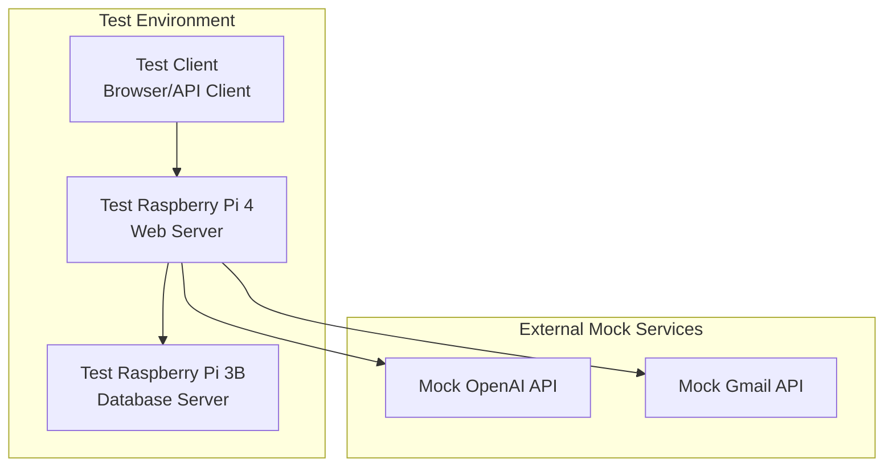

# Integration Test Plan

## Overview

This document outlines the test procedures, scenarios, and methodologies for verifying the integration between components of the Personal Database Assistant system. The plan ensures that all integration points function correctly before deployment to production.

## Test Environment

### Test Architecture

The test environment should mirror the production architecture as closely as possible while providing isolation for testing:



### Test Data

1. **Database Test Data**:
   - Predefined dataset covering all entity types
   - Edge cases and boundary conditions
   - Performance test data (large volume)

2. **File Test Data**:
   - Sample documents (PDF, JPG, PNG, etc.)
   - Various file sizes (small to large)
   - Valid and invalid file formats

3. **API Test Data**:
   - Valid and invalid request payloads
   - Edge case parameters
   - Malformed requests for security testing

## Test Categories

### 1. API Integration Tests

#### 1.1 Basic Connectivity Tests

| Test ID | Test Description | Prerequisites | Test Steps | Expected Result |
|---------|-----------------|---------------|------------|-----------------|
| API-CONN-001 | Verify basic connectivity between web server and database server | Both servers running with test configurations | 1. Send GET request to `/api/v1/health/` endpoint from web server to database server<br>2. Check response | Successful response with 200 status code |
| API-CONN-002 | Verify authentication mechanism with valid API key | API keys configured | 1. Send authenticated request from web server to database server<br>2. Check response | Successful authentication and response |
| API-CONN-003 | Verify authentication fails with invalid API key | API keys configured | 1. Send request with incorrect API key<br>2. Check response | 401 Unauthorized response |
| API-CONN-004 | Verify IP restriction enforcement | IP whitelist configured | 1. Send request from non-whitelisted IP<br>2. Check response | 403 Forbidden response |

#### 1.2 Data Retrieval Tests

| Test ID | Test Description | Prerequisites | Test Steps | Expected Result |
|---------|-----------------|---------------|------------|-----------------|
| API-GET-001 | Retrieve asset list | Test assets in database | 1. Send GET request to `/api/v1/assets/`<br>2. Check response structure and data | Complete asset list with correct pagination |
| API-GET-002 | Retrieve single asset by ID | Test asset with ID 1 | 1. Send GET request to `/api/v1/assets/1/`<br>2. Check response structure and data | Complete asset details for ID 1 |
| API-GET-003 | Retrieve nested related data | Asset with related entities | 1. Send GET request to `/api/v1/assets/1/?include=reservations`<br>2. Check response | Asset with nested reservations data |
| API-GET-004 | Test filtering capabilities | Multiple assets with different properties | 1. Send GET request with filter parameters<br>2. Check filtered results | Correctly filtered dataset |

#### 1.3 Data Modification Tests

| Test ID | Test Description | Prerequisites | Test Steps | Expected Result |
|---------|-----------------|---------------|------------|-----------------|
| API-POST-001 | Create new asset | Valid asset data | 1. Send POST request to `/api/v1/assets/` with valid data<br>2. Check response and database state | New asset created, returned with ID |
| API-PUT-001 | Update existing asset | Existing test asset | 1. Send PUT request to `/api/v1/assets/1/` with modified data<br>2. Check response and database state | Asset updated with new values |
| API-PATCH-001 | Partially update asset | Existing test asset | 1. Send PATCH request with partial data<br>2. Check response and database state | Only specified fields updated |
| API-DELETE-001 | Delete asset | Deletable test asset | 1. Send DELETE request to `/api/v1/assets/2/`<br>2. Check response and database state | Asset deleted successfully |

#### 1.4 Error Handling Tests

| Test ID | Test Description | Prerequisites | Test Steps | Expected Result |
|---------|-----------------|---------------|------------|-----------------|
| API-ERR-001 | Request non-existent resource | Empty database or known unused ID | 1. Send GET request to non-existent asset<br>2. Check error response | 404 Not Found with appropriate error message |
| API-ERR-002 | Submit invalid data | - | 1. Send POST request with invalid data<br>2. Check error response | 422 Unprocessable Entity with validation errors |
| API-ERR-003 | Request with malformed JSON | - | 1. Send request with malformed JSON payload<br>2. Check error response | 400 Bad Request with clear error message |
| API-ERR-004 | Test rate limiting | Rate limits configured | 1. Send multiple requests exceeding rate limit<br>2. Check response headers and error | 429 Too Many Requests with retry information |

### 2. File Transfer and Processing Tests

#### 2.1 File Upload Tests

| Test ID | Test Description | Prerequisites | Test Steps | Expected Result |
|---------|-----------------|---------------|------------|-----------------|
| FILE-UP-001 | Upload document file | Test document | 1. Send POST request with multipart form data including file<br>2. Check response and storage state | File uploaded and stored correctly |
| FILE-UP-002 | Upload image file | Test image | 1. Send POST request with image file<br>2. Check response and storage state | Image uploaded and stored correctly |
| FILE-UP-003 | Upload large file | Large test file (20MB) | 1. Send POST request with large file<br>2. Check response and storage state | File uploaded completely without corruption |
| FILE-UP-004 | Upload invalid file type | File with disallowed extension | 1. Send POST request with invalid file type<br>2. Check error response | 400 Bad Request with file type validation error |

#### 2.2 File Retrieval Tests

| Test ID | Test Description | Prerequisites | Test Steps | Expected Result |
|---------|-----------------|---------------|------------|-----------------|
| FILE-GET-001 | Download document file | Uploaded test document | 1. Send GET request to file download endpoint<br>2. Check response headers and content | Complete file with correct content type |
| FILE-GET-002 | Access file metadata | Uploaded test file | 1. Send GET request to file metadata endpoint<br>2. Check response | Complete metadata without file content |
| FILE-GET-003 | Download non-existent file | - | 1. Send GET request to non-existent file<br>2. Check error response | 404 Not Found error |

#### 2.3 Document Processing Tests

| Test ID | Test Description | Prerequisites | Test Steps | Expected Result |
|---------|-----------------|---------------|------------|-----------------|
| DOC-PROC-001 | Process PDF document | Test PDF with text | 1. Upload PDF document<br>2. Trigger document processing<br>3. Check results | Text extracted and metadata generated |
| DOC-PROC-002 | Process image with text | Test image with text | 1. Upload image<br>2. Trigger OCR processing<br>3. Check results | Text recognized and extracted |
| DOC-PROC-003 | Process corrupted document | Deliberately corrupted file | 1. Upload corrupted document<br>2. Trigger processing<br>3. Check error handling | Graceful error handling with clear message |

### 3. External Service Integration Tests

#### 3.1 AI Service Integration Tests

| Test ID | Test Description | Prerequisites | Test Steps | Expected Result |
|---------|-----------------|---------------|------------|-----------------|
| AI-INT-001 | Test OpenAI API connectivity | API key configured | 1. Send test query to AI service<br>2. Check response | Successful API call and response |
| AI-INT-002 | Test natural language query | Test database with sample data | 1. Submit natural language query<br>2. Check query translation and results | Query correctly interpreted and executed |
| AI-INT-003 | Test AI fallback for document processing | Test document | 1. Upload document<br>2. Trigger AI-assisted processing<br>3. Check results | AI model extracts structured data |
| AI-INT-004 | Test API error handling | Invalid API key | 1. Configure invalid API key<br>2. Send request<br>3. Check error handling | Graceful error handling with fallback |

#### 3.2 Gmail API Integration Tests

| Test ID | Test Description | Prerequisites | Test Steps | Expected Result |
|---------|-----------------|---------------|------------|-----------------|
| GMAIL-001 | Test Gmail OAuth flow | OAuth credentials configured | 1. Initiate OAuth flow<br>2. Complete authorization<br>3. Check token storage | Access token successfully obtained and stored |
| GMAIL-002 | Test email metadata retrieval | Connected Gmail account | 1. Request email metadata<br>2. Check response structure | Email metadata correctly retrieved and parsed |
| GMAIL-003 | Test email attachment download | Email with attachment | 1. Request attachment download<br>2. Check file storage | Attachment downloaded and stored correctly |
| GMAIL-004 | Test token refresh mechanism | Expired access token | 1. Configure expired token<br>2. Attempt request<br>3. Check token refresh and retry | Token automatically refreshed and request succeeded |

### 4. Security Integration Tests

#### 4.1 Authentication and Authorization Tests

| Test ID | Test Description | Prerequisites | Test Steps | Expected Result |
|---------|-----------------|---------------|------------|-----------------|
| SEC-AUTH-001 | Test web interface login | User accounts configured | 1. Attempt login with valid credentials<br>2. Check session creation | Successful login and session creation |
| SEC-AUTH-002 | Test permission enforcement | User with limited permissions | 1. Login with limited user<br>2. Attempt privileged operations<br>3. Check responses | Permission denied for unauthorized operations |
| SEC-AUTH-003 | Test API key rotation | Multiple API keys configured | 1. Rotate primary API key<br>2. Test requests with old and new keys | Old key rejected, new key accepted |
| SEC-AUTH-004 | Test session expiration | Active user session | 1. Create session<br>2. Wait for timeout period<br>3. Attempt operation with expired session | Session expired error and redirect to login |

#### 4.2 Transport Security Tests

| Test ID | Test Description | Prerequisites | Test Steps | Expected Result |
|---------|-----------------|---------------|------------|-----------------|
| SEC-TLS-001 | Verify HTTPS configuration | SSL certificates installed | 1. Connect to web interface via HTTPS<br>2. Check certificate validity | Secure connection established with valid certificate |
| SEC-TLS-002 | Test HTTP to HTTPS redirection | Web server configured | 1. Connect via HTTP<br>2. Check redirection | Automatic redirection to HTTPS endpoint |
| SEC-TLS-003 | Verify secure cipher suites | Web server configured | 1. Check supported cipher suites<br>2. Attempt connection with weak ciphers | Only strong ciphers accepted |

#### 4.3 Data Security Tests

| Test ID | Test Description | Prerequisites | Test Steps | Expected Result |
|---------|-----------------|---------------|------------|-----------------|
| SEC-DATA-001 | Test sensitive data masking | Database with sensitive data | 1. Retrieve entities with sensitive fields<br>2. Check response | Sensitive data properly masked |
| SEC-DATA-002 | Test data validation | - | 1. Submit requests with malicious payloads<br>2. Check response and system state | Input sanitized and rejected if dangerous |

### 5. End-to-End Integration Tests

#### 5.1 User Interface to Database Tests

| Test ID | Test Description | Prerequisites | Test Steps | Expected Result |
|---------|-----------------|---------------|------------|-----------------|
| E2E-001 | Create asset through UI | Test user account | 1. Login to web interface<br>2. Navigate to asset creation<br>3. Fill form and submit<br>4. Check database state | Asset correctly created in database |
| E2E-002 | Upload and process document | Test document | 1. Login to web interface<br>2. Upload document<br>3. Check processing results and database state | Document stored and processed correctly |
| E2E-003 | Execute natural language query | Test data in database | 1. Login to web interface<br>2. Submit natural language query<br>3. Check results | Query translated to API calls and results displayed |
| E2E-004 | Complete Gmail integration | Test Gmail account | 1. Login to web interface<br>2. Configure Gmail integration<br>3. Check email synchronization | Emails correctly synchronized and indexed |

#### 5.2 Multi-Component Tests

| Test ID | Test Description | Prerequisites | Test Steps | Expected Result |
|---------|-----------------|---------------|------------|-----------------|
| MULTI-001 | Financial dashboard data flow | Test financial data | 1. Login to web interface<br>2. Navigate to financial dashboard<br>3. Check data aggregation and visualization | Data correctly retrieved, aggregated, and displayed |
| MULTI-002 | Document upload with AI processing | Test document | 1. Login to web interface<br>2. Upload document<br>3. Check AI processing and database update | Document processed by OCR, AI extraction, and stored |
| MULTI-003 | Email categorization workflow | Connected Gmail account | 1. Receive new email with attachment<br>2. Trigger sync<br>3. Check categorization and document extraction | Email categorized and attachment indexed |

### 6. Performance and Load Tests

#### 6.1 API Performance Tests

| Test ID | Test Description | Prerequisites | Test Steps | Expected Result |
|---------|-----------------|---------------|------------|-----------------|
| PERF-API-001 | API response time baseline | Test database with moderate data | 1. Send 100 sequential GET requests<br>2. Measure response times | Average response time under 200ms |
| PERF-API-002 | API concurrent request handling | - | 1. Send 50 concurrent requests<br>2. Measure success rate and response times | All requests successful with acceptable response times |
| PERF-API-003 | Data volume impact | Large test dataset | 1. Perform queries against large dataset<br>2. Measure response times | Response times remain within acceptable limits |

#### 6.2 File Transfer Performance

| Test ID | Test Description | Prerequisites | Test Steps | Expected Result |
|---------|-----------------|---------------|------------|-----------------|
| PERF-FILE-001 | Document upload performance | Various test files | 1. Upload files of different sizes<br>2. Measure transfer rates | Transfer rates meet minimum requirements |
| PERF-FILE-002 | Concurrent file operations | Multiple test files | 1. Perform multiple concurrent uploads/downloads<br>2. Measure throughput | Operations complete successfully with reasonable throughput |

#### 6.3 System Load Tests

| Test ID | Test Description | Prerequisites | Test Steps | Expected Result |
|---------|-----------------|---------------|------------|-----------------|
| LOAD-001 | Sustained operation under load | Test automation scripts | 1. Simulate multiple users performing various operations<br>2. Monitor system resources<br>3. Run for 1 hour | System remains stable and responsive |
| LOAD-002 | Recovery from high load | - | 1. Induce high load<br>2. Observe system behavior<br>3. Return to normal load<br>4. Check recovery | System recovers to normal performance levels |

### 7. Failure Mode and Recovery Tests

#### 7.1 Network Failure Tests

| Test ID | Test Description | Prerequisites | Test Steps | Expected Result |
|---------|-----------------|---------------|------------|-----------------|
| FAIL-NET-001 | Handle temporary database server unavailability | Ability to restart services | 1. Process request<br>2. Temporarily disable database server<br>3. Continue sending requests<br>4. Restore database server<br>5. Check behavior | Requests gracefully failed during outage, resumed after recovery |
| FAIL-NET-002 | Handle internet connectivity loss | Ability to control network | 1. Initiate external service operation<br>2. Disconnect internet<br>3. Check error handling<br>4. Restore connection<br>5. Check recovery | Graceful error handling during outage, operation resumable |

#### 7.2 Service Failure Tests

| Test ID | Test Description | Prerequisites | Test Steps | Expected Result |
|---------|-----------------|---------------|------------|-----------------|
| FAIL-SVC-001 | Handle Redis service failure | Ability to restart Redis | 1. Process operations using Redis<br>2. Stop Redis service<br>3. Check behavior<br>4. Restart Redis<br>5. Check recovery | Graceful degradation during outage, recovery after restart |
| FAIL-SVC-002 | Handle external API unavailability | Mock service control | 1. Initiate AI-dependent operation<br>2. Make AI service unavailable<br>3. Check error handling<br>4. Restore service<br>5. Check recovery | Appropriate error messages, fallback to alternative processing |

## Test Data Sets

### Core Test Data

The following core test data should be prepared for integration testing:

#### User Test Data

```json
[
  {
    "username": "testadmin",
    "email": "admin@example.com",
    "password": "SecureTestPassword1!",
    "is_staff": true,
    "is_superuser": true
  },
  {
    "username": "testuser",
    "email": "user@example.com",
    "password": "SecureTestPassword2!",
    "is_staff": false,
    "is_superuser": false
  },
  {
    "username": "readonly",
    "email": "readonly@example.com",
    "password": "SecureTestPassword3!",
    "is_staff": false,
    "is_superuser": false
  }
]
```

#### Asset Test Data

```json
[
  {
    "nickname": "Test Property 1",
    "address": "123 Test Street",
    "postal_code": "12345",
    "city": "Testville",
    "country": "TS",
    "buying_date": "2020-01-15",
    "buying_price": 250000,
    "has_on_going_mortgage": true,
    "is_rented": true
  },
  {
    "nickname": "Test Property 2",
    "address": "456 Sample Avenue",
    "postal_code": "67890",
    "city": "Exampletown",
    "country": "EX",
    "buying_date": "2021-03-20",
    "buying_price": 180000,
    "has_on_going_mortgage": false,
    "is_rented": false
  }
]
```

#### Reservation Test Data

```json
[
  {
    "asset_id": 1,
    "platform_id": 1,
    "reservation_number": "RES123456",
    "entry_date": "2023-07-10",
    "number_of_nights": 7,
    "end_date": "2023-07-17",
    "renting_person_full_name": "John Tester",
    "price": 800.00,
    "cleaning": 50.00,
    "commission_platform": 80.00
  },
  {
    "asset_id": 1,
    "platform_id": 1,
    "reservation_number": "RES789012",
    "entry_date": "2023-07-20",
    "number_of_nights": 5,
    "end_date": "2023-07-25",
    "renting_person_full_name": "Jane Sample",
    "price": 600.00,
    "cleaning": 50.00,
    "commission_platform": 60.00
  }
]
```

### Test Document Files

Prepare the following test document files:

1. **Test PDF Document** - Standard PDF with text and images
2. **Test Invoice** - PDF invoice with amount, date, and company information
3. **Test Contract** - Multi-page legal document
4. **Test Image** - JPG image with text content for OCR testing
5. **Test Corrupted File** - Deliberately malformed PDF
6. **Test Large File** - 20MB PDF document

## Test Automation

### API Test Automation

API tests should be automated using Pytest and the Requests library:

```python
# Example API test skeleton
import pytest
import requests

BASE_URL = "http://localhost:8000/api/v1"
API_KEY = "test_api_key"

@pytest.fixture
def api_client():
    headers = {
        "Authorization": f"Api-Key {API_KEY}",
        "Content-Type": "application/json"
    }
    return requests.Session(), headers

def test_get_assets(api_client):
    session, headers = api_client
    response = session.get(f"{BASE_URL}/assets/", headers=headers)
    assert response.status_code == 200
    data = response.json()
    assert data["status"] == "success"
    assert "results" in data["data"]
    assert len(data["data"]["results"]) > 0
```

### End-to-End Test Automation

End-to-end tests should be automated using Selenium or Cypress:

```python
# Example Selenium test skeleton
from selenium import webdriver
from selenium.webdriver.common.by import By
from selenium.webdriver.support.ui import WebDriverWait
from selenium.webdriver.support import expected_conditions as EC

def test_login_and_view_assets():
    driver = webdriver.Chrome()
    try:
        # Login
        driver.get("https://localhost/login")
        driver.find_element(By.ID, "username").send_keys("testuser")
        driver.find_element(By.ID, "password").send_keys("SecureTestPassword2!")
        driver.find_element(By.ID, "login-button").click()
        
        # Wait for dashboard to load
        WebDriverWait(driver, 10).until(
            EC.presence_of_element_located((By.ID, "dashboard"))
        )
        
        # Navigate to assets
        driver.find_element(By.ID, "assets-nav").click()
        
        # Verify assets are displayed
        asset_elements = WebDriverWait(driver, 10).until(
            EC.presence_of_all_elements_located((By.CLASS_NAME, "asset-card"))
        )
        assert len(asset_elements) > 0
        
    finally:
        driver.quit()
```

## Test Environment Setup Script

Create a script to set up the test environment with sample data:

```bash
#!/bin/bash

# Setup test database
echo "Setting up test database..."
python manage.py migrate
python manage.py loaddata test_users.json
python manage.py loaddata test_assets.json
python manage.py loaddata test_reservations.json

# Copy test files to appropriate locations
echo "Copying test files..."
mkdir -p test_media/documents
cp test_files/* test_media/documents/

# Configure test environment variables
echo "Configuring test environment..."
cp .env.test .env

echo "Test environment ready!"
```

## Test Execution Plan

### Test Sequence

Execute tests in the following order:

1. Basic connectivity tests
2. Authentication and authorization tests
3. Data retrieval tests
4. Data modification tests
5. File upload and retrieval tests
6. Document processing tests
7. External service integration tests
8. End-to-end tests
9. Performance and load tests
10. Failure mode and recovery tests

### Test Schedule

| Phase | Test Types | Duration | Dependencies |
|-------|------------|----------|--------------|
| 1 | Environment Setup | 1 day | None |
| 2 | Basic API Tests | 2 days | Phase 1 |
| 3 | File and Document Tests | 2 days | Phase 2 |
| 4 | External Service Tests | 2 days | Phase 3 |
| 5 | End-to-End Tests | 3 days | Phase 4 |
| 6 | Performance and Failure Tests | 2 days | Phase 5 |
| 7 | Regression Testing | 1 day | Phase 6 |

### Test Reporting

For each test execution, generate a report with:

1. Test summary (pass/fail counts)
2. Detailed test results
3. Performance metrics
4. Error logs and screenshots for failures
5. Environment information

## Acceptance Criteria

The integration testing phase will be considered successful when:

1. All tests in sections 1-5 pass with no critical or high-severity issues
2. Performance tests meet the following criteria:
   - Average API response time under 200ms for basic operations
   - File upload/download throughput of at least 5MB/s
   - System remains stable under simulated load
3. Recovery tests demonstrate appropriate handling of failure scenarios
4. No security vulnerabilities identified during testing

## Test Issue Management

### Issue Severity Levels

| Severity | Description | Examples |
|----------|-------------|----------|
| Critical | Prevents core functionality, security breach | Authentication bypass, data loss |
| High | Major feature unavailable, significant performance degradation | API endpoint returns errors, slow response under normal load |
| Medium | Feature works with workaround, minor performance issue | UI display issue, occasionally slow response |
| Low | Cosmetic issue, minor inconvenience | Formatting error, non-optimal workflow |

### Issue Resolution Process

1. Log issue with severity, steps to reproduce, and expected vs. actual results
2. Assign to appropriate developer
3. Fix issue in development environment
4. Verify fix in test environment
5. Regression test related functionality
6. Close issue if verification passes

## Conclusion

This integration test plan provides a comprehensive approach to verify the correct functioning of all components in the Personal Database Assistant system. Following this plan will ensure that integration points are thoroughly tested before deployment, reducing the risk of issues in production.

The plan should be updated as new features are added or existing functionality is modified. 