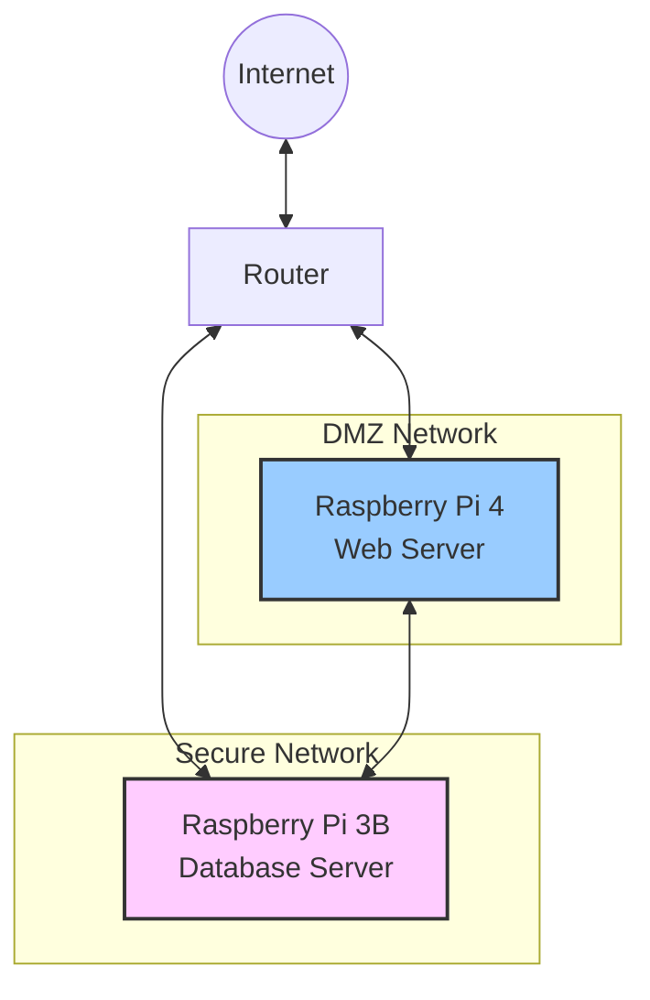

# Deployment Guide

## Overview

This document provides step-by-step instructions for deploying the Personal Database Assistant system, which consists of a database server (Raspberry Pi 3B) and a web application server (Raspberry Pi 4). The guide ensures a smooth installation while maintaining security isolation between components.

## Deployment Architecture

The system uses a two-server architecture with network isolation:



## Prerequisites

### Hardware Requirements

1. **Raspberry Pi 3B** (Database Server)
   - 32GB+ microSD card (Class 10)
   - Power supply
   - Ethernet connection

2. **Raspberry Pi 4** (Web Application Server)
   - 4GB+ RAM recommended
   - 64GB+ microSD card (Class 10)
   - Power supply
   - Ethernet connection
   - Optional: Case with cooling fan

3. **Network Equipment**
   - Router with VLAN support
   - Ethernet cables
   - Internet connection

### Software Prerequisites

1. **Raspberry Pi OS Images**
   - Raspberry Pi OS (64-bit recommended for Pi 4)
   - Raspberry Pi Imager tool

2. **Development Machine**
   - SSH client
   - Git
   - Text editor
   - Terminal

3. **Required Accounts**
   - GitHub account (if using private repositories)
   - Dynamic DNS service account (optional)
   - OpenAI API account
   - Google Cloud Platform account (for Gmail API)

## Deployment Steps

### Phase 1: Network Setup

#### 1.1. Router Configuration

1. **Set up VLANs**:
   ```
   VLAN 1 (ID: 10) - DMZ Network
   VLAN 2 (ID: 20) - Secure Network
   ```

2. **Configure IP Ranges**:
   ```
   DMZ Network: 192.168.1.0/24
   Secure Network: 192.168.2.0/24
   ```

3. **Configure Firewall Rules**:
   ```
   Allow: Internet → Pi4 (HTTPS, port 443)
   Allow: Pi4 → Internet (HTTP/HTTPS)
   Allow: Pi4 → Pi3B (API, port 8000)
   Deny: Internet → Pi3B (all ports)
   Deny: Pi3B → Internet (all ports)
   ```

4. **Set up Static DHCP Reservations**:
   ```
   Pi4 MAC Address → 192.168.1.10
   Pi3B MAC Address → 192.168.2.10
   ```

5. **Configure Port Forwarding**:
   ```
   External port 443 → 192.168.1.10:443
   ```

#### 1.2. Dynamic DNS Setup (Optional)

1. Create an account with a dynamic DNS provider (DuckDNS, No-IP, etc.)
2. Register a domain name (e.g., yourdomain.duckdns.org)
3. Install the dynamic DNS client on the Raspberry Pi 4
4. Configure automatic IP updates

### Phase 2: Database Server Setup (Raspberry Pi 3B)

#### 2.1. Operating System Installation

1. **Flash Raspberry Pi OS**:
   ```bash
   # Use Raspberry Pi Imager
   # Select Raspberry Pi OS (32-bit)
   # Configure:
   # - Enable SSH
   # - Set hostname: db-server
   # - Set username/password
   # - Configure WiFi (if needed)
   ```

2. **First Boot and Updates**:
   ```bash
   # Connect via SSH
   ssh pi@192.168.2.10
   
   # Update system
   sudo apt update
   sudo apt upgrade -y
   
   # Install essential packages
   sudo apt install -y vim git python3-pip python3-venv postgresql libpq-dev supervisor
   ```

#### 2.2. PostgreSQL Setup

1. **Configure PostgreSQL**:
   ```bash
   # Secure PostgreSQL to listen only on localhost
   sudo sed -i "s/#listen_addresses = 'localhost'/listen_addresses = 'localhost'/g" /etc/postgresql/13/main/postgresql.conf
   
   # Restart PostgreSQL
   sudo systemctl restart postgresql
   
   # Create database and user
   sudo -u postgres createuser db_user
   sudo -u postgres createdb personal_database
   sudo -u postgres psql -c "ALTER USER db_user WITH ENCRYPTED PASSWORD 'secure_password';"
   sudo -u postgres psql -c "GRANT ALL PRIVILEGES ON DATABASE personal_database TO db_user;"
   ```

#### 2.3. Application Setup

1. **Clone Repository**:
   ```bash
   # Create application directory
   mkdir -p ~/database_server
   cd ~/database_server
   
   # Clone repository (use HTTPS or SSH)
   git clone https://github.com/yourusername/database-server.git .
   
   # If private repository, you'll need to authenticate
   ```

2. **Create Virtual Environment**:
   ```bash
   # Create and activate virtualenv
   python3 -m venv venv
   source venv/bin/activate
   
   # Install requirements
   pip install -r requirements.txt
   ```

3. **Environment Configuration**:
   ```bash
   # Create .env file
   cp .env.example .env
   
   # Edit configuration
   nano .env
   ```

   Configure the following key parameters:
   ```
   DJANGO_SECRET_KEY=<generate_a_secure_random_key>
   DEBUG=False
   ALLOWED_HOSTS=localhost,127.0.0.1,192.168.2.10
   
   DB_NAME=personal_database
   DB_USER=db_user
   DB_PASSWORD=secure_password
   DB_HOST=localhost
   DB_PORT=5432
   
   API_KEYS=<generate_a_secure_api_key_for_web_server>
   ALLOWED_API_IPS=192.168.1.10
   ```

4. **Database Initialization**:
   ```bash
   # Apply migrations
   python manage.py migrate
   
   # Create superuser
   python manage.py createsuperuser
   
   # Collect static files
   python manage.py collectstatic --noinput
   ```

5. **Import Initial Data** (Optional):
   ```bash
   # If you have a database dump
   python manage.py loaddata initial_data.json
   ```

#### 2.4. Service Configuration

1. **Configure Supervisor**:
   ```bash
   # Create log directory
   sudo mkdir -p /var/log/database_server
   sudo chown pi:pi /var/log/database_server
   
   # Create supervisor configuration
   sudo nano /etc/supervisor/conf.d/database_server.conf
   ```

   Add the following configuration:
   ```ini
   [program:database_server]
   command=/home/pi/database_server/venv/bin/gunicorn --workers 2 --bind 0.0.0.0:8000 config.wsgi:application
   directory=/home/pi/database_server
   user=pi
   autostart=true
   autorestart=true
   redirect_stderr=true
   stdout_logfile=/var/log/database_server/gunicorn.log
   environment=
       DJANGO_SETTINGS_MODULE="config.settings.production",
       DJANGO_SECRET_KEY="%(ENV_DJANGO_SECRET_KEY)s",
       DEBUG="False"
   ```

2. **Start Service**:
   ```bash
   # Reload supervisor configuration
   sudo supervisorctl reread
   sudo supervisorctl update
   
   # Check status
   sudo supervisorctl status database_server
   ```

3. **Test API**:
   ```bash
   # Test locally
   curl -H "Authorization: Api-Key YOUR_API_KEY" http://localhost:8000/api/v1/health/
   
   # Should return: {"status": "success", "message": "API is operational"}
   ```

### Phase 3: Web Application Server Setup (Raspberry Pi 4)

#### 3.1. Operating System Installation

1. **Flash Raspberry Pi OS**:
   ```bash
   # Use Raspberry Pi Imager
   # Select Raspberry Pi OS (64-bit)
   # Configure:
   # - Enable SSH
   # - Set hostname: web-server
   # - Set username/password
   # - Configure WiFi (if needed)
   ```

2. **First Boot and Updates**:
   ```bash
   # Connect via SSH
   ssh pi@192.168.1.10
   
   # Update system
   sudo apt update
   sudo apt upgrade -y
   
   # Install essential packages
   sudo apt install -y vim git python3-pip python3-venv redis-server nginx certbot python3-certbot-nginx supervisor curl
   
   # Install Node.js
   curl -fsSL https://deb.nodesource.com/setup_16.x | sudo -E bash -
   sudo apt install -y nodejs
   ```

#### 3.2. Redis Setup

1. **Configure Redis**:
   ```bash
   # Secure Redis
   sudo nano /etc/redis/redis.conf
   ```

   Make the following changes:
   ```
   # Bind to localhost only
   bind 127.0.0.1
   
   # Set password
   requirepass your_redis_password
   ```

   ```bash
   # Restart Redis
   sudo systemctl restart redis-server
   ```

#### 3.3. Application Setup

1. **Clone Repository**:
   ```bash
   # Create application directory
   mkdir -p ~/web_server
   cd ~/web_server
   
   # Clone repository (use HTTPS or SSH)
   git clone https://github.com/yourusername/web-server.git .
   
   # If private repository, you'll need to authenticate
   ```

2. **Create Virtual Environment**:
   ```bash
   # Create and activate virtualenv
   python3 -m venv venv
   source venv/bin/activate
   
   # Install requirements
   pip install -r requirements.txt
   ```

3. **Environment Configuration**:
   ```bash
   # Create .env file
   cp .env.example .env
   
   # Edit configuration
   nano .env
   ```

   Configure the following key parameters:
   ```
   DJANGO_SECRET_KEY=<generate_a_secure_random_key>
   DEBUG=False
   ALLOWED_HOSTS=localhost,127.0.0.1,192.168.1.10,yourdomain.duckdns.org
   
   DATABASE_API_URL=http://192.168.2.10:8000/api/v1
   DATABASE_API_KEY=<same_api_key_configured_on_database_server>
   
   REDIS_HOST=localhost
   REDIS_PORT=6379
   REDIS_PASSWORD=your_redis_password
   
   OPENAI_API_KEY=your_openai_api_key
   GMAIL_OAUTH_CLIENT_ID=your_google_client_id
   GMAIL_OAUTH_CLIENT_SECRET=your_google_client_secret
   ```

4. **Frontend Build**:
   ```bash
   # Install frontend dependencies
   cd frontend
   npm install
   
   # Build frontend
   npm run build
   
   # Return to project root
   cd ..
   ```

5. **Django Setup**:
   ```bash
   # Apply migrations (if any)
   python manage.py migrate
   
   # Create superuser
   python manage.py createsuperuser
   
   # Collect static files
   python manage.py collectstatic --noinput
   ```

#### 3.4. SSL Certificate Setup

1. **Obtain SSL Certificate**:
   ```bash
   # Issue certificate with Let's Encrypt
   sudo certbot --nginx -d yourdomain.duckdns.org
   
   # Follow the prompts
   ```

2. **Configure Auto-renewal**:
   ```bash
   # Add to crontab
   echo "0 0 * * 0 certbot renew --quiet" | sudo tee -a /etc/crontab
   ```

#### 3.5. Nginx Configuration

1. **Create Nginx Configuration**:
   ```bash
   # Create configuration file
   sudo nano /etc/nginx/sites-available/web_server
   ```

   Add the following configuration:
   ```nginx
   server {
       listen 80;
       server_name yourdomain.duckdns.org;
       
       # Redirect HTTP to HTTPS
       return 301 https://$host$request_uri;
   }

   server {
       listen 443 ssl;
       server_name yourdomain.duckdns.org;
       
       ssl_certificate /etc/letsencrypt/live/yourdomain.duckdns.org/fullchain.pem;
       ssl_certificate_key /etc/letsencrypt/live/yourdomain.duckdns.org/privkey.pem;
       
       # SSL configuration
       ssl_protocols TLSv1.2 TLSv1.3;
       ssl_prefer_server_ciphers on;
       ssl_ciphers ECDHE-ECDSA-AES128-GCM-SHA256:ECDHE-RSA-AES128-GCM-SHA256;
       ssl_session_cache shared:SSL:10m;
       ssl_session_timeout 1d;
       ssl_session_tickets off;
       
       # Security headers
       add_header Strict-Transport-Security "max-age=31536000; includeSubDomains" always;
       add_header X-Frame-Options DENY;
       add_header X-Content-Type-Options nosniff;
       add_header X-XSS-Protection "1; mode=block";
       
       # Static files
       location /static/ {
           alias /home/pi/web_server/staticfiles/;
           expires 1d;
       }
       
       location /media/ {
           alias /home/pi/web_server/media/;
           expires 1d;
       }
       
       # Proxy to Gunicorn
       location / {
           proxy_pass http://127.0.0.1:8000;
           proxy_set_header Host $host;
           proxy_set_header X-Real-IP $remote_addr;
           proxy_set_header X-Forwarded-For $proxy_add_x_forwarded_for;
           proxy_set_header X-Forwarded-Proto $scheme;
           proxy_redirect off;
           proxy_buffering off;
           proxy_read_timeout 300s;
       }
   }
   ```

2. **Enable Configuration**:
   ```bash
   # Enable site
   sudo ln -s /etc/nginx/sites-available/web_server /etc/nginx/sites-enabled/
   
   # Remove default site
   sudo rm /etc/nginx/sites-enabled/default
   
   # Test configuration
   sudo nginx -t
   
   # Restart Nginx
   sudo systemctl restart nginx
   ```

#### 3.6. Service Configuration

1. **Create Log Directories**:
   ```bash
   # Create log directories
   sudo mkdir -p /var/log/web_server/celery
   sudo chown -R pi:pi /var/log/web_server
   ```

2. **Configure Supervisor**:
   ```bash
   # Create supervisor configuration
   sudo nano /etc/supervisor/conf.d/web_server.conf
   ```

   Add the following configuration:
   ```ini
   [program:web_server]
   command=/home/pi/web_server/venv/bin/gunicorn --workers 3 --bind 127.0.0.1:8000 config.wsgi:application
   directory=/home/pi/web_server
   user=pi
   autostart=true
   autorestart=true
   redirect_stderr=true
   stdout_logfile=/var/log/web_server/gunicorn.log
   environment=
       DJANGO_SETTINGS_MODULE="config.settings.production",
       DJANGO_SECRET_KEY="%(ENV_DJANGO_SECRET_KEY)s",
       DEBUG="False"

   [program:celery_worker]
   command=/home/pi/web_server/venv/bin/celery -A config worker --loglevel=info
   directory=/home/pi/web_server
   user=pi
   autostart=true
   autorestart=true
   redirect_stderr=true
   stdout_logfile=/var/log/web_server/celery/worker.log
   environment=
       DJANGO_SETTINGS_MODULE="config.settings.production",
       DJANGO_SECRET_KEY="%(ENV_DJANGO_SECRET_KEY)s",
       DEBUG="False"

   [program:celery_beat]
   command=/home/pi/web_server/venv/bin/celery -A config beat --loglevel=info
   directory=/home/pi/web_server
   user=pi
   autostart=true
   autorestart=true
   redirect_stderr=true
   stdout_logfile=/var/log/web_server/celery/beat.log
   environment=
       DJANGO_SETTINGS_MODULE="config.settings.production",
       DJANGO_SECRET_KEY="%(ENV_DJANGO_SECRET_KEY)s",
       DEBUG="False"
   ```

3. **Start Services**:
   ```bash
   # Reload supervisor configuration
   sudo supervisorctl reread
   sudo supervisorctl update
   
   # Check status
   sudo supervisorctl status
   ```

### Phase 4: System Validation

#### 4.1. Connectivity Testing

1. **Test Database API Connectivity**:
   ```bash
   # From the web server
   curl -H "Authorization: Api-Key YOUR_API_KEY" http://192.168.2.10:8000/api/v1/health/
   
   # Should return: {"status": "success", "message": "API is operational"}
   ```

2. **Test Web Server Functionality**:
   ```bash
   # Local test
   curl https://localhost/api/health/ -k
   
   # Should return: {"status": "success", "message": "Web server is operational"}
   ```

3. **Test External Access**:
   - Open a browser on a different device
   - Navigate to `https://yourdomain.duckdns.org`
   - Verify that the login page loads correctly

#### 4.2. Full Integration Testing

1. **Login Test**:
   - Login with the superuser account
   - Verify that you can access the dashboard

2. **Database Query Test**:
   - Navigate to the Assets section
   - Verify that assets are displayed (if any exist)
   - Create a new asset and verify it appears in the list

3. **AI Integration Test**:
   - Navigate to the AI Chat interface
   - Ask a simple question like "Show me my assets"
   - Verify that the AI responds with appropriate data

4. **Gmail Integration Test** (if configured):
   - Navigate to the Email section
   - Connect a Gmail account
   - Verify that emails are synced and displayed

### Phase 5: Post-Deployment Tasks

#### 5.1. Security Hardening

1. **Update Packages**:
   ```bash
   # On both Raspberry Pis
   sudo apt update
   sudo apt upgrade -y
   ```

2. **Secure SSH**:
   ```bash
   # Edit SSH configuration
   sudo nano /etc/ssh/sshd_config
   ```

   Make the following changes:
   ```
   # Disable password authentication
   PasswordAuthentication no
   
   # Use key-based authentication instead
   PubkeyAuthentication yes
   
   # Disable root login
   PermitRootLogin no
   ```

   ```bash
   # Restart SSH service
   sudo systemctl restart sshd
   ```

3. **Set up Fail2Ban** (optional):
   ```bash
   # Install Fail2Ban
   sudo apt install -y fail2ban
   
   # Configure and start service
   sudo cp /etc/fail2ban/jail.conf /etc/fail2ban/jail.local
   sudo systemctl enable fail2ban
   sudo systemctl start fail2ban
   ```

#### 5.2. Backup Configuration

1. **Set up Database Backup**:
   ```bash
   # On the database server
   mkdir -p ~/backups
   
   # Create backup script
   nano ~/backup-database.sh
   ```

   Add the following content:
   ```bash
   #!/bin/bash
   TIMESTAMP=$(date +"%Y%m%d-%H%M%S")
   BACKUP_DIR=$HOME/backups
   
   pg_dump -U db_user personal_database > $BACKUP_DIR/db_backup_$TIMESTAMP.sql
   
   # Keep only the 10 most recent backups
   ls -t $BACKUP_DIR/db_backup_*.sql | tail -n +11 | xargs rm -f
   ```

   ```bash
   # Make script executable
   chmod +x ~/backup-database.sh
   
   # Add to crontab
   (crontab -l 2>/dev/null; echo "0 2 * * * $HOME/backup-database.sh") | crontab -
   ```

2. **Set up Configuration Backup**:
   ```bash
   # On both servers
   mkdir -p ~/backups/config
   
   # Create backup script
   nano ~/backup-config.sh
   ```

   Add the following content:
   ```bash
   #!/bin/bash
   TIMESTAMP=$(date +"%Y%m%d-%H%M%S")
   BACKUP_DIR=$HOME/backups/config
   
   # Copy important configuration files
   cp ~/.env $BACKUP_DIR/.env.$TIMESTAMP
   
   # If this is the web server
   if [ -f /etc/nginx/sites-available/web_server ]; then
       cp /etc/nginx/sites-available/web_server $BACKUP_DIR/nginx.$TIMESTAMP
   fi
   
   # Keep only the 10 most recent backups
   ls -t $BACKUP_DIR/.env.* | tail -n +11 | xargs rm -f
   if [ -f /etc/nginx/sites-available/web_server ]; then
       ls -t $BACKUP_DIR/nginx.* | tail -n +11 | xargs rm -f
   fi
   ```

   ```bash
   # Make script executable
   chmod +x ~/backup-config.sh
   
   # Add to crontab
   (crontab -l 2>/dev/null; echo "0 3 * * * $HOME/backup-config.sh") | crontab -
   ```

#### 5.3. Monitoring Setup

1. **Install Basic Monitoring Tools**:
   ```bash
   # On both servers
   sudo apt install -y htop iotop
   ```

2. **Set up Log Rotation**:
   ```bash
   # Configure logrotate
   sudo nano /etc/logrotate.d/personal-db-assistant
   ```

   Add the following content:
   ```
   /var/log/web_server/*.log {
       daily
       missingok
       rotate 14
       compress
       delaycompress
       notifempty
       create 0640 pi pi
   }
   
   /var/log/database_server/*.log {
       daily
       missingok
       rotate 14
       compress
       delaycompress
       notifempty
       create 0640 pi pi
   }
   ```

## Maintenance Procedures

### System Updates

1. **Operating System Updates**:
   ```bash
   # On both servers
   sudo apt update
   sudo apt upgrade -y
   
   # If kernel is updated
   sudo reboot
   ```

2. **Application Updates**:
   ```bash
   # On both servers
   cd ~/[web_server or database_server]
   
   # Pull latest changes
   git pull
   
   # Activate virtual environment
   source venv/bin/activate
   
   # Install updated dependencies
   pip install -r requirements.txt
   
   # Apply migrations (if any)
   python manage.py migrate
   
   # Collect static files (web server only)
   python manage.py collectstatic --noinput
   
   # Restart services
   sudo supervisorctl restart all
   ```

### Database Maintenance

1. **Database Backup**:
   ```bash
   # On database server
   ~/backup-database.sh
   ```

2. **Database Vacuum**:
   ```bash
   # Connect to PostgreSQL
   sudo -u postgres psql
   
   # Run vacuum
   \c personal_database
   VACUUM ANALYZE;
   
   # Exit
   \q
   ```

### Certificate Renewal

1. **Renew SSL Certificate**:
   ```bash
   # On web server
   sudo certbot renew
   ```

### Service Monitoring and Restart

1. **Check Service Status**:
   ```bash
   # On both servers
   sudo supervisorctl status
   ```

2. **Restart Services**:
   ```bash
   # Restart specific service
   sudo supervisorctl restart [service_name]
   
   # Restart all services
   sudo supervisorctl restart all
   ```

## Troubleshooting

### Common Issues and Solutions

1. **Web Server Not Accessible**
   - Check if Nginx is running: `sudo systemctl status nginx`
   - Check Nginx error logs: `sudo tail -f /var/log/nginx/error.log`
   - Verify that Gunicorn is running: `sudo supervisorctl status web_server`

2. **Database API Connection Issues**
   - Verify network connectivity: `ping 192.168.2.10`
   - Check if API is running: `sudo supervisorctl status database_server`
   - Verify API key configuration in web server's `.env` file
   - Check API logs: `tail -f /var/log/database_server/gunicorn.log`

3. **Redis Issues**
   - Check if Redis is running: `sudo systemctl status redis-server`
   - Verify Redis connectivity: `redis-cli -a [password] ping`
   - Check Redis configuration in web server's `.env` file

4. **Frontend Not Loading Correctly**
   - Rebuild frontend: 
     ```bash
     cd ~/web_server/frontend
     npm run build
     sudo supervisorctl restart web_server
     ```

5. **SSL Certificate Issues**
   - Check certificate status: `sudo certbot certificates`
   - Renew certificate: `sudo certbot renew --dry-run`
   - Check Nginx configuration: `sudo nginx -t`

### Viewing Logs

1. **Web Server Logs**:
   ```bash
   # Nginx access logs
   sudo tail -f /var/log/nginx/access.log
   
   # Nginx error logs
   sudo tail -f /var/log/nginx/error.log
   
   # Gunicorn logs
   tail -f /var/log/web_server/gunicorn.log
   
   # Celery worker logs
   tail -f /var/log/web_server/celery/worker.log
   
   # Celery beat logs
   tail -f /var/log/web_server/celery/beat.log
   ```

2. **Database Server Logs**:
   ```bash
   # Gunicorn logs
   tail -f /var/log/database_server/gunicorn.log
   
   # PostgreSQL logs
   sudo tail -f /var/log/postgresql/postgresql-13-main.log
   ```

### Checking Resource Usage

```bash
# CPU and memory usage
htop

# Disk usage
df -h

# I/O statistics
iotop
```

## Rollback Procedures

### Application Rollback

1. **Roll Back to Previous Version**:
   ```bash
   # On affected server
   cd ~/[web_server or database_server]
   
   # Checkout previous version
   git log --oneline -10  # Find the commit to roll back to
   git checkout [commit_hash]
   
   # Reactivate environment and reinstall dependencies
   source venv/bin/activate
   pip install -r requirements.txt
   
   # Apply migrations if needed
   python manage.py migrate
   
   # Collect static files (web server only)
   python manage.py collectstatic --noinput
   
   # Restart services
   sudo supervisorctl restart all
   ```

### Database Rollback

1. **Restore from Backup**:
   ```bash
   # On database server
   # Stop database server
   sudo supervisorctl stop database_server
   
   # Drop and recreate database
   sudo -u postgres dropdb personal_database
   sudo -u postgres createdb personal_database
   sudo -u postgres psql -c "GRANT ALL PRIVILEGES ON DATABASE personal_database TO db_user;"
   
   # Restore from backup
   psql -U db_user personal_database < ~/backups/db_backup_[timestamp].sql
   
   # Restart database server
   sudo supervisorctl start database_server
   ```

## Conclusion

This deployment guide provides comprehensive instructions for setting up the Personal Database Assistant system. By following these steps, you can establish a secure and functional deployment that separates the database server from internet exposure while providing a user-friendly web interface.

Remember to regularly back up your data and configuration files, monitor system performance, and keep the software updated to ensure long-term stability and security. 