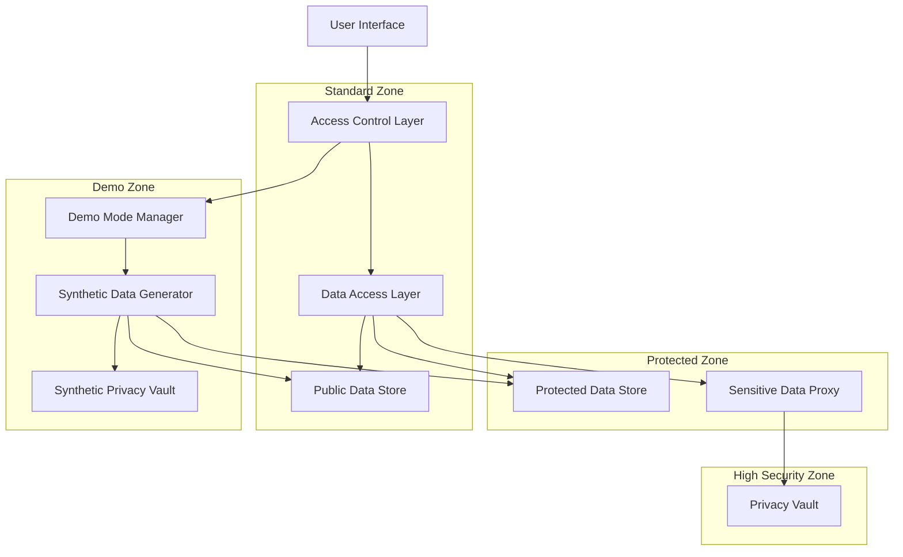
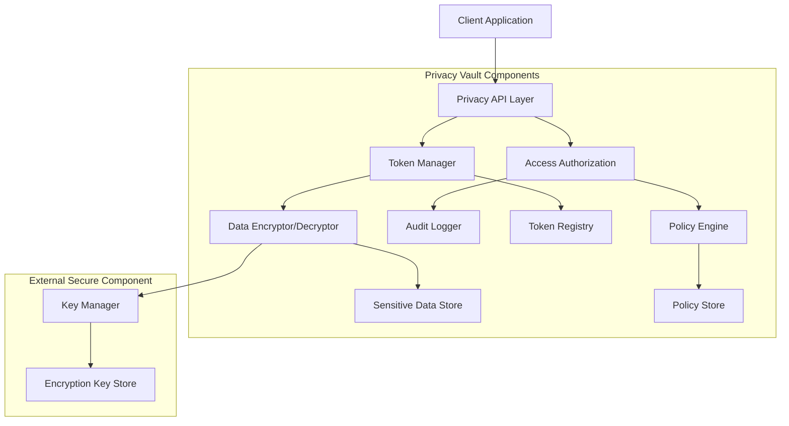
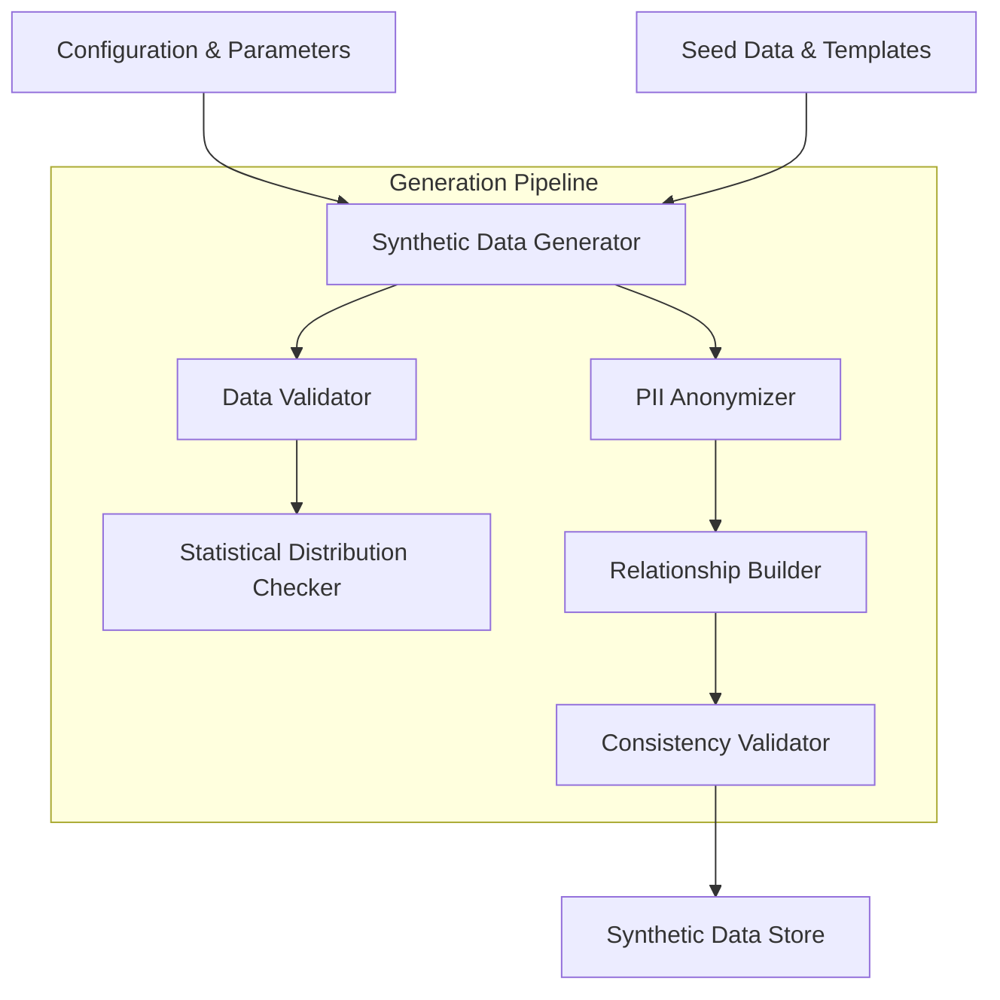
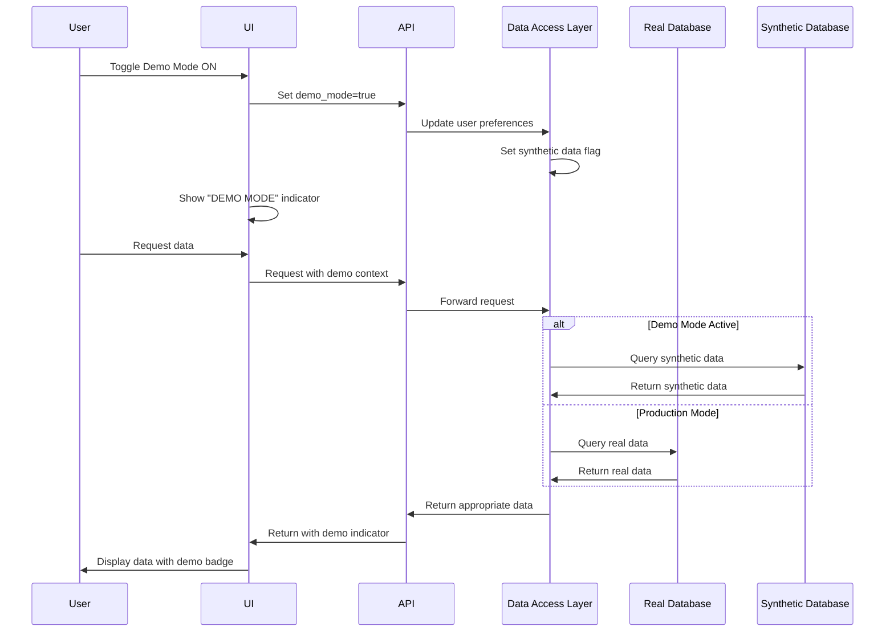

# Data Privacy Strategy

## Overview

This document outlines the comprehensive data privacy strategy for the Personal Database Assistant. It details the architectural approach to protecting sensitive data, implementing privacy by design principles, and providing synthetic data alternatives for demonstrations and testing.

## Data Privacy Architecture

### Privacy-by-Design Principles

The Personal Database Assistant implements privacy-by-design principles throughout its architecture:

1. **Proactive not Reactive; Preventative not Remedial**
   - Privacy protections are built into the system architecture
   - Privacy impact assessments conducted during design
   - Data minimization principles applied to all data collection

2. **Privacy as the Default Setting**
   - Maximum privacy protection enabled by default
   - Opt-in required for data sharing, not opt-out
   - Most restrictive access controls applied as baseline

3. **Privacy Embedded into Design**
   - Privacy controls integrated into core functionality
   - Data Protection capabilities built into database schema
   - Separation of sensitive and non-sensitive data

4. **Full Functionality — Positive-Sum, not Zero-Sum**
   - Privacy features do not reduce system functionality
   - Security and usability balanced with privacy needs
   - Multiple privacy tiers available based on user needs

5. **End-to-End Security — Full Lifecycle Protection**
   - Data protected from collection to destruction
   - Secure data transmission, processing, and storage
   - Proper data deletion and anonymization procedures

6. **Visibility and Transparency — Keep it Open**
   - Clear privacy policies communicated to users
   - Audit logs available for all data access
   - Data processing activities documented and accessible

7. **Respect for User Privacy — Keep it User-Centric**
   - User controls for privacy preferences
   - Data access and correction capabilities
   - Consent management for processing activities

### High-Level Privacy Architecture



## Data Privacy Vault

### Core Concepts

The Data Privacy Vault serves as the central security component for protecting sensitive data:

1. **Tokenization**
   - Replaces sensitive data with non-sensitive tokens
   - Original data stored only in the Privacy Vault
   - References in main database use tokens only
   - Tokens contain no sensitive information

2. **Purpose-Based Access**
   - All data access requires explicit purpose declaration
   - Purposes must be pre-approved and limited in scope
   - System enforces purpose limitation throughout data lifecycle
   - Access policies defined per data type and purpose

3. **Secure Encryption**
   - All sensitive data encrypted at rest and in transit
   - Encryption keys managed in a separate key management system
   - Regular key rotation with secure transition periods
   - Multiple encryption layers for defense in depth

4. **Comprehensive Auditing**
   - All access to sensitive data logged in detail
   - Immutable audit records for compliance
   - Real-time monitoring for unusual access patterns
   - Regular audit review procedures

### Vault Architecture



### Tokenization Process

1. **Data Submission**
   - Application submits sensitive data to Privacy Vault
   - Privacy Vault validates data format and type
   - Access controls verified for submission rights

2. **Token Generation**
   - Privacy Vault generates unique token for data
   - Token format: `tkn_[type]_[uuid]`
   - Example: `tkn_iban_a1b2c3d4e5f6`
   - Tokens contain no sensitive information

3. **Data Storage**
   - Privacy Vault encrypts sensitive data
   - Encrypted data stored in isolated secure storage
   - Token-to-data mapping maintained in secure registry
   - Original data never leaves the vault unencrypted

4. **Data Retrieval**
   - Application submits token and purpose to Privacy Vault
   - Privacy Vault validates access rights for purpose
   - If approved, returns decrypted data with time limitation
   - All access recorded in audit logs

## Data Classification

The Personal Database Assistant classifies all data according to sensitivity:

### Public Data (Low Sensitivity)

General information with minimal privacy concerns.

**Examples:**
- Asset category names
- Transaction categories
- Bank names and public details
- Document types

**Protection Measures:**
- Standard access controls
- Authenticated API access
- Basic input validation
- Regular backups

### Protected Data (Medium Sensitivity)

Information with moderate sensitivity that requires protection but is not highly risky.

**Examples:**
- Asset names and descriptions
- Transaction dates and general descriptions
- Document metadata
- Email subjects and metadata

**Protection Measures:**
- Role-based access controls
- Rate limiting on APIs
- Encrypted transmission
- Audit logging of significant changes
- Data minimization in responses

### Sensitive Data (High Sensitivity)

Information that could lead to significant harm if disclosed improperly.

**Examples:**
- Bank account numbers and financial details
- Personal identification information
- Complete transaction details
- Tax information and financial reports
- Exact asset locations and values

**Protection Measures:**
- Storage in Data Privacy Vault
- Tokenization in main database
- Purpose-based access control
- Short-lived access grants
- Comprehensive audit logging
- Encryption at rest and in transit

## Synthetic Data Generation

### Synthetic Data Architecture

The synthetic data generation system creates realistic but non-sensitive data for demonstrations, testing, and development.



### Data Generation Process

1. **Configuration**
   - Define entity types to generate
   - Specify volume requirements
   - Set statistical distributions
   - Configure time ranges and value constraints

2. **Primary Entity Generation**
   - Generate core entities first (users, assets)
   - Ensure realistic attribute values
   - Apply clear "demo/synthetic" markers
   - Validate against statistical expectations

3. **Relationship Building**
   - Create related entities with proper references
   - Maintain referential integrity
   - Build realistic ownership and transaction patterns
   - Ensure temporal consistency (correct date ordering)

4. **Consistency Validation**
   - Verify all generated data meets business rules
   - Check financial calculations balance correctly
   - Validate all required relationships are present
   - Ensure temporal consistency across entities

5. **Demo Mode Activation**
   - Register synthetic dataset in system
   - Update synthetic data flags for all affected tables
   - Configure data access layer to use synthetic data
   - Set clear visual indicators for demo mode

### Synthetic Data Characteristics

All synthetic data follows specific patterns to ensure it is clearly identifiable as non-production data:

1. **Identifiable Markers**
   - Usernames always prefixed with "demo_"
   - Email addresses use domain "@example.com"
   - Assets contain "Demo" in their names
   - Clear visual indicators in UI when viewing synthetic data

2. **Realistic Patterns**
   - Transaction patterns follow realistic financial behaviors
   - Asset values reflect real-world market distributions
   - Temporal data follows meaningful patterns (seasonal trends)
   - Document types and metadata mirror production patterns

3. **Non-Sensitive Content**
   - No real personal identifiers ever used
   - Financial data uses realistic patterns but fictional values
   - Addresses use valid formats but fictional locations
   - Documents contain synthetic content only

## Demo Mode Implementation

### Demo Mode Toggle

The system provides a controlled mechanism to switch between real and synthetic data:

1. **Access Control**
   - Demo mode toggle requires specific permission
   - Administrators can force demo mode for specific users
   - Demo mode status clearly visible in UI
   - All demo mode activations logged for audit

2. **Data Access Layer**
   - Data access components route requests based on mode
   - Consistent interface regardless of data source
   - No mixing of real and synthetic data in queries
   - Cache isolation between real and synthetic data

3. **API Behavior**
   - APIs accept demo mode parameter
   - Documentation clearly indicates demo mode capabilities
   - Rate limits may be different for demo mode
   - Response headers indicate synthetic data usage

### Demo Mode User Experience



## Data Privacy Lifecycle Management

### Data Collection

1. **Consent Management**
   - Clear purpose specification for each data type
   - Granular consent options for users
   - Consent records maintained with timestamps
   - Ability to review and modify consent

2. **Data Minimization**
   - Only collect data necessary for stated purposes
   - Define retention periods at collection time
   - Structurally separate required vs. optional data
   - Regular review of collected data necessity

### Data Storage

1. **Storage Segmentation**
   - Sensitive data stored only in Privacy Vault
   - Protected data stored in secure database with access controls
   - Public data stored in standard database tables
   - Physical and logical separation of data stores

2. **Encryption Strategy**
   - Data at rest encrypted with strong algorithms
   - Encryption key management with regular rotation
   - Different encryption schemes based on sensitivity
   - Dedicated encryption for backups

### Data Access

1. **Principle of Least Privilege**
   - Access limited to minimum necessary for function
   - Time-limited access for sensitive operations
   - Regular access review and removal of unused rights
   - Context-based access controls (time, location)

2. **Access Tracking**
   - Comprehensive logging of all sensitive data access
   - Both successful and failed access attempts recorded
   - Real-time alerting for suspicious access patterns
   - Regular access audit reviews

### Data Retention and Deletion

1. **Retention Policies**
   - Clear retention periods for each data category
   - Automated enforcement of retention periods
   - Business need justification for extended retention
   - Regular review of retained data

2. **Secure Deletion**
   - Proper deletion from all storage locations
   - Secure wiping techniques for sensitive data
   - Verification of deletion completion
   - Deletion records for compliance purposes

## Security Measures

### Network Security

1. **Segmentation**
   - Privacy Vault in isolated network segment
   - Strict firewall rules limiting access
   - Network-level encryption for all traffic
   - Regular network security testing

2. **Monitoring**
   - Intrusion detection systems
   - Anomaly detection for unusual traffic
   - Regular security scanning
   - Real-time alerting for security events

### Application Security

1. **Secure Development**
   - Security requirements in design phase
   - Regular code reviews for security issues
   - Static and dynamic security testing
   - Dependency vulnerability scanning

2. **API Security**
   - Input validation on all parameters
   - Rate limiting and anti-automation measures
   - API keys with limited scopes
   - Regular API security assessments

### Physical Security

1. **Server Security**
   - Privacy Vault hosted in high-security facilities
   - Multi-factor access control for physical access
   - Environmental controls and monitoring
   - Regular physical security assessments

## Privacy Compliance

### Regulatory Framework Support

The Personal Database Assistant implements controls to support compliance with:

1. **GDPR Requirements**
   - Data subject access rights implementation
   - Breach notification procedures
   - Data protection impact assessments
   - Lawful basis documentation for processing

2. **Financial Data Regulations**
   - Secure handling of financial information
   - Transaction record security
   - Audit trails for financial operations
   - Data retention compliance

### Privacy Impact Assessment

1. **Assessment Process**
   - Privacy impact assessment for all new features
   - Documentation of privacy risks and mitigations
   - Regular review of existing functionality
   - Stakeholder input and review

2. **Risk Management**
   - Privacy risk register maintenance
   - Risk mitigation planning
   - Regular testing of privacy controls
   - Continuous improvement process

## Implementation Guidelines

### Development Best Practices

1. **Accessing the Privacy Vault**
   ```javascript
   // Example: Storing sensitive data in the Privacy Vault
   async function storeAccountNumber(accountNumber, userId) {
     try {
       // Always validate data before sending to Privacy Vault
       if (!validateAccountNumber(accountNumber)) {
         throw new Error('Invalid account number format');
       }
       
       const response = await fetch('https://api.privacyvault.example/tokenize', {
         method: 'POST',
         headers: {
           'Authorization': `Bearer ${await getServiceToken()}`,
           'Content-Type': 'application/json'
         },
         body: JSON.stringify({
           data_type: 'account_number',
           value: accountNumber,
           owner_id: userId,
           data_policy: 'financial_standard'
         })
       });
       
       if (!response.ok) {
         throw new Error(`Privacy Vault error: ${response.status}`);
       }
       
       const { token } = await response.json();
       
       // Store only the token in your main database
       return token;
     } catch (error) {
       // Log error securely (without sensitive data)
       logError('Failed to store account number', error);
       throw new Error('Failed to securely store account information');
     }
   }
   ```

2. **Retrieving Sensitive Data**
   ```javascript
   // Example: Retrieving sensitive data with purpose limitation
   async function getAccountDetails(accountToken, userId, purpose) {
     try {
       // Always specify purpose and validate authorization
       if (!userHasPermission(userId, purpose)) {
         throw new Error('User not authorized for this purpose');
       }
       
       const response = await fetch('https://api.privacyvault.example/detokenize', {
         method: 'POST',
         headers: {
           'Authorization': `Bearer ${await getServiceToken()}`,
           'Content-Type': 'application/json'
         },
         body: JSON.stringify({
           token: accountToken,
           purpose: purpose,
           user_id: userId,
           justification: 'User requested account details view'
         })
       });
       
       if (response.status === 403) {
         throw new Error('Access denied for requested purpose');
       }
       
       if (!response.ok) {
         throw new Error(`Privacy Vault error: ${response.status}`);
       }
       
       const { value, expiration } = await response.json();
       
       // Ensure data is only used for specified purpose
       // and destroyed after use
       try {
         return processAccountData(value, purpose);
       } finally {
         // Securely clear sensitive data from memory
         securelyWipeVariable(value);
       }
     } catch (error) {
       logError('Failed to retrieve account details', error);
       throw new Error('Unable to access account information');
     }
   }
   ```

3. **Generating Synthetic Data**
   ```javascript
   // Example: Requesting synthetic data generation
   async function generateSyntheticDataset(parameters) {
     try {
       // Validate permissions
       if (!currentUser.hasPermission('synthetic_data:generate')) {
         throw new Error('Not authorized to generate synthetic data');
       }
       
       const response = await fetch('https://api.synthetic.example/generate', {
         method: 'POST',
         headers: {
           'Authorization': `Bearer ${await getAdminToken()}`,
           'Content-Type': 'application/json'
         },
         body: JSON.stringify({
           entity_types: parameters.entities || ['users', 'assets', 'transactions'],
           volume: parameters.volume || 'medium',
           date_range: parameters.dateRange || {
             start: '2020-01-01',
             end: '2023-12-31'
           },
           seed: parameters.seed || Math.floor(Math.random() * 1000000)
         })
       });
       
       if (!response.ok) {
         throw new Error(`Synthetic data generation error: ${response.status}`);
       }
       
       const { job_id } = await response.json();
       
       // Return job ID for status tracking
       return job_id;
     } catch (error) {
       logError('Failed to generate synthetic data', error);
       throw new Error('Unable to generate synthetic data');
     }
   }
   ```

### Testing Considerations

1. **Privacy Testing**
   - Data leakage tests for all interfaces
   - Access control boundary testing
   - Privilege escalation attempt testing
   - Privacy Vault penetration testing

2. **Synthetic Data Testing**
   - Validation of synthetic data realism
   - Testing with synthetic data isolation
   - Verification of demo mode indicators
   - Cross-contamination testing between real and synthetic data

## Appendix: Privacy Vault API Reference

### API Endpoints

| Endpoint | Method | Purpose | Authentication |
|----------|--------|---------|----------------|
| `/tokenize` | POST | Store sensitive data and return token | Service API Key |
| `/detokenize` | POST | Retrieve sensitive data using token | Service API Key + User Token |
| `/tokens/{token}/metadata` | GET | Retrieve token metadata | Service API Key |
| `/tokens/{token}/revoke` | POST | Revoke token access | Service API Key + Admin Token |
| `/audit/access/{token}` | GET | Get access logs for token | Service API Key + Audit Token |
| `/policies` | GET | List access policies | Service API Key + Admin Token |
| `/policies/{id}` | GET/PUT | Get/update access policy | Service API Key + Admin Token |

### API Request/Response Examples

#### Tokenize Data

Request:
```json
POST /tokenize
{
  "data_type": "bank_account_iban",
  "value": "FR7630001007941234567890185",
  "owner_id": "user_12345",
  "data_policy": "financial_standard"
}
```

Response:
```json
{
  "token": "tkn_ba_7a8b9c0d1e2f3g",
  "data_type": "bank_account_iban",
  "created_at": "2023-08-15T14:22:31Z",
  "policy_id": "pol_fin_std",
  "masked_value": "FR76XXXXXXXXXXXX7890185"
}
```

#### Detokenize Data

Request:
```json
POST /detokenize
{
  "token": "tkn_ba_7a8b9c0d1e2f3g",
  "purpose": "account_display",
  "user_id": "user_12345",
  "justification": "User requested account summary view"
}
```

Response:
```json
{
  "value": "FR7630001007941234567890185",
  "data_type": "bank_account_iban",
  "access_id": "acc_1a2b3c4d",
  "expires_at": "2023-08-15T14:27:31Z",
  "usage_restrictions": ["display_only", "no_storage"]
}
```

## Appendix: Synthetic Data API Reference

### API Endpoints

| Endpoint | Method | Purpose | Authentication |
|----------|--------|---------|----------------|
| `/generate` | POST | Request synthetic data generation | Admin API Key |
| `/jobs/{job_id}` | GET | Check generation job status | Admin API Key |
| `/datasets` | GET | List available synthetic datasets | Service API Key |
| `/datasets/{id}` | GET | Get synthetic dataset metadata | Service API Key |
| `/datasets/{id}/activate` | POST | Set dataset as active for demo mode | Admin API Key |
| `/demo-mode` | PUT | Enable/disable demo mode for user | Service API Key + User Token |

### API Request/Response Examples

#### Generate Synthetic Data

Request:
```json
POST /generate
{
  "entity_types": ["users", "assets", "transactions", "documents"],
  "volume": "medium",
  "date_range": {
    "start": "2020-01-01",
    "end": "2023-12-31"
  },
  "seed": 98765,
  "options": {
    "include_documents": true,
    "transaction_frequency": "weekly",
    "asset_value_range": {
      "min": 50000,
      "max": 500000
    }
  }
}
```

Response:
```json
{
  "job_id": "syn_job_a1b2c3d4",
  "status": "queued",
  "estimated_completion": "2023-08-15T15:30:00Z",
  "entity_count_estimate": {
    "users": 10,
    "assets": 30,
    "transactions": 2500,
    "documents": 150
  }
}
```

#### Activate Demo Mode

Request:
```json
PUT /demo-mode
{
  "enabled": true,
  "user_id": "user_12345",
  "dataset_id": "syn_ds_latest",
  "expiration": "2023-08-22T00:00:00Z"
}
```

Response:
```json
{
  "status": "enabled",
  "user_id": "user_12345",
  "dataset_id": "syn_ds_latest",
  "dataset_version": "v2.3",
  "expiration": "2023-08-22T00:00:00Z",
  "demo_indicator_settings": {
    "show_banner": true,
    "banner_text": "DEMO MODE - Synthetic Data",
    "color_theme": "demo"
  }
}
``` 