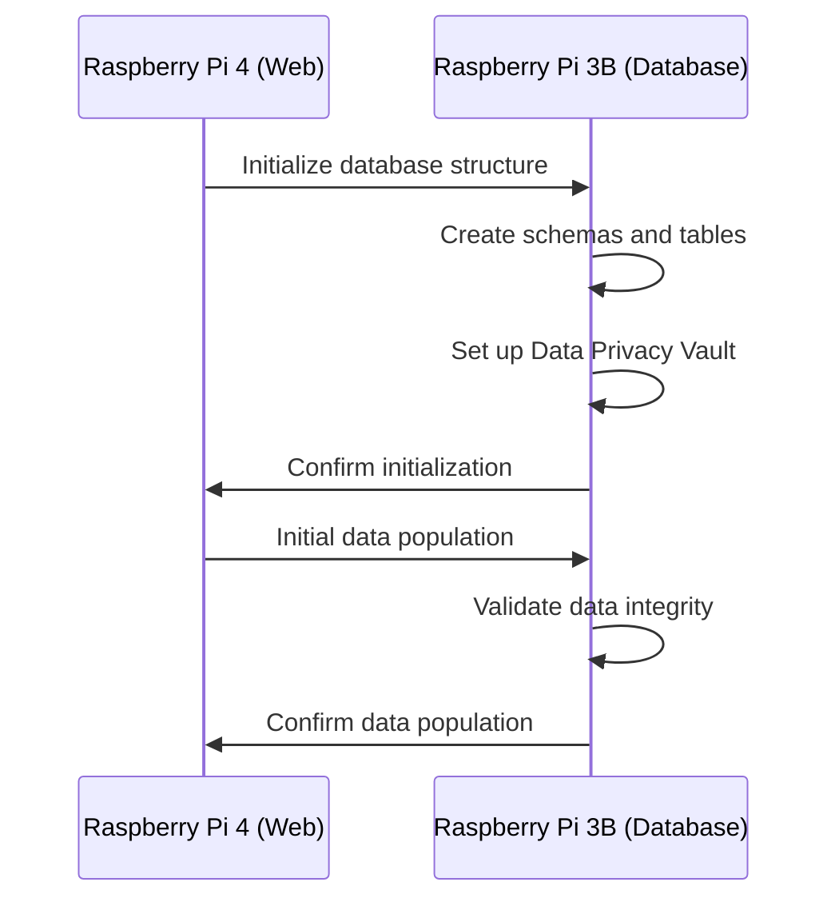
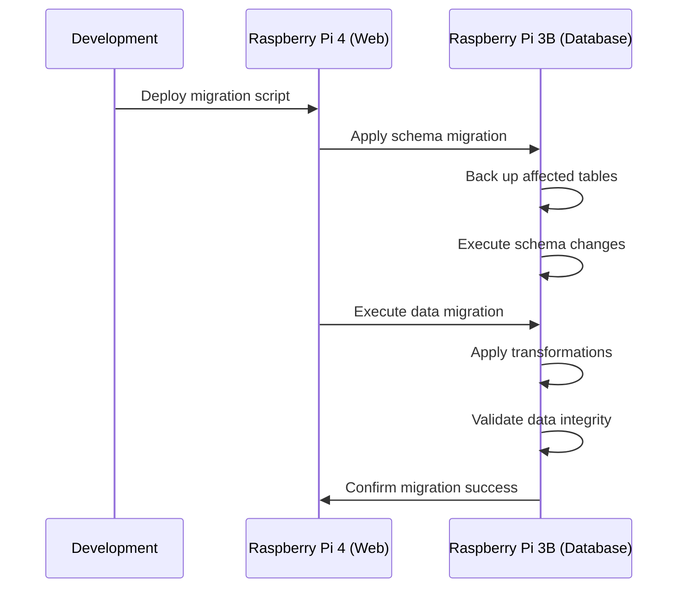

# Database Migration Strategy

## Overview

This document outlines the strategies and procedures for database migrations in the Personal Database Assistant project. It covers how to maintain data integrity during integration phases, strategies for data migration, and best practices for schema evolution while ensuring system stability.

## Migration Philosophy

The Personal Database Assistant adopts a cautious approach to database migrations, prioritizing:

1. **Data Integrity**: Ensuring no data loss occurs during migrations
2. **Backward Compatibility**: Maintaining compatibility with existing system components
3. **Zero-Downtime**: Minimizing or eliminating service disruptions
4. **Rollback Capability**: Ability to revert changes if issues are detected

## Migration Types

### 1. Schema Migrations

Schema migrations involve changes to the database structure, including:

- Adding/removing tables or columns
- Modifying column types, constraints, or indexes
- Creating or modifying relationships between tables

Schema migrations typically use Django's migration framework and are versioned in the codebase.

### 2. Data Migrations

Data migrations involve transforming existing data without necessarily changing the schema:

- Moving data between tables
- Reformatting or enriching data
- Cleaning up or correcting data
- Tokenizing sensitive data for the Data Privacy Vault

### 3. System Migrations

System migrations involve:

- Major version upgrades of the database system
- Moving databases between servers
- Converting data between different database platforms
- Splitting or merging databases

## Migration Strategy Between Raspberry Pi Servers

### Initial Database Setup



### Incremental Migrations



## Migration Procedures

### Pre-Migration Preparation

1. **Database Backup**
   - Full backup of the PostgreSQL database
   - Storage of backup files in a secure, offline location
   - Validation of backup integrity through test restoration

2. **Migration Script Preparation**
   - Creation and testing of Django migration files
   - Review of migration scripts by at least one other developer
   - Documentation of migration steps and expected outcomes

3. **Test Environment Validation**
   - Execution of the full migration process in a test environment
   - Verification of application functionality post-migration
   - Performance testing to identify potential bottlenecks

### Migration Execution

1. **Maintenance Window Notification**
   - Communication of migration schedule to all stakeholders
   - Clear description of expected downtime (if any)
   - Availability of technical personnel during the migration

2. **Migration Command Execution**
   ```bash
   # Example migration execution on Raspberry Pi 4
   cd /path/to/application
   python manage.py migrate --plan  # Review migration plan
   python manage.py migrate         # Execute migrations
   ```

3. **Real-time Monitoring**
   - Monitoring of database performance during migration
   - Observation of error logs for unexpected issues
   - Tracking of migration progress and timing

### Post-Migration Validation

1. **Application Testing**
   - Execution of automated test suite to verify functionality
   - Manual testing of critical features
   - Validation of integrations with external systems

2. **Performance Verification**
   - Measurement of query performance for critical operations
   - Comparison with pre-migration benchmarks
   - Optimization of indexes if necessary

3. **Rollback Execution (if necessary)**
   ```bash
   # Example rollback to a specific migration
   python manage.py migrate app_name 0004_previous_migration
   ```

## Data Privacy Vault Considerations

### Tokenization Migration

When implementing or updating the Data Privacy Vault, special migration procedures are required:

1. **Identification of Sensitive Data**
   - Audit of existing database for sensitive information
   - Classification according to sensitivity levels
   - Documentation of tokenization requirements

2. **Tokenization Process**
   ```mermaid
   graph TD
     A[Identify Sensitive Data] --> B[Create Vault Schema]
     B --> C[Generate Encryption Keys]
     C --> D[Backup Original Data]
     D --> E[Migrate Data to Vault]
     E --> F[Replace with Tokens]
     F --> G[Verify Data Access]
     G --> H[Delete Original Sensitive Data]
   ```

3. **Access Migration**
   - Update of data access patterns to use the Privacy API
   - Documentation of purpose-based access requirements
   - Training of developers on new access patterns

## Synthetic Data Migration

The migration of synthetic data follows a separate track:

1. **Synthetic Database Isolation**
   - Synthetic data is maintained in a separate schema or database
   - Clear identification of synthetic datasets
   - Prevention of data mixing with production data

2. **Synthetic Data Refresh**
   - Regular regeneration of synthetic data to match production schema
   - Preservation of referential integrity and business rules
   - Documentation of synthetic data properties

3. **Demo Mode Switching**
   - Seamless transition between production and synthetic data
   - Support for mixed-mode operations (development/training)
   - Clear UI indicators for synthetic data usage

## Version Control for Migrations

Django migration files are versioned in the source code repository:

1. **Migration Numbering**
   - Sequential numbering of migrations (e.g., `0001_initial.py`, `0002_add_field.py`)
   - Dependencies between migrations explicitly declared
   - Documentation of migration purposes in code comments

2. **Branch Management**
   - Feature branches contain their own migrations
   - Migrations squashed before merging to main branch
   - Conflict resolution strategies documented

3. **Deployment Coordination**
   - Synchronization of migration deployment with code deployment
   - Testing of migration/rollback in staging environment
   - Coordination with database administrators for complex migrations

## Data Migration Tools

### Django ORM Migrations

The primary tool for schema migrations is Django's migration framework:

```python
# Example data migration in Django
from django.db import migrations

def migrate_data(apps, schema_editor):
    OldModel = apps.get_model('app_name', 'OldModel')
    NewModel = apps.get_model('app_name', 'NewModel')
    
    for old_instance in OldModel.objects.all():
        NewModel.objects.create(
            new_field=old_instance.old_field,
            # Transform data as needed
        )

class Migration(migrations.Migration):
    dependencies = [
        ('app_name', '0003_previous_migration'),
    ]
    
    operations = [
        migrations.RunPython(migrate_data),
    ]
```

### Custom Migration Scripts

For complex migrations, custom Python scripts may be used:

```python
# Example custom migration script
import django
import os

os.environ.setdefault('DJANGO_SETTINGS_MODULE', 'project.settings')
django.setup()

from app.models import SourceModel, TargetModel
from privacy_vault.api import tokenize_value

def migrate_and_tokenize():
    count = 0
    for source in SourceModel.objects.all():
        # Create token for sensitive data
        sensitive_token = tokenize_value(source.sensitive_data)
        
        # Create new record with token
        TargetModel.objects.create(
            public_data=source.public_data,
            sensitive_data_token=sensitive_token
        )
        count += 1
        
    print(f"Migrated and tokenized {count} records")

if __name__ == "__main__":
    migrate_and_tokenize()
```

## Cross-Device Migration Strategies

### Raspberry Pi 4 to Raspberry Pi 3B Migration

For migrating data between the web server and database server:

1. **Network Transfer**
   - Secure, authenticated API calls for data transfer
   - Batch processing to minimize network load
   - Checksums to validate data integrity

2. **Message Queue Processing**
   - Redis-based message queue for reliable transfers
   - Retry mechanisms for failed operations
   - Monitoring of queue depth and processing rate

3. **Offline Migration**
   - USB drive transfer for large initial data loads
   - Encrypted storage of migration files
   - Verification procedures for successful transfer

## Emergency Recovery Procedures

### Backup Restoration

In case of migration failure:

1. **Database Restoration**
   ```bash
   # Example PostgreSQL restoration
   pg_restore -d database_name path/to/backup.dump
   ```

2. **Application Rollback**
   - Reversion to previous application version
   - Reversion to previous migration state
   - Comprehensive testing after restoration

3. **Incremental Recovery**
   - Recovery of specific affected tables
   - Manual correction of problematic data
   - Validation of system integrity post-recovery

## Migration Testing Framework

To ensure migration reliability:

1. **Automated Migration Testing**
   - Test migrations against snapshots of production data
   - Verification of data integrity post-migration
   - Performance measurement of migration operations

2. **Regression Testing**
   - Full application test suite run after migration
   - Verification of all critical business functions
   - Integration testing with external systems

3. **Stress Testing**
   - Testing migrations with larger-than-production datasets
   - Measurement of migration times and resource usage
   - Identification of optimization opportunities

## Compliance and Documentation

### Migration Audit Trail

1. **Migration Logging**
   - Detailed logs of all migration activities
   - Recording of timing, affected records, and outcomes
   - Storage of logs for compliance purposes

2. **Change Documentation**
   - Documentation of migration purpose and scope
   - Records of approvals and reviews
   - Updating of system documentation to reflect changes

3. **Compliance Verification**
   - Validation of continued compliance with data regulations
   - Documentation of privacy controls for sensitive data
   - Evidence of testing and validation procedures

## Best Practices

1. **Always back up before migrating**
2. **Test migrations in a staging environment first**
3. **Use transactions for data migrations when possible**
4. **Implement migration monitoring and alerting**
5. **Document all migrations in detail**
6. **Prepare rollback plans for each migration**
7. **Automate migration testing**
8. **Maintain a migration history log**
9. **Validate data integrity after migration**
10. **Coordinate migrations with application deployments**

## Conclusion

A well-executed database migration strategy is crucial for the reliable evolution of the Personal Database Assistant. By following these procedures and best practices, data integrity can be maintained throughout the system's lifecycle, while enabling the addition of new features and capabilities. 