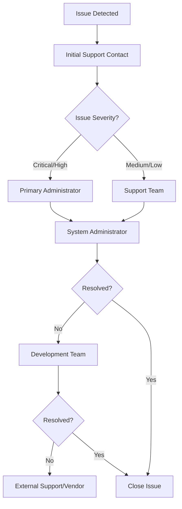
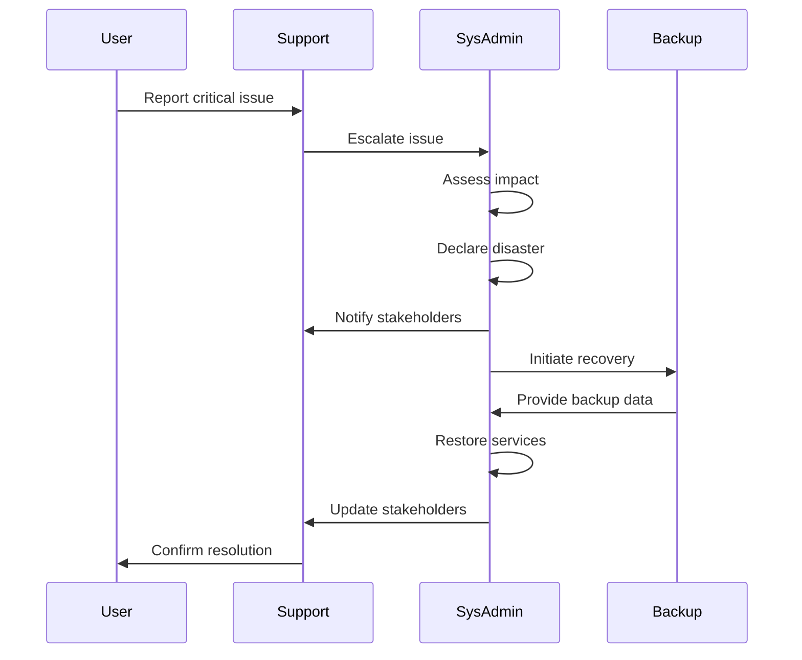
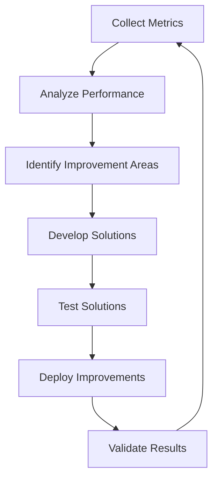

# Service Level Agreement (SLA)

## Overview

This Service Level Agreement (SLA) defines the performance expectations, availability targets, and support procedures for the Personal Database Assistant system. It establishes clear operational standards and responsibilities between system components and stakeholders.

## System Components

The SLA covers the following system components:

1. **Database Server (Raspberry Pi 3B)**
   - PostgreSQL database
   - Data Privacy Vault
   - API services

2. **Web Application Server (Raspberry Pi 4)**
   - Django web application
   - React frontend
   - External service integrations

3. **Network Infrastructure**
   - VLAN configuration
   - Firewall rules
   - Local network connectivity

## Service Availability

### Availability Targets

| System Component | Target Uptime | Maximum Planned Downtime | Maximum Unplanned Downtime |
|------------------|---------------|--------------------------|----------------------------|
| Database Server | 99.5% | 4 hours/month | 3.6 hours/month |
| Web Application Server | 99.0% | 7.2 hours/month | 7.2 hours/month |
| End-to-End System | 98.5% | 7.2 hours/month | 7.2 hours/month |

### Maintenance Windows

1. **Scheduled Maintenance**
   - Primary Window: Sundays, 01:00-05:00 AM local time
   - Secondary Window: Wednesdays, 01:00-03:00 AM local time
   - Notification provided at least 72 hours in advance
   - Maximum of two scheduled maintenances per month

2. **Emergency Maintenance**
   - May occur outside scheduled windows for critical issues
   - Notification provided as soon as possible
   - Post-incident report provided within 24 hours

### Exclusions

The following situations are excluded from uptime calculations:

1. Force majeure events (natural disasters, power outages, etc.)
2. Issues with third-party services (OpenAI API, Gmail API)
3. Network issues outside the home network
4. Planned maintenance within the defined maintenance windows
5. User-initiated system changes or misconfigurations

## Performance Metrics

### Response Time

| Operation Type | Target Response Time | Maximum Response Time |
|----------------|----------------------|------------------------|
| API Read Operations | < 200ms | 500ms |
| API Write Operations | < 500ms | 1000ms |
| Web Page Load (first paint) | < 1s | 2s |
| Web Page Load (fully interactive) | < 2s | 4s |
| AI-Powered Analysis | < 5s | 10s |
| Document Processing | < 30s | 60s |
| Email Integration | < 60s | 120s |

### Throughput

| System Component | Normal Operating Capacity | Peak Capacity |
|------------------|---------------------------|---------------|
| Database Queries | 50 queries/second | 100 queries/second |
| API Requests | 20 requests/second | 40 requests/second |
| Document Processing | 5 documents/minute | 10 documents/minute |
| Email Processing | 10 emails/minute | 20 emails/minute |

### Resource Utilization

Target resource utilization under normal operation:

| Resource | Database Server (RPi 3B) | Web Server (RPi 4) |
|----------|--------------------------|-------------------|
| CPU | < 60% | < 70% |
| Memory | < 70% | < 80% |
| Storage | < 75% | < 75% |
| Network | < 50% | < 60% |

## Data Integrity and Backup

### Backup Schedule

| Data Type | Backup Frequency | Retention Period | Recovery Time Objective |
|-----------|------------------|------------------|-------------------------|
| Full Database | Daily | 30 days | < 4 hours |
| Incremental Changes | Hourly | 7 days | < 1 hour |
| Configuration Files | Weekly & after changes | 90 days | < 2 hours |
| Application Code | After deployment | 1 year | < 2 hours |

### Data Integrity Checks

1. **Database Consistency**
   - Daily automated integrity checks
   - Weekly full verification
   - Post-migration verification

2. **Backup Validation**
   - Automated restoration testing weekly
   - Manual restoration testing monthly
   - Validation of restored data integrity

## Support Services

### Support Levels

| Level | Description | Response Time | Resolution Time |
|-------|-------------|---------------|-----------------|
| Critical | Complete system outage or data corruption | 15 minutes | 4 hours |
| High | Major functionality unavailable or significant performance degradation | 1 hour | 8 hours |
| Medium | Minor functionality issues with workarounds available | 4 hours | 24 hours |
| Low | Cosmetic issues, feature requests, documentation updates | 24 hours | 72 hours |

### Support Hours

- **Standard Support Hours**: Monday-Friday, 9:00 AM - 5:00 PM local time
- **Emergency Support**: 24/7 for Critical issues only

### Escalation Path

### Contact Methods

| Support Channel | Contact Information | Availability | Response Time |
|-----------------|---------------------|--------------|---------------|
| Email | support@personaldb.example | 24/7 receipt | As per severity |
| Phone | +1-555-123-4567 | Business hours | Immediate |
| In-app Support | Support ticket system | 24/7 | As per severity |
| Emergency Line | +1-555-987-6543 | 24/7 | 15 minutes |

## Monitoring and Reporting

### System Monitoring

The following aspects are continuously monitored:

1. **Infrastructure Health**
   - Server uptime
   - CPU, memory, and disk usage
   - Network connectivity
   - Temperature and hardware health

2. **Application Performance**
   - Response times
   - Error rates
   - Request throughput
   - Background task queues

3. **Security Monitoring**
   - Authentication attempts
   - API usage patterns
   - Network traffic anomalies
   - Privacy Vault access

### Incident Management

1. **Incident Detection**
   - Automated alerts based on threshold violations
   - User-reported issues
   - Proactive monitoring checks

2. **Incident Response**
   - Initial assessment within SLA response time
   - Regular status updates during resolution
   - Post-incident analysis and reporting

3. **Incident Documentation**
   - Root cause analysis
   - Resolution steps
   - Preventative measures
   - Impact assessment

### Reporting Schedule

| Report Type | Frequency | Distribution | Format |
|-------------|-----------|--------------|--------|
| System Health | Weekly | System Administrators | Dashboard + PDF |
| Performance Metrics | Monthly | All Stakeholders | PDF |
| Incident Reports | After each incident | System Administrators | PDF |
| Availability Summary | Monthly | All Stakeholders | PDF |
| Security Audit | Quarterly | System Administrators | PDF |

## Service Continuity

### Disaster Recovery

1. **Recovery Time Objectives (RTO)**
   - Database Server: < 4 hours
   - Web Application Server: < 2 hours
   - Full System: < 6 hours

2. **Recovery Point Objectives (RPO)**
   - Database: < 1 hour of data loss
   - Configuration: < 24 hours
   - Application Code: No loss (version controlled)

3. **Disaster Scenarios**
   - Hardware failure
   - Software corruption
   - Network outage
   - Security breach
   - Environmental issues

### Continuity Procedures

## Security Service Levels

### Security Response

| Security Event | Detection Time | Response Time | Resolution Time |
|----------------|----------------|---------------|-----------------|
| Unauthorized Access | < 15 minutes | < 30 minutes | < 4 hours |
| Data Privacy Violation | < 15 minutes | < 30 minutes | < 4 hours |
| Suspicious Activity | < 1 hour | < 2 hours | < 8 hours |
| Vulnerability Alert | < 4 hours | < 8 hours | Based on severity |

### Security Patching

1. **Critical Security Updates**
   - Implementation within 24 hours of release
   - Emergency patching outside maintenance windows if needed
   - Verification of patch effectiveness

2. **Non-Critical Security Updates**
   - Implementation within 7 days of release
   - Deployment during standard maintenance windows
   - Testing in staging environment before deployment

## Service Improvement

### Performance Optimization

1. **Regular Performance Review**
   - Quarterly performance analysis
   - Identification of bottlenecks
   - Implementation of optimization recommendations

2. **Capacity Planning**
   - Monthly usage trend analysis
   - Proactive resource allocation
   - Hardware upgrade recommendations when needed

### Continuous Improvement Process

## Integration Service Levels

### External API Dependencies

| Service | Availability Target | Fallback Mechanism | Degraded Operation |
|---------|---------------------|-------------------|---------------------|
| OpenAI API | 99.0% | Cached responses | Limited AI features |
| Gmail API | 99.5% | Queued operations | Delayed email processing |
| OAuth Services | 99.5% | Session extension | Re-authentication required |

### Integration Monitoring

1. **API Health Checks**
   - Regular polling of external APIs
   - Latency and error rate monitoring
   - Automatic alerting for degraded performance

2. **Integration Status Dashboard**
   - Real-time display of all integration statuses
   - Historical performance data
   - Incident tracking for external dependencies

## Compliance with SLA

### Performance Measurement

1. **Monitoring Tools**
   - Prometheus for metrics collection
   - Grafana for visualization
   - ELK stack for log analysis
   - Custom health check endpoints

2. **SLA Reporting**
   - Monthly SLA compliance report
   - Trend analysis over time
   - Recommendations for improvements

### SLA Violations

1. **Violation Categories**
   - Availability breach
   - Performance breach
   - Support response breach
   - Security incident response breach

2. **Remediation Process**
   - Root cause analysis
   - Corrective action plan
   - Implementation of preventative measures
   - Follow-up verification

## Service Management

### Change Management

1. **Change Categories**
   - Critical: Major impact on functionality or security
   - Major: Significant new features or changes
   - Minor: Small enhancements or fixes
   - Routine: Regular maintenance tasks

2. **Change Approval Process**
   - Change request submission
   - Impact assessment
   - Stakeholder review
   - Implementation planning
   - Post-implementation review

### Release Management

1. **Release Schedule**
   - Major Releases: Quarterly
   - Minor Releases: Monthly
   - Hotfixes: As needed

2. **Release Notification**
   - Major Releases: 2 weeks in advance
   - Minor Releases: 1 week in advance
   - Hotfixes: As soon as possible

## Synthetic Data Service Levels

### Demo Environment

1. **Availability**
   - 99.0% uptime
   - Maximum 7.3 hours/month downtime
   - Separate from production SLAs

2. **Data Refresh**
   - Full refresh monthly
   - Schema synchronization with production weekly
   - On-demand refresh capability

## Communication Protocols

### Notification Matrix

| Event Type | Notification Method | Stakeholder Group | Timeframe |
|------------|---------------------|-------------------|-----------|
| Planned Maintenance | Email + In-app | All Users | 72 hours before |
| Unplanned Outage | Email + SMS | Administrators | Within 15 minutes |
| Feature Release | Email + In-app | All Users | 7 days before |
| Security Incident | Email + Phone | Administrators | Within 30 minutes |
| SLA Violation | Email | Administrators | Within 24 hours |

### Status Page

A public status page is maintained at https://status.personaldb.example with:

1. **Current Status**
   - Overall system health
   - Component-by-component status
   - Planned maintenance schedule

2. **Incident History**
   - Previous incidents with resolution details
   - Historical uptime statistics
   - Post-mortem reports for major incidents

## SLA Review and Updates

1. **Periodic Review**
   - Quarterly review of SLA metrics
   - Annual comprehensive SLA revision
   - Stakeholder feedback incorporation

2. **SLA Modification Process**
   - Proposal of changes
   - Stakeholder review period
   - Approval by system administrators
   - Implementation and notification

## Appendix: Definitions

- **Uptime**: Percentage of time the system is available within the measurement period, excluding scheduled maintenance.
- **Response Time**: Time elapsed between a user request and the system's initial response.
- **Resolution Time**: Time elapsed between issue identification and restoration of full service.
- **Critical Issue**: Issue that causes complete system unavailability or data loss.
- **Recovery Time Objective (RTO)**: Maximum acceptable time for system recovery after a disaster.
- **Recovery Point Objective (RPO)**: Maximum acceptable data loss measured in time.

## Appendix: Contact Information

### Primary Contacts

- **System Administrator**: admin@personaldb.example, +1-555-111-2222
- **Support Team**: support@personaldb.example, +1-555-333-4444
- **Security Team**: security@personaldb.example, +1-555-555-6666
- **Development Team**: dev@personaldb.example, +1-555-777-8888

### Escalation Contacts

- **Tier 1 Escalation**: tier1@personaldb.example, +1-555-987-6543
- **Tier 2 Escalation**: tier2@personaldb.example, +1-555-876-5432
- **Emergency Contact**: emergency@personaldb.example, +1-555-765-4321

---

_This SLA is effective from [EFFECTIVE DATE] and remains valid until replaced by a newer version. All stakeholders will be notified at least 30 days before any modifications to this SLA take effect._ 