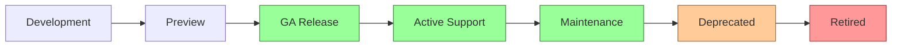
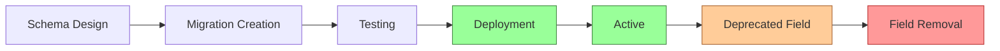
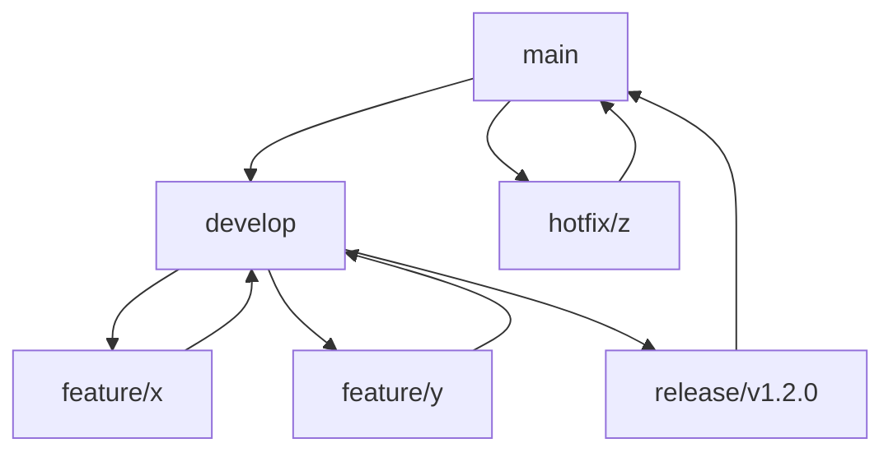
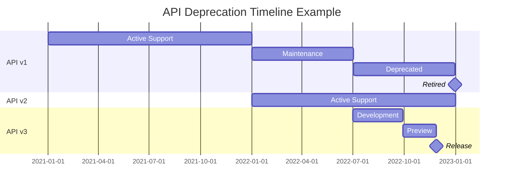

# Versioning Strategy

## Overview

This document outlines the versioning strategy for the Personal Database Assistant system. It defines how API and database schema changes will be managed over time, ensuring backward compatibility and providing clear guidelines for handling system evolution.

## Versioning Principles

The Personal Database Assistant adheres to the following versioning principles:

1. **Semantic Versioning**: Following SemVer 2.0.0 standards for clear communication of change magnitude
2. **API Stability**: Maintaining backward compatibility within major versions
3. **Progressive Enhancement**: Adding new features without breaking existing functionality
4. **Deprecation Periods**: Providing adequate transition time before removing features
5. **Clear Documentation**: Maintaining comprehensive change logs and migration guides

## Versioning Scheme

### System Versioning

The overall system follows Semantic Versioning (MAJOR.MINOR.PATCH):

- **MAJOR**: Incompatible API changes, significant architectural changes
- **MINOR**: New functionality added in a backward-compatible manner
- **PATCH**: Backward-compatible bug fixes and minor improvements

Example: `v2.3.1`

### API Versioning

The REST API uses a URI-based versioning scheme:

```
https://api.personaldb.example/v1/assets
```

Key characteristics:
- Major version in the URI path
- Minor and patch updates maintain compatibility within the major version
- Headers indicate the specific minor version for tracking purposes

### Database Schema Versioning

The database schema uses sequential versioning, managed through Django migrations:

- Each migration is numbered sequentially within its app (e.g., `0001_initial.py`, `0002_add_field.py`)
- Migration files include the purpose and changes in comments
- The database maintains a record of applied migrations

## Version Lifecycle

### API Version Lifecycle



| Phase | Duration | Support Level |
|-------|----------|--------------|
| Development | Variable | Internal only |
| Preview | 1-3 months | Early adopters, no stability guarantee |
| GA Release | 2+ years | Full support, backward compatibility guarantee |
| Active Support | Min 18 months | Bug fixes and minor improvements |
| Maintenance | 6 months | Critical bug fixes only |
| Deprecated | 6 months | No updates, planned removal announced |
| Retired | N/A | Endpoints return 410 Gone status |

### Database Schema Lifecycle



| Phase | Duration | Actions |
|-------|----------|---------|
| Schema Design | Variable | Database modeling and planning |
| Migration Creation | Variable | Django migration files created |
| Testing | Variable | Validation in test environment |
| Deployment | Variable | Migration applied to production |
| Active | Indefinite | Schema in active use |
| Deprecated Field | Min 6 months | Field marked as deprecated, no longer used in new code |
| Field Removal | N/A | Field removed from schema after deprecation period |

## Compatibility Management

### Backward Compatibility

For APIs, backward compatibility means:

1. **No Breaking Changes**:
   - Existing endpoints must continue to function
   - Request formats must continue to be accepted
   - Response formats must maintain required fields

2. **Allowed Changes**:
   - Adding new endpoints
   - Adding optional request parameters
   - Adding fields to response objects
   - Relaxing validation rules

### Forward Compatibility

For better future-proofing:

1. **Client Design**:
   - Clients should ignore unknown fields in responses
   - Clients should use content negotiation mechanisms
   - Clients should not depend on undocumented behavior

2. **API Design**:
   - Use feature flags for new functionality
   - Design extensible data structures
   - Use enums that can be extended

## Breaking Changes Management

When breaking changes are necessary:

### API Breaking Changes

1. **Introduction Process**:
   - Create a new major API version
   - Maintain the previous version for the deprecation period
   - Provide migration guides for client developers

2. **Communication Strategy**:
   - Advance notice (minimum 6 months for major changes)
   - Detailed migration guides with code examples
   - Reference client implementations when appropriate

### Database Breaking Changes

1. **Schema Evolution**:
   - Use multi-phase migrations for complex changes
   - Maintain backward compatibility at the application layer
   - Use Django's migration framework for controlled changes

2. **Data Integrity**:
   - Include data migration steps when schema changes
   - Validate data integrity post-migration
   - Provide rollback mechanisms for failed migrations

## Version Control Integration

### Git Branching Strategy



1. **Branch Structure**:
   - `main`: Production-ready code
   - `develop`: Integration branch for features
   - `feature/*`: Individual feature development
   - `release/*`: Release preparation
   - `hotfix/*`: Production fixes

2. **Version Tagging**:
   - Git tags for each release (e.g., `v1.2.0`)
   - Annotated tags with release notes
   - Tags created at release branch merges to main

## API Versioning Implementation

### URI Path Versioning

```python
# Example Django URL configuration
urlpatterns = [
    path('api/v1/', include('api.v1.urls')),
    path('api/v2/', include('api.v2.urls')),
]
```

### Version Headers

```python
# Example API response header
headers = {
    'API-Version': '1.2.3',
    'API-Deprecated': 'false',
    'API-Sunset-Date': None,
}
```

### Version Discovery

```json
// Example response from /api endpoint
{
  "versions": [
    {
      "version": "v1",
      "status": "deprecated",
      "sunset_date": "2023-12-31",
      "url": "https://api.personaldb.example/v1"
    },
    {
      "version": "v2",
      "status": "stable",
      "sunset_date": null,
      "url": "https://api.personaldb.example/v2"
    }
  ],
  "latest_version": "v2",
  "current_version": "v2"
}
```

## Database Migration Strategy

### Migration Types

1. **Schema Migrations**:
   - Adding/removing tables or columns
   - Changing column types or constraints
   - Creating or modifying indexes

2. **Data Migrations**:
   - Transforming existing data
   - Populating new fields
   - Data cleanup and correction

### Migration Files

Example migration file:

```python
# homes/migrations/0005_asset_energy_rating.py
from django.db import migrations, models

class Migration(migrations.Migration):
    """
    Adds energy rating field to Asset model.
    
    This supports the new energy efficiency tracking feature.
    The field is nullable to maintain compatibility with existing records.
    """
    
    dependencies = [
        ('homes', '0004_asset_location_coordinates'),
    ]
    
    operations = [
        migrations.AddField(
            model_name='asset',
            name='energy_rating',
            field=models.CharField(max_length=10, null=True, blank=True),
        ),
    ]
```

### Multi-phase Migrations

For complex changes, a multi-phase approach is used:

1. **Phase 1**: Add new structures without removing old ones
2. **Phase 2**: Update application to use new structures
3. **Phase 3**: Migrate data from old to new structures
4. **Phase 4**: Update application to stop writing to old structures
5. **Phase 5**: Remove old structures after deprecation period

## Privacy Vault Versioning

The Data Privacy Vault has special versioning considerations:

1. **Schema Versioning**:
   - Separate versioning for the vault schema
   - Stricter compatibility requirements
   - Extended deprecation periods for sensitive data

2. **Encryption Versioning**:
   - Version identifiers for encryption methods
   - Support for multiple encryption versions concurrently
   - Migration path for re-encrypting data with newer methods

3. **Token Versioning**:
   - Format version embedded in tokens
   - Compatibility layer for processing different token versions
   - Long-term support for historical token formats

## Synthetic Data Versioning

Synthetic data sets are versioned separately:

1. **Dataset Versions**:
   - Major version matching production schema version
   - Minor version for dataset improvements
   - Dataset version included in metadata

2. **Generation Script Versioning**:
   - Version control for data generation scripts
   - Correlation with schema versions
   - Documentation of dataset characteristics per version

## Documentation Management

### API Documentation

1. **Version-specific Documentation**:
   - Separate documentation for each major API version
   - Clear indication of version status (preview, active, deprecated)
   - Per-endpoint compatibility notes

2. **Change Documentation**:
   - Detailed change logs
   - Breaking vs. non-breaking changes
   - Migration guides for major version changes

### Schema Documentation

1. **Entity Relationship Diagrams**:
   - Version-specific ERD documents
   - Visual indication of changed components
   - Historical ERDs maintained for reference

2. **Data Dictionary Versioning**:
   - Data dictionary tied to schema versions
   - Change tracking for field definitions
   - Deprecation notices for fields scheduled for removal

## Release Process

### Release Scheduling

1. **Planned Release Cycles**:
   - Major releases: Yearly
   - Minor releases: Quarterly
   - Patch releases: Monthly or as needed

2. **Hotfix Process**:
   - Emergency fixes for critical issues
   - Minimal scope to reduce risk
   - Applied to both current and previous supported versions

### Release Artifacts

1. **Deployment Packages**:
   - Versioned application code
   - Migration scripts
   - Configuration updates

2. **Release Notes**:
   - Detailed description of changes
   - Upgrade instructions
   - Known issues and workarounds

## Version Compatibility Matrix

### Client-Server Compatibility

| Client Version | API v1 | API v2 | API v3 |
|----------------|--------|--------|--------|
| v1.x | Full | N/A | N/A |
| v2.x | Partial | Full | N/A |
| v3.x | Minimal | Full | Full |

### Database-Application Compatibility

| Database Schema Version | App v1.x | App v2.x | App v3.x |
|-------------------------|---------|---------|---------|
| 0001-0010 | Compatible | Incompatible | Incompatible |
| 0011-0020 | Compatible* | Compatible | Incompatible |
| 0021+ | Incompatible | Compatible | Compatible |

*With limitations

## API Deprecation Process

### Deprecation Timeline



### Deprecation Notices

1. **API Responses**:
   - Deprecation headers in responses from deprecated endpoints
   - Links to newer endpoints
   - Sunset date information

2. **Documentation**:
   - Visual indicators for deprecated features
   - Alternatives and migration guidance
   - Timeline for removal

### Sunset Headers

```http
HTTP/1.1 200 OK
Content-Type: application/json
API-Version: 1.5.2
API-Deprecated: true
API-Sunset-Date: Tue, 31 Dec 2023 23:59:59 GMT
API-Successor-Version: 2.0.0
Link: <https://api.personaldb.example/v2/assets>; rel="successor-version"
```

## Testing Strategy

### Version Compatibility Testing

1. **Automated Tests**:
   - Test suite for each supported version
   - Cross-version compatibility tests
   - Migration path validation

2. **Compatibility Matrix Testing**:
   - Client-server compatibility testing
   - Database schema compatibility testing
   - Backward compatibility verification

### Regression Testing

1. **Test Coverage**:
   - Core functionality tests per version
   - Edge case testing for version-specific behaviors
   - Performance comparison across versions

2. **Testing Tools**:
   - Automated test suites (Django test framework)
   - API contract testing (Postman, Pact)
   - Migration testing with sample datasets

## Best Practices

### API Best Practices

1. **Design for Evolution**:
   - Use optional fields when possible
   - Implement feature detection
   - Create extensible data structures

2. **Versioning Consistency**:
   - Consistent versioning across all APIs
   - Clear version communication in responses
   - Version discovery mechanism

### Schema Best Practices

1. **Safe Schema Changes**:
   - Add rather than modify or remove
   - Use nullable fields for new additions
   - Implement data migration utilities

2. **Migration Safety**:
   - Test migrations thoroughly
   - Create backup points before migrations
   - Use transactions when possible

## Conclusion

A well-defined versioning strategy is essential for the long-term maintainability and stability of the Personal Database Assistant system. By following these guidelines, the system can evolve and improve while maintaining compatibility with existing integrations and preserving data integrity across versions. 