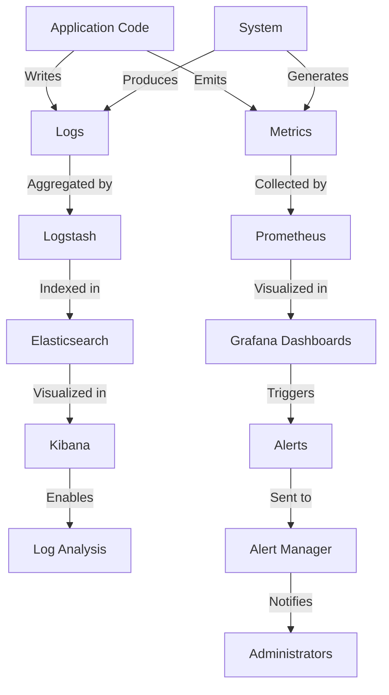
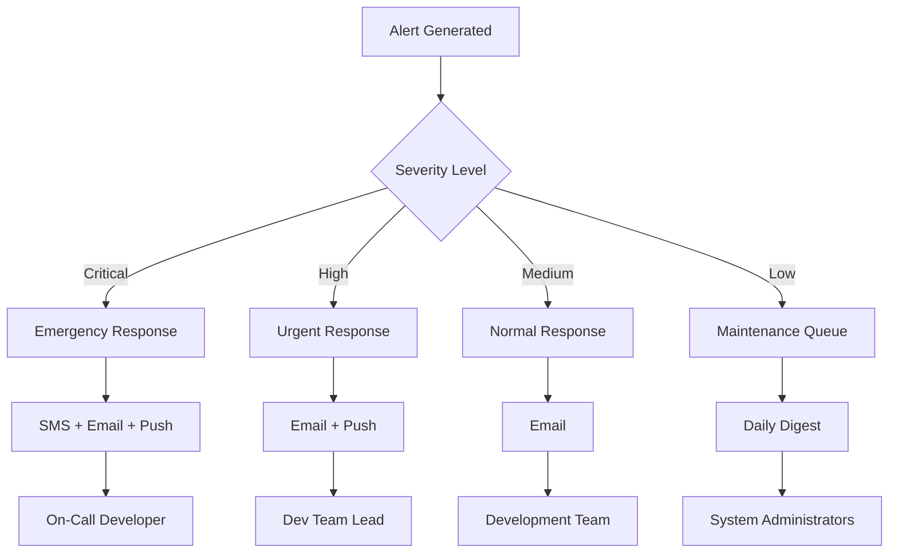
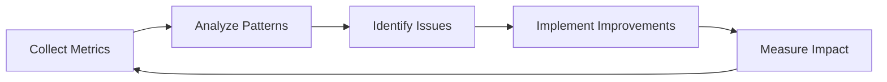

# Monitoring and Logging Framework

## Overview

This document outlines the monitoring and logging framework for the Personal Database Assistant. It details the metrics to track, logging structure, and troubleshooting procedures to enable effective system oversight and rapid problem resolution.

## Monitoring Architecture

The Personal Database Assistant implements a comprehensive monitoring system spanning both Raspberry Pi devices and all system layers.

### High-Level Monitoring Architecture



### Component Distribution

| Component | Location | Purpose |
|-----------|----------|---------|
| Application Instrumentation | Both RPi devices | Generate metrics and logs |
| Prometheus | RPi 4 | Collect and store metrics |
| Grafana | RPi 4 | Visualize metrics and alerting |
| ELK Stack (lite) | RPi 4 | Log aggregation and analysis |
| System Monitors | Both RPi devices | OS-level monitoring |
| Alert Manager | RPi 4 | Alert routing and deduplication |

## Key Metrics

### System Health Metrics

#### Hardware Metrics

| Metric | Description | Collection Interval | Alert Threshold |
|--------|-------------|---------------------|-----------------|
| CPU Usage | Percentage of CPU utilization | 15s | >85% for 5m |
| Memory Usage | Percentage of memory used | 15s | >90% for 5m |
| Disk Usage | Percentage of disk space used | 1m | >85% |
| Disk I/O | Disk read/write operations | 30s | Sustained high I/O |
| Temperature | CPU and GPU temperature | 30s | >75°C |
| Network I/O | Network traffic volume | 30s | N/A (trend analysis) |

#### Service Health Metrics

| Metric | Description | Collection Interval | Alert Threshold |
|--------|-------------|---------------------|-----------------|
| Service Status | Up/down status of key services | 15s | Any down service |
| Process Count | Number of running processes | 1m | Outside expected range |
| Open File Handles | Count of open file descriptors | 1m | >80% of limit |
| Uptime | System and service uptime | 1m | Unexpected restart |

### Application Metrics

#### Django Application Metrics

| Metric | Description | Collection Interval | Alert Threshold |
|--------|-------------|---------------------|-----------------|
| Request Rate | Requests per second | Real-time | N/A (trend analysis) |
| Response Time | Average and percentile response times | Real-time | p95 >500ms for 5m |
| Error Rate | Percentage of 4xx/5xx responses | Real-time | >1% errors for 5m |
| Active Sessions | Number of active user sessions | 1m | N/A (capacity planning) |
| View Performance | Time spent in specific views | Real-time | >200ms avg for 5m |
| Template Render Time | Time to render templates | Real-time | >100ms avg for 5m |
| Database Query Time | Time spent on database queries | Real-time | >100ms avg for 5m |

#### Django REST Framework Metrics

| Metric | Description | Collection Interval | Alert Threshold |
|--------|-------------|---------------------|-----------------|
| API Request Rate | API calls per second by endpoint | Real-time | N/A (trend analysis) |
| API Response Time | Response time by endpoint | Real-time | p95 >300ms for 5m |
| API Error Rate | Error percentage by endpoint | Real-time | >1% for 5m |
| Authentication Failures | Failed authentication attempts | Real-time | >5 failures per minute |

#### Celery Metrics

| Metric | Description | Collection Interval | Alert Threshold |
|--------|-------------|---------------------|-----------------|
| Task Queue Length | Number of pending tasks | 15s | >100 tasks or growing consistently |
| Task Processing Time | Time to complete tasks by type | Real-time | >2x average for task type |
| Task Success Rate | Percentage of successful tasks | Real-time | <95% success rate |
| Worker Status | Up/down status of worker processes | 15s | Any down worker |

### Database Metrics

#### PostgreSQL Metrics

| Metric | Description | Collection Interval | Alert Threshold |
|--------|-------------|---------------------|-----------------|
| Connection Count | Active and idle connections | 30s | >80% of max connections |
| Query Execution Time | Time to execute queries | Real-time | p95 >200ms for 5m |
| Transaction Rate | Transactions per second | Real-time | N/A (trend analysis) |
| Cache Hit Ratio | Database cache efficiency | 1m | <90% for 5m |
| Index Usage | Ratio of index scans to sequential scans | 5m | Low index usage ratio |
| Table/Index Size | Growth of database objects | 1h | Unusual growth rate |
| Vacuum Activity | Autovacuum and manual vacuum operations | 5m | Extended vacuum runtime |

### External Integration Metrics

| Metric | Description | Collection Interval | Alert Threshold |
|--------|-------------|---------------------|-----------------|
| OpenAI API Latency | Response time from OpenAI API | Per request | >2s avg for 5m |
| OpenAI API Error Rate | Percentage of failed API calls | Per request | >5% for 5m |
| Gmail API Latency | Response time from Gmail API | Per request | >1s avg for 5m |
| Gmail API Error Rate | Percentage of failed API calls | Per request | >5% for 5m |
| API Rate Limit Status | Remaining capacity for external APIs | Per request | <20% remaining |

### Security Metrics

| Metric | Description | Collection Interval | Alert Threshold |
|--------|-------------|---------------------|-----------------|
| Failed Login Attempts | Number of authentication failures | Real-time | >5 failures in 5m for same user |
| Privacy Vault Access | Number of sensitive data access requests | Real-time | Unusual access patterns |
| Suspicious API Activity | Abnormal API usage patterns | 5m | Significant deviation from baseline |
| Network Connection Count | New network connections by source | 1m | Unusual connection patterns |

## Logging Framework

### Log Levels

The system uses standard log levels with specific guidelines:

| Level | When to Use | Retention Period |
|-------|-------------|-----------------|
| ERROR | Application errors, exceptions, security violations | 90 days |
| WARNING | Potential issues, deprecated feature usage | 60 days |
| INFO | Key business events, user actions, system changes | 30 days |
| DEBUG | Detailed information for troubleshooting | 7 days |
| TRACE | Very detailed debugging information | 3 days (development only) |

### Structured Logging Format

All logs are structured in JSON format to enable easier parsing and analysis:

```json
{
  "timestamp": "2023-04-15T14:22:33.456Z",
  "level": "INFO",
  "logger": "app.views.assets",
  "message": "Asset retrieved successfully",
  "correlation_id": "c0ff33-b33f-f00d-cafe-deadbeef",
  "user_id": "user_12345",
  "request_id": "req_abcdef123456",
  "ip_address": "192.168.1.100",
  "method": "GET",
  "path": "/api/v1/assets/123",
  "status_code": 200,
  "response_time_ms": 45,
  "additional_data": {
    "asset_id": 123,
    "asset_type": "real_estate"
  }
}
```

### Log Categories

Logs are organized into the following categories:

1. **Application Logs**
   - Django application logs
   - API request/response logs
   - Background task logs

2. **System Logs**
   - OS logs
   - Service logs (Nginx, Redis, etc.)
   - Hardware monitoring logs

3. **Security Logs**
   - Authentication events
   - Authorization decisions
   - Privacy Vault access
   - Suspicious activity

4. **Integration Logs**
   - External API calls
   - API Gateway logs
   - OAuth token exchanges

5. **Database Logs**
   - Query logs (slow queries only in production)
   - Schema migration logs
   - Database maintenance logs

### Log Collection and Storage

1. **Collection Mechanism**
   - Application logs: Direct logging to files and stdout
   - System logs: rsyslog
   - All logs captured by Filebeat and forwarded to Logstash

2. **Storage Strategy**
   - Short-term: Elasticsearch (last 30 days)
   - Long-term: Compressed archives on external storage
   - Security-critical logs: Immutable storage with integrity verification

3. **Retention Policy**
   - Governed by log level and category
   - Automatic rotation and archiving
   - Compliance with data privacy regulations

## Dashboard and Visualization

### Grafana Dashboards

1. **System Overview Dashboard**
   - Current system status
   - Resource utilization
   - Key performance indicators
   - Recent alerts

2. **Application Performance Dashboard**
   - Request volume and response times
   - Error rates
   - Database performance
   - Cache effectiveness

3. **User Activity Dashboard**
   - Active users
   - Feature usage
   - Session metrics
   - User-reported issues

4. **Integration Health Dashboard**
   - External API status
   - Response times
   - Error rates
   - Rate limit status

5. **Security Dashboard**
   - Authentication activity
   - Privacy Vault usage
   - Suspicious events
   - Firewall statistics

### Kibana Visualizations

1. **Log Explorer**
   - Full-text search across logs
   - Filtering by fields
   - Time-based analysis
   - Correlation of related events

2. **Error Analysis**
   - Error frequency
   - Error patterns
   - Impact assessment
   - Resolution tracking

3. **Audit Trail**
   - User activity timeline
   - Administrative actions
   - Data access records
   - Compliance reporting

## Alerting System

### Alert Levels

| Level | Description | Response Time | Notification Channels |
|-------|-------------|---------------|----------------------|
| Critical | Service outage, data loss, security breach | Immediate | SMS, Email, Push Notification |
| High | Performance degradation, approaching resource limits | <15 minutes | Email, Push Notification |
| Medium | Non-critical errors, unusual patterns | <1 hour | Email |
| Low | Informational, maintenance reminders | <24 hours | Email Digest |

### Alert Routing



### Alert Aggregation and Deduplication

1. **Grouping Rules**
   - Group by service and error type
   - Temporal grouping for recurring issues
   - Contextual grouping based on affected components

2. **Rate Limiting**
   - Maximum alert frequency per issue
   - Progressive notifications for persistent issues
   - Automatic muting for known issues in maintenance

3. **Alert Lifecycle**
   - New → Acknowledged → In Progress → Resolved
   - Auto-resolution based on metric recovery
   - Escalation for unacknowledged critical alerts

## Synthetic Monitoring

### External Checks

1. **Uptime Monitoring**
   - HTTPS connectivity checks
   - SSL certificate validity
   - DNS resolution
   - Frequency: 1 minute

2. **API Health Checks**
   - Key endpoint availability
   - Authentication flow validation
   - Data retrieval verification
   - Frequency: 5 minutes

3. **End-to-End Tests**
   - Critical user flows
   - Integration connectivity
   - Data processing validation
   - Frequency: 15 minutes

### Internal Checks

1. **Service Health Probes**
   - Internal service status checks
   - Dependencies availability
   - Resource allocation verification
   - Frequency: 30 seconds

2. **Database Connectivity**
   - Connection pool status
   - Basic query execution
   - Replication status (if applicable)
   - Frequency: 1 minute

3. **Scheduled Tasks**
   - Celery worker status
   - Task queue processing rate
   - Completed vs. failed tasks
   - Frequency: 1 minute

## Performance Monitoring

### Real User Monitoring (RUM)

1. **Frontend Metrics**
   - Page load time
   - First Contentful Paint
   - Time to Interactive
   - JavaScript errors

2. **API Client Metrics**
   - API call latency
   - Request success rate
   - API usage patterns
   - Client-side errors

### Application Performance Monitoring (APM)

1. **Transaction Tracing**
   - End-to-end request flow
   - Component-level timing
   - Database query analysis
   - External service dependencies

2. **Resource Consumption**
   - Memory allocation
   - CPU usage by request
   - Connection pooling efficiency
   - Resource leaks detection

### Capacity Planning Metrics

1. **Growth Trends**
   - User count growth
   - Data volume increase
   - Transaction rate changes
   - Storage utilization trends

2. **Saturation Points**
   - Peak load patterns
   - Resource bottlenecks
   - Scaling thresholds
   - Performance degradation indicators

## Privacy Vault Monitoring

### Access Monitoring

1. **Access Patterns**
   - Access frequency by purpose
   - User/service access distribution
   - Time-of-day patterns
   - Data category access statistics

2. **Anomaly Detection**
   - Unusual access volume
   - New access patterns
   - Off-hours access
   - Multiple failed access attempts

### Privacy Compliance Metrics

1. **Purpose Limitation**
   - Purpose-to-access correlation
   - Purpose declaration compliance
   - Purpose validation success rate
   - Blocked access attempts

2. **Data Minimization**
   - Field-level access statistics
   - Overprivileged access attempts
   - Progressive data disclosure metrics
   - Request scope analysis

## Synthetic Data Monitoring

### Demo Mode Metrics

1. **Usage Patterns**
   - Demo mode activation frequency
   - User behavior in demo mode
   - Feature exploration patterns
   - Session duration statistics

2. **Data Quality**
   - Synthetic data coverage
   - Realism assessment
   - Relationship integrity
   - Feedback on synthetic data quality

## Troubleshooting Procedures

### Incident Response

#### Initial Assessment

1. **Impact Evaluation**
   - Affected services and users
   - Performance degradation level
   - Data integrity concerns
   - Security implications

2. **Triage Process**
   ```mermaid
   graph TD
       A[Incident Detected] --> B[Classify Severity]
       B --> C[Assemble Response Team]
       C --> D[Initial Investigation]
       D --> E{Root Cause Identified?}
       E -->|Yes| F[Implement Fix]
       E -->|No| G[Escalate Investigation]
       G --> H[Detailed Diagnostics]
       H --> I[Identify Root Cause]
       I --> F
       F --> J[Verify Resolution]
       J --> K[Document Incident]
   ```

#### Diagnostic Procedures

1. **Log Analysis**
   - Correlation of logs across services
   - Identifying error patterns and sequences
   - Tracing request paths
   - Examining state changes

2. **Metric Investigation**
   - Identifying anomalies in metrics
   - Correlation with system events
   - Resource utilization analysis
   - Performance pattern examination

3. **Database Diagnostics**
   - Identifying slow queries
   - Connection pool status
   - Lock contention analysis
   - Optimization opportunities

4. **Network Diagnostics**
   - Connectivity tests between components
   - Latency and packet loss measurement
   - Bandwidth utilization analysis
   - Firewall rule verification

### Common Issues and Resolutions

#### Application Issues

| Issue | Diagnostic Steps | Typical Resolution |
|-------|-----------------|-------------------|
| High Response Time | Check resource usage, database query time, external API latency | Optimize slow queries, add caching, scale resources |
| Memory Leaks | Monitor memory growth over time, analyze heap dumps | Fix object retention issues, adjust garbage collection |
| Error Spikes | Analyze error logs, check recent deployments | Roll back changes, fix bug, add validation |
| Authentication Failures | Review auth logs, check token validity | Refresh credentials, fix auth configuration |

#### Database Issues

| Issue | Diagnostic Steps | Typical Resolution |
|-------|-----------------|-------------------|
| Connection Exhaustion | Check active connections, identify connection leaks | Fix connection pooling, increase max connections |
| Slow Queries | Analyze query execution plans, check indexes | Add/optimize indexes, rewrite queries |
| Locking Contention | Identify blocking transactions, review transaction isolation | Optimize transaction scope, adjust isolation level |
| Disk Space Issues | Check table growth rates, log file sizes | Archive data, add storage, optimize vacuum |

#### Integration Issues

| Issue | Diagnostic Steps | Typical Resolution |
|-------|-----------------|-------------------|
| External API Failures | Check API response codes, validate credentials | Refresh tokens, implement retry with backoff |
| Rate Limiting | Monitor rate limit headers, review usage patterns | Implement request throttling, optimize request batching |
| OAuth Token Expiry | Check token lifetimes, verify refresh process | Implement proactive token refresh, fix auth flow |
| Data Synchronization | Verify data consistency, check sync logs | Trigger re-sync, fix synchronization logic |

### Troubleshooting Checklists

#### System-level Checklist

1. Check current system resource utilization
2. Verify service status for all components
3. Examine recent system logs for errors
4. Verify network connectivity between components
5. Check for recent system or package updates
6. Verify disk space and I/O performance
7. Check for hardware issues (temperature, errors)
8. Review scheduled tasks and cron jobs

#### Application-level Checklist

1. Check application logs for exceptions
2. Verify deployment status and recent changes
3. Check database connectivity and performance
4. Verify cache hit rates and effectiveness
5. Check external API availability
6. Verify authentication services
7. Examine request flow and response times
8. Check for background task processing issues

## Log Management Best Practices

### Production Logging Guidelines

1. **What to Log**
   - Business events
   - Authentication/authorization decisions
   - System state changes
   - Errors and exceptions
   - Performance metrics
   - Security events

2. **What NOT to Log**
   - Sensitive personal data
   - Credentials
   - Security tokens
   - Financial details
   - Health information
   - Excessive debugging information

3. **Log Sanitization**
   - Parameter value redaction (e.g., passwords)
   - Tokenization of identifiers
   - Masking of PII in logs
   - Truncation of large values

### Log Retention and Archiving

1. **Retention by Category**
   - Security logs: 1 year
   - Transaction logs: 90 days
   - Performance logs: 30 days
   - Debug logs: 7 days

2. **Archiving Process**
   - Daily rotation of active logs
   - Compression of rotated logs
   - Secure transfer to long-term storage
   - Integrity verification
   - Compliance with privacy regulations

### Log Access Controls

1. **Access Levels**
   - Administrator: Full access to all logs
   - Developer: Access to application and performance logs
   - Support: Access to redacted user activity logs
   - Auditor: Access to compliance and security logs

2. **Access Tracking**
   - Logging of all log access events
   - Purpose recording for sensitive log access
   - Audit trail of log searches and exports

## Reporting

### Scheduled Reports

| Report | Frequency | Recipients | Content |
|--------|-----------|------------|---------|
| System Health | Daily | System Administrators | Resource utilization, service status, errors |
| Performance Summary | Weekly | Development Team | Response times, throughput, bottlenecks |
| Security Review | Weekly | Security Team | Auth attempts, suspicious activities, access patterns |
| Availability Report | Monthly | All Stakeholders | Uptime, incidents, SLA compliance |
| Capacity Planning | Monthly | System Administrators | Growth trends, resource projections |

### Alert Analysis

1. **Alert Frequency Analysis**
   - Categorization of alerts by type
   - Identification of noisy alerts
   - False positive analysis
   - Alert tuning recommendations

2. **Mean Time to Resolution**
   - Average time to acknowledge alerts
   - Average time to resolve incidents
   - Resolution efficiency by alert type
   - Team performance metrics

### Continuous Improvement



1. **Monitoring Refinement**
   - Regular review of alert thresholds
   - Addition of new metrics as needed
   - Removal of unused or noisy metrics
   - Dashboard improvements

2. **Log Enhancement**
   - Log coverage assessment
   - Addition of contextual information
   - Structured logging improvements
   - Log parsing optimization

## Integrations with External Systems

### Health Monitoring

The system exposes health endpoints for external monitoring systems:

1. **Health Check Endpoints**
   - `/health`: Overall system health
   - `/health/db`: Database connectivity
   - `/health/redis`: Redis connectivity
   - `/health/external`: External API status

2. **Status Page Integration**
   - Automated status page updates
   - Incident reporting
   - Scheduled maintenance notifications
   - Historical uptime tracking

### Monitoring for Multi-Pi Setup

Specialized monitoring for the two-Raspberry Pi architecture:

1. **Inter-Pi Communication**
   - Network connectivity between Pi devices
   - API latency between devices
   - Message queue health
   - Synchronization status

2. **Device-Specific Monitoring**
   - Hardware health for each Pi
   - Temperature monitoring
   - Power supply stability
   - SD card health and wear levels

## Implementation Guide

### Instrumentation for Django

Add instrumentation to Django applications:

```python
# Example for adding Prometheus monitoring to Django
# In settings.py
INSTALLED_APPS = [
    # ... other apps
    'django_prometheus',
]

MIDDLEWARE = [
    'django_prometheus.middleware.PrometheusBeforeMiddleware',
    # ... other middleware
    'django_prometheus.middleware.PrometheusAfterMiddleware',
]

# In urls.py
urlpatterns = [
    # ... other urls
    path('metrics/', include('django_prometheus.urls')),
]
```

### Structured Logging Setup

Configure structured logging for Django:

```python
# In settings.py
LOGGING = {
    'version': 1,
    'disable_existing_loggers': False,
    'formatters': {
        'json': {
            'class': 'pythonjsonlogger.jsonlogger.JsonFormatter',
            'format': '%(timestamp)s %(level)s %(name)s %(message)s',
        },
    },
    'handlers': {
        'console': {
            'class': 'logging.StreamHandler',
            'formatter': 'json',
        },
        'file': {
            'class': 'logging.handlers.RotatingFileHandler',
            'filename': os.path.join(BASE_DIR, 'logs/app.log'),
            'maxBytes': 10485760,
            'backupCount': 10,
            'formatter': 'json',
        },
    },
    'loggers': {
        'django': {
            'handlers': ['console', 'file'],
            'level': 'INFO',
        },
        'app': {
            'handlers': ['console', 'file'],
            'level': 'INFO',
            'propagate': False,
        },
    },
}
```

### Custom Metrics

Add custom metrics to track business-specific events:

```python
# Example for adding custom Prometheus metrics
from prometheus_client import Counter, Histogram

# Define metrics
api_calls_total = Counter(
    'api_calls_total', 
    'Total count of API calls',
    ['method', 'endpoint', 'status']
)

request_latency = Histogram(
    'request_latency_seconds', 
    'Request latency in seconds',
    ['method', 'endpoint']
)

# Use in views
@request_latency.labels(method='GET', endpoint='/api/assets').time()
def get_assets(request):
    # Process request
    status = 200
    api_calls_total.labels(method='GET', endpoint='/api/assets', status=status).inc()
    return response
```

## Conclusion

A robust monitoring and logging framework is essential for the reliability, security, and performance of the Personal Database Assistant. By implementing the strategies outlined in this document, the system can maintain high availability, quickly troubleshoot issues, and continuously improve based on operational data.

## Appendix A: Tool Configuration

### Prometheus Configuration

Example `prometheus.yml` configuration:

```yaml
global:
  scrape_interval: 15s
  evaluation_interval: 15s

alerting:
  alertmanagers:
  - static_configs:
    - targets:
      - localhost:9093

rule_files:
  - "alert_rules.yml"

scrape_configs:
  - job_name: 'prometheus'
    static_configs:
      - targets: ['localhost:9090']
  
  - job_name: 'django'
    static_configs:
      - targets: ['localhost:8000']
  
  - job_name: 'node_exporter'
    static_configs:
      - targets: ['localhost:9100', '192.168.2.x:9100']
  
  - job_name: 'postgres_exporter'
    static_configs:
      - targets: ['192.168.2.x:9187']
```

### Grafana Dashboard Examples

Example dashboard JSON configurations are available in the `/monitoring/grafana-dashboards/` directory, including:

- `system-overview.json`: System-level monitoring
- `django-performance.json`: Django application performance
- `api-metrics.json`: API-specific metrics
- `database-performance.json`: PostgreSQL performance

### Logging Configuration for ELK Stack

Example Logstash configuration:

```
input {
  beats {
    port => 5044
    host => "0.0.0.0"
  }
}

filter {
  if [fields][log_type] == "application" {
    json {
      source => "message"
    }
    date {
      match => [ "timestamp", "ISO8601" ]
    }
  }
  
  # Additional processing based on log type
}

output {
  elasticsearch {
    hosts => ["localhost:9200"]
    index => "%{[fields][log_type]}-%{+YYYY.MM.dd}"
  }
}
```

## Appendix B: Alert Rules

Example Prometheus alert rules:

```yaml
groups:
- name: system
  rules:
  - alert: HighCPULoad
    expr: 100 - (avg by(instance) (irate(node_cpu_seconds_total{mode="idle"}[5m])) * 100) > 85
    for: 5m
    labels:
      severity: warning
    annotations:
      summary: "High CPU load (instance {{ $labels.instance }})"
      description: "CPU load is > 85%\n  VALUE = {{ $value }}\n  LABELS: {{ $labels }}"

  - alert: HighMemoryUsage
    expr: (node_memory_MemTotal_bytes - node_memory_MemAvailable_bytes) / node_memory_MemTotal_bytes * 100 > 90
    for: 5m
    labels:
      severity: warning
    annotations:
      summary: "High memory usage (instance {{ $labels.instance }})"
      description: "Memory usage is > 90%\n  VALUE = {{ $value }}\n  LABELS: {{ $labels }}"

- name: application
  rules:
  - alert: HighErrorRate
    expr: rate(django_http_responses_total_by_status_total{status=~"5.."}[5m]) / rate(django_http_responses_total_by_status_total[5m]) * 100 > 5
    for: 1m
    labels:
      severity: critical
    annotations:
      summary: "High error rate"
      description: "Error rate is > 5% ({{ $value }}%)"
``` 