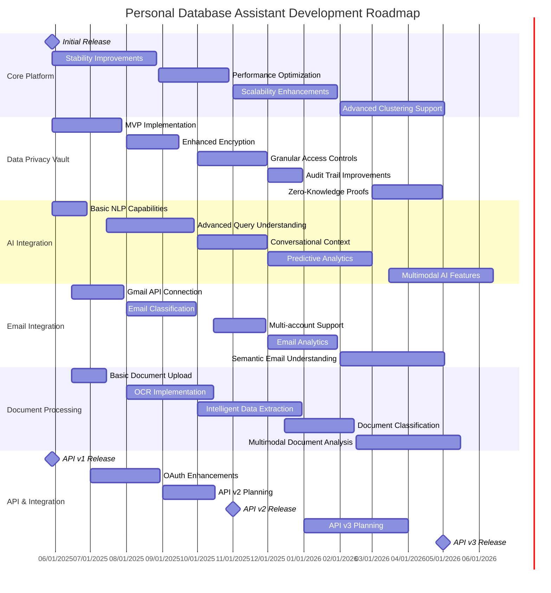

# Feature Roadmap

## Overview

This document outlines the future development plans, features, and upcoming changes for the Personal Database Assistant. It is designed to help integration partners anticipate and plan for system evolution.

## Development Timeline

## Short-Term Roadmap (Next 6 Months)

### Q2 2025 (Current Quarter)

#### Initial Platform Launch
- **Core Platform Release**
  - Initial deployment on Raspberry Pi infrastructure
  - Basic database functionality
  - User authentication and authorization
  - Expected: May 29, 2025

- **Development Environment Setup**
  - Developer documentation
  - API playground
  - Sample code and libraries
  - Expected: June 2025

#### Data Privacy Vault Implementation
- **MVP Privacy Framework**
  - Basic encryption for sensitive data
  - Privacy-focused data architecture
  - Access control system
  - Expected: July 2025

- **Data Classification System**
  - Sensitivity level tagging
  - Data category classification
  - Privacy policy enforcement
  - Expected: June 2025

#### AI Integration Groundwork
- **Basic NLP Capabilities**
  - Simple query understanding
  - Basic financial question answering
  - Command parsing functionality
  - Expected: June 2025

- **AI Architecture Foundation**
  - Model integration framework
  - Response generation pipeline
  - Knowledge extraction system
  - Expected: July 2025

#### Email Integration Launch
- **Gmail API Connection**
  - Email retrieval functionality
  - Basic email parsing
  - Secure credential management
  - Expected: July 2025

- **Basic Email Organization**
  - Simple labeling system
  - Sender identification
  - Priority inbox setup
  - Expected: August 2025

### Q3 2025

#### Platform Growth
- **Stability Improvements**
  - Error handling enhancements
  - Recovery mechanisms
  - Performance monitoring
  - Expected: August 2025

- **Performance Optimization**
  - Query optimization
  - Caching implementation
  - Resource utilization improvements
  - Expected: September 2025

#### Advanced Feature Development
- **Enhanced Encryption**
  - Field-level encryption
  - Key rotation mechanisms
  - Encryption policy management
  - Expected: September 2025

- **Advanced Query Understanding**
  - Complex financial queries
  - Multi-part questions
  - Context-aware responses
  - Expected: October 2025

#### Document System Introduction
- **Document Upload Functionality**
  - Multi-format document support
  - Secure storage implementation
  - Basic version control
  - Expected: August 2025

- **OCR Implementation**
  - Text extraction from images
  - Document format recognition
  - Data extraction pipeline
  - Expected: October 2025

#### API Development
- **OAuth Enhancements**
  - Advanced authentication flows
  - Fine-grained permissions
  - Token management improvements
  - Expected: September 2025

- **API v2 Planning**
  - GraphQL architecture design
  - Subscription-based models
  - Enhanced rate limiting
  - Expected: October 2025

## Medium-Term Roadmap (6-12 Months)

### Q4 2025

#### Platform Expansion
- **Scalability Enhancements**
  - Multi-instance support
  - Load balancing implementation
  - Storage optimization
  - Expected: November 2025

- **API v2 Release**
  - GraphQL endpoints
  - Subscription capabilities
  - Enhanced documentation
  - Expected: November 2025

#### Advanced Functionality
- **Granular Access Controls**
  - Purpose-based access
  - Time-limited permissions
  - Contextual authentication
  - Expected: November 2025

- **Multi-account Email Support**
  - Multiple provider integration
  - Account synchronization
  - Unified interface
  - Expected: December 2025

#### Intelligent Processing
- **Intelligent Data Extraction**
  - Entity recognition in documents
  - Relationship mapping
  - Contextual data understanding
  - Expected: December 2025

- **Conversational Context**
  - Multi-turn conversations
  - Historical context preservation
  - Personalized interactions
  - Expected: December 2025

### Q1 2026

#### Advanced Analytics
- **Predictive Analytics**
  - Financial trend prediction
  - Spending pattern analysis
  - Asset value forecasting
  - Expected: February 2026

- **Email Analytics**
  - Communication pattern analysis
  - Contact relationship mapping
  - Time-value analysis
  - Expected: February 2026

#### Enhanced Security
- **Audit Trail Improvements**
  - Comprehensive activity logging
  - Security event correlation
  - Compliance reporting
  - Expected: January 2026

- **Document Classification**
  - Automatic document categorization
  - Sensitivity classification
  - Retention policy enforcement
  - Expected: February 2026

#### Advanced Integration
- **API v3 Planning**
  - Event-driven architecture design
  - Real-time capabilities
  - Federation framework
  - Expected: March 2026

- **External System Integration**
  - Financial institution connectors
  - Public data source integration
  - Third-party service hooks
  - Expected: March 2026

## Long-Term Roadmap (Beyond 12 Months)

### Future Vision Initiatives

#### Advanced AI Features (Q2-Q3 2026)
- **Zero-Knowledge Proofs**
  - Privacy-preserving computation
  - Secure multi-party computation
  - Homomorphic encryption
  - Tentative: Q2 2026

- **Multimodal AI Features**
  - Image analysis capabilities
  - Voice interaction
  - Cross-modal intelligence
  - Tentative: Q3 2026

#### Enhanced Experience (Q3-Q4 2026)
- **Semantic Understanding**
  - Deep context extraction
  - Relationship inference
  - Intent-based interactions
  - Tentative: Q3 2026

- **Multimodal Document Analysis**
  - Advanced document understanding
  - Cross-document knowledge extraction
  - Multimedia content analysis
  - Tentative: Q4 2026

#### Advanced Architecture (Q4 2026-Q1 2027)
- **Advanced Clustering**
  - High-availability configuration
  - Multi-node data processing
  - Geographic distribution
  - Tentative: Q4 2026

- **Extended Reality Integration**
  - VR data visualization
  - AR asset tagging
  - Spatial user interfaces
  - Tentative: Q1 2027

#### Future Technologies (2027 and Beyond)
- **Blockchain Integration**
  - Digital asset management
  - Smart contract integration
  - Decentralized identity
  - Tentative: 2027

- **Quantum-Ready Infrastructure**
  - Post-quantum cryptography
  - Quantum-resistant algorithms
  - Future-proof data protection
  - Tentative: 2027-2028

## Feature Evolution

### Planned Features (First Release)

| Feature | Target Date | Description |
|---------|-------------|------------|
| Core Database | May 29, 2025 | Central database functionality for asset tracking |
| Basic API | May 29, 2025 | REST API with authentication |
| Web Interface | May 29, 2025 | Browser-based admin panel |
| Privacy Controls | June 2025 | Basic data privacy protection |
| Gmail Integration | July 2025 | Basic email connectivity |

### Planned Enhancements (6-12 Months)

| Feature | Target Date | Description |
|---------|-------------|------------|
| GraphQL API | November 2025 | Enhanced API capabilities |
| Advanced NLP | October 2025 | Improved natural language understanding |
| Document OCR | October 2025 | Document scanning and text extraction |
| Multi-account Support | December 2025 | Support for multiple email services |
| Financial Analytics | February 2026 | Enhanced financial data analysis |

## API Evolution

### API v1 (Initial Release: Q2 2025)
- REST-based API
- Basic CRUD operations
- Authentication via OAuth 2.0
- Rate-limited endpoints
- Focus on stability and reliability

### API v2 (Planned: Q4 2025)
- GraphQL support alongside REST
- Subscription-based updates
- Enhanced query capabilities
- Improved performance and pagination
- Expanded documentation

### API v3 (Planning: Q1-Q2 2026)
- Event-driven architecture
- Real-time capabilities through WebSockets
- Enhanced federation across instances
- Advanced permission model
- Developer toolkit enhancements

### API Versioning Strategy
- URI-based versioning for major versions (`/api/v1/`, `/api/v2/`)
- Header-based versioning for minor versions
- Comprehensive change logs for all versions
- Migration guides for version transitions
- Client libraries updated to support multiple versions

## Schema Evolution

### Database Schema Updates

| Release | Changes | Impact | Migration Path |
|---------|---------|--------|---------------|
| Initial Release | Core data model implementation | N/A | Initial schema |
| Q3 2025 | Enhanced privacy fields | Low | Automatic migration |
| Q4 2025 | Extended asset metadata | Medium | Data migration scripts provided |
| Q1 2026 | Document relationship model | Medium | Phased migration approach |
| Q2 2026 | Analytics data models | High | Complex migration with preparation time |

### Data Model Evolution
- Gradual enhancement of existing models
- Addition of new models for expanded functionality
- Backward compatible changes preferred
- Breaking changes scheduled with adequate notice
- Migration scripts provided for all significant changes

## Integration Planning

### Initial Integration Considerations

1. **Core API Integration (Q2-Q3 2025)**
   - Impact: Foundational
   - Basic CRUD operations
   - Authentication requirements
   - Migration Path: Comprehensive API documentation

2. **Privacy Framework Adoption (Q3 2025)**
   - Impact: Medium
   - Data classification requirements
   - Privacy controls implementation
   - Migration Path: Privacy integration guide

3. **Document Processing Pipeline (Q3-Q4 2025)**
   - Impact: Low
   - New endpoints for document processing
   - OCR capability usage
   - Migration Path: Document API guide

### Medium-term Integration Planning

1. **API v2 Transition (Q4 2025-Q1 2026)**
   - Impact: High
   - New endpoint structure
   - GraphQL adoption considerations
   - Migration Path: Comprehensive transition guide

2. **AI Feature Integration (Q4 2025-Q1 2026)**
   - Impact: Medium
   - NLP interface utilization
   - Conversational capabilities
   - Migration Path: AI integration handbook

3. **Analytics Platform (Q1-Q2 2026)**
   - Impact: Medium
   - Financial data analysis
   - Predictive modeling integration
   - Migration Path: Analytics implementation guide

## Development Practices

### Testing Environments

1. **Development Environment**
   - Available at launch
   - Basic functionality testing
   - Limited test data
   - Reset on demand

2. **Staging Environment**
   - Available Q3 2025
   - Preview of upcoming features
   - Beta API versions
   - Weekly updates from development

3. **Integration Testing Environment**
   - Available Q4 2025
   - Partner-specific test data
   - Simulated edge cases
   - Custom scenario testing

### Release Process

1. **Release Cadence**
   - Major releases: Quarterly
   - Minor releases: Monthly
   - Patch releases: As needed, typically bi-weekly
   - Hot fixes: Within 24-48 hours of critical issues

2. **Release Communication**
   - Release notes published 4 weeks before major releases
   - Developer newsletter for upcoming changes
   - Breaking change notifications at least 3 months in advance
   - API status page for real-time deployment information

## Synthetic Data

### Demo Mode Development

1. **Initial Synthetic Dataset (Q2 2025)**
   - Basic financial records
   - Sample asset data
   - Test user profiles
   - Expected: June 2025

2. **Enhanced Test Data (Q3 2025)**
   - Expanded transaction history
   - Diverse asset categories
   - Realistic data patterns
   - Expected: September 2025

3. **Scenario-based Simulation (Q4 2025)**
   - Financial situation modeling
   - Time-series data simulation
   - Relationship-rich data sets
   - Expected: December 2025

## Technology Stack

### Infrastructure Evolution

1. **Raspberry Pi Deployment (Q2 2025)**
   - Initial dual-Pi architecture
   - Local network configuration
   - Basic redundancy
   - Expected: May 2025

2. **Containerization (Q3 2025)**
   - Docker-based deployment
   - Service isolation
   - Simplified development environment
   - Expected: September 2025

3. **Enhanced Clustering (Q1 2026)**
   - Multi-node capabilities
   - Automated failover
   - Load distribution
   - Expected: March 2026

### Technology Updates

| Component | Initial Version | Next Update | Future Direction |
|-----------|---------|-------------|-----------------|
| Django | 5.1 | 5.2 (Q3 2025) | Stay current with LTS versions |
| React | 19.x | 20.x (When stable) | Evaluate server components |
| PostgreSQL | 16 | 17 (Q4 2025) | Evaluate columnar extensions |
| Python | 3.13 | 3.14 (Q3 2025) | Follow stable releases |
| Node.js | 22.x LTS | 24.x LTS (When available) | Stay on LTS versions |

## Conclusion

This roadmap represents our current plans and is subject to change as we respond to market feedback, technical challenges, and emerging opportunities. We are committed to providing advance notice of any significant changes to this roadmap, particularly those that may impact integration partners.

For the most current roadmap information, please visit the Developer Portal at https://dev.personaldb.example/roadmap or contact your integration support representative.

---

*Last Updated: March 29, 2025*  
*Next Scheduled Update: June 2025* 