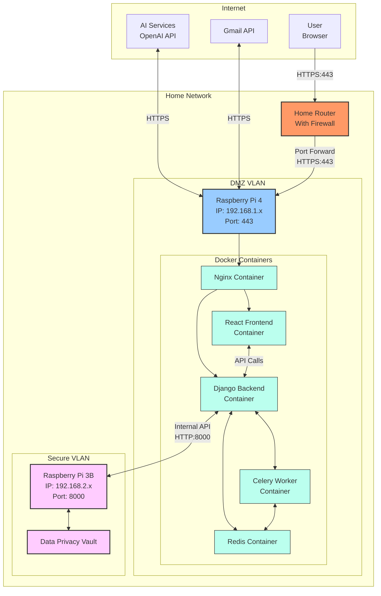
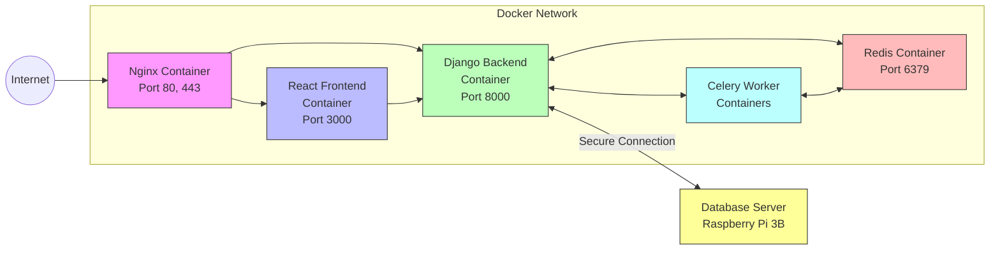
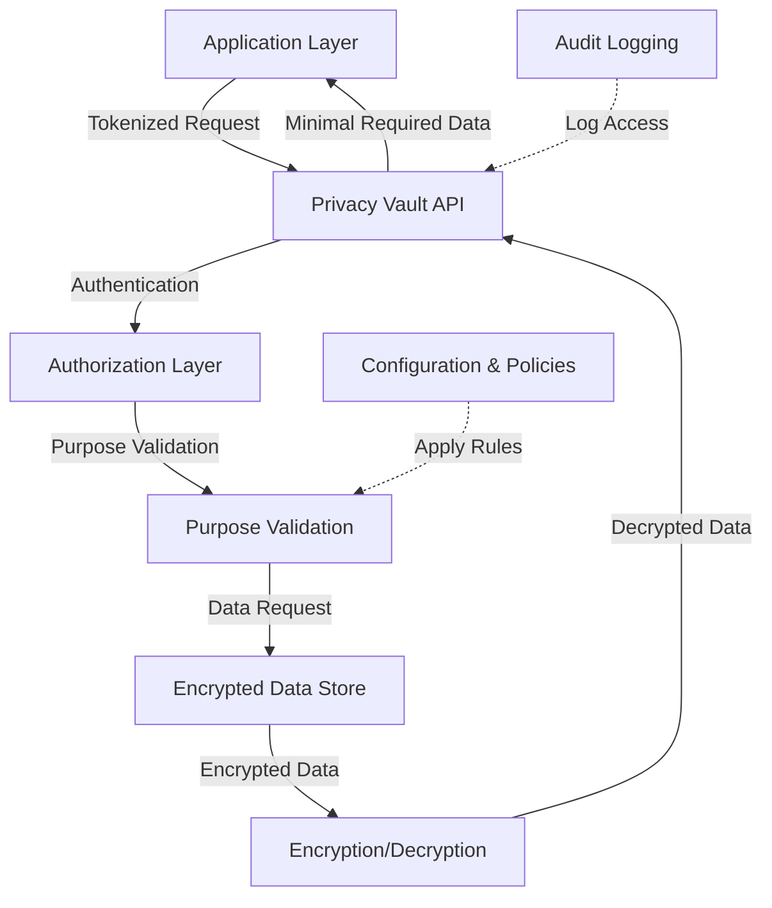

# Personal Database Assistant - Final Project Specification

## Project Overview

The Personal Database Assistant project aims to create a secure, internet-accessible interface to an existing offline personal database. The solution maintains strong security separation between the database (offline Raspberry Pi 3B) and the internet-facing application (Raspberry Pi 4) while providing AI-powered analytics, document processing, and email integration capabilities. All components on the Raspberry Pi 4 will be fully containerized using Docker to ensure scalability, maintainability, and deployment consistency.

## System Architecture

### Hardware Components

1. **Database Server (Raspberry Pi 3B)**
   - Hosts the PostgreSQL database
   - Maintains full offline security
   - Provides API access only to authorized devices
   - Houses the Data Privacy Vault for sensitive information

2. **Web Application Server (Raspberry Pi 4)**
   - Internet-facing component
   - Hosts the containerized web interface and application logic via Docker
   - Runs all services (Django backend, React frontend, Redis, Nginx, etc.) in separate containers
   - Communicates with the database server via secure local network
   - Integrates with external services (OpenAI, Gmail)

### Network Architecture



## Technology Stack

### Containerization (Raspberry Pi 4)
- **Docker**: For containerizing all application components
- **Docker Compose**: For orchestrating multi-container applications
- **Container Registry**: For storing and versioning container images
- **Container Monitoring**: For monitoring container health and performance

### Backend Containers (Raspberry Pi 4)
- **Django**: Core application framework in dedicated backend container
- **Django REST Framework**: For API endpoints consumption and creation
- **Celery**: Background task processing in dedicated worker containers
- **Redis**: Caching, message broker, and session storage in dedicated container
- **Nginx**: Web server with SSL termination in dedicated container
- **Let's Encrypt**: SSL certificate management

### Frontend Container (Raspberry Pi 4)
- **React**: Frontend framework in dedicated container
- **TypeScript**: Type-safe JavaScript development
- **Axios**: HTTP client for API communication
- **React Bootstrap**: UI component framework
- **Plotly/Chart.js**: Data visualization components

### Database Server (Raspberry Pi 3B)
- **Django**: API interface to database
- **Django REST Framework**: RESTful API endpoints
- **PostgreSQL**: Primary database
- **pgcrypto**: Database encryption capabilities
- **Data Privacy Vault**: Specialized storage for sensitive personal data

### External Integrations
- **OpenAI API**: Natural language processing and AI assistant capabilities
- **Gmail API**: Email integration for document processing
- **OAuth 2.0**: Secure authentication for external services

## Core Functionality

### 1. AI Chatbot Interface
- Natural language processing for database queries
- Custom knowledge base connected to personal data
- Secure query execution against offline database
- Context-aware conversations about financial data and assets

### 2. Financial Dashboard
- Default visualizations (predefined reports)
- Dynamic visualization generation based on natural language requests
- Category management system for expense classification
- Data processing pipeline for financial analytics

### 3. Email Integration
- Gmail API integration for multiple accounts
- Email metadata indexing and search
- Label-based filtering and organization
- AI-powered email analysis and summarization

### 4. Document Processing
- Document upload and OCR capabilities
- Intelligent data extraction from documents
- Classification system for different document types
- Validation workflow before database insertion

## Container Architecture

### Container Organization
1. **Frontend Container**: React application serving the user interface
   - Built with TypeScript and React
   - Optimized production build served via Nginx
   - Communicates with backend via REST API

2. **Backend Container**: Django application serving the API
   - REST API endpoints for data access
   - Authentication and authorization logic
   - Integration with external services
   - Business logic implementation

3. **Celery Worker Containers**: Multiple worker containers for background tasks
   - Standard worker for general tasks
   - High-priority worker for critical operations
   - Document processing worker for OCR and data extraction

4. **Redis Container**: For message brokering, task queues, and caching
   - Message broker for Celery tasks
   - Caching layer for API responses
   - Session storage for user authentication
   - Pub/Sub for real-time notifications

5. **Nginx Container**: For SSL termination, static file serving, and reverse proxy
   - Reverse proxy to backend and frontend containers
   - SSL/TLS termination
   - Static file serving
   - Load balancing and request routing

6. **Monitoring Container**: For container health and performance monitoring
   - Resource usage tracking
   - Container availability monitoring
   - Log aggregation
   - Alert system for critical issues

### Container Communication
- Inter-container communication via Docker network
- Secure volume mapping for persistent storage
- Environment variables for configuration
- Health checks for container monitoring

### Container Networking


## Data Privacy Vault Implementation

### Overview
The Data Privacy Vault (DPV) provides an additional layer of security for sensitive personal information, separating it from regular application data and implementing specialized encryption and access controls.

### Key Features

1. **Data Tokenization**
   - Replace sensitive data with non-sensitive tokens in main database
   - Original sensitive data stored only in the privacy vault
   - References maintained through secure token mapping

2. **Encryption Layers**
   - Field-level encryption for sensitive data
   - Separate encryption keys for different data categories
   - Key rotation capabilities for enhanced security

3. **Access Control**
   - Strict API-based access to sensitive data
   - Purpose-based access controls (e.g., display, reporting, analysis)
   - Comprehensive audit logging of all access requests

4. **Data Minimization**
   - Automatic data truncation where appropriate
   - Configurable data retention policies
   - Capability to anonymize historical data

### Implementation Approach



### Schema Design

The Data Privacy Vault will use a schema that separates data into sensitivity levels:

1. **Public Data**: Regular application data in main database (names, non-sensitive details)
2. **Protected Data**: Moderately sensitive information with basic encryption (addresses, contact details)
3. **Highly Sensitive Data**: Maximum protection with advanced encryption (financial account details, tax information)

## Synthetic Data Generation for Demo

### Requirements

To facilitate demonstrations while protecting real personal data, the system will include capabilities to generate and use synthetic data that:

1. **Mimics Production Structure**: Matches the schema and relationships of real data
2. **Provides Realistic Scenarios**: Generates plausible financial patterns and asset information
3. **Maintains Referential Integrity**: Ensures all relationships are properly maintained
4. **Is Clearly Identified**: Clearly marked as demo data throughout the interface

### Implementation Strategy

1. **Data Generation Framework**
   - Python-based synthetic data generation using libraries like Faker
   - Custom generators for domain-specific data (financial transactions, property details)
   - Configurable data volume and time periods

2. **Deployment Approach**
   - Separate "demo mode" configuration in the application
   - Ability to switch between production and demo databases
   - Visual indicators in UI when using demo data

3. **Demo Dataset Scope**
   - Multiple years of financial history
   - Various asset types (real estate, vehicles, investments)
   - Simulated email correspondence and documents
   - Realistic user activity patterns

### Demo Data Schema

```
- Users: 3-5 fictional users with different profiles
- Assets: 10-15 properties with different characteristics
- Financial Accounts: 5-10 accounts with transaction history
- Transactions: 1000+ transactions over 2-3 years
- Documents: 30-50 sample documents of different types
- Emails: 100+ email records with metadata and sample content
```

## Communication Between Raspberry Pis

### Approach

1. **REST API over Local Network**:
   - Secure REST API on the database Pi that only accepts local connections
   - API key authentication + IP restriction for all requests
   - HMAC request signing for tamper prevention

2. **Message Queue for Write Operations**:
   - Redis-based message queue for reliable write operations
   - Asynchronous processing for document uploads and complex operations
   - At-least-once delivery guarantee for critical operations

### Security Measures

1. **Network-Level Security**:
   - Separate VLAN for database server with strict firewall rules
   - No internet access for database server
   - MAC address filtering for additional security

2. **Application-Level Security**:
   - API key rotation schedule (monthly)
   - Request signing with timestamps to prevent replay attacks
   - Comprehensive request validation and sanitization

## Development and Deployment Plan

### Phase 1: Core Infrastructure

1. Set up Raspberry Pi hardware and network configuration
2. Configure VLAN separation and firewall rules
3. Install Docker and Docker Compose on Raspberry Pi 4
4. Create base container images for backend, frontend, and Redis
5. Implement basic API communication between servers
6. Set up authentication mechanisms
7. Implement Data Privacy Vault infrastructure

### Phase 2: Web Application Development

1. Develop containerized Django backend
   - Create REST API endpoints
   - Implement backend business logic
   - Configure Celery for background tasks
2. Develop containerized React frontend
   - Create UI components and routes
   - Implement state management
   - Build API integration layer
3. Configure Nginx container for serving the application
4. Set up Redis container for caching and message brokering
5. Implement user authentication and authorization
6. Configure container orchestration with Docker Compose
7. Set up basic asset management functionality
8. Integrate synthetic data generation for demo mode

### Phase 3: External Integrations

1. Implement OpenAI API integration for natural language processing
2. Set up Gmail API integration for email processing
3. Develop document processing pipeline in dedicated containers
4. Build AI-powered analytics capabilities
5. Configure container networking for external service access

### Phase 4: Security Hardening and Testing

1. Conduct security audit and penetration testing
2. Implement additional security controls based on findings
3. Perform load testing and performance optimization
4. Implement container health checks and monitoring
5. Configure automatic container restarts and failover
6. Finalize data privacy controls and audit logging
7. Set up container logging and monitoring

## Container Management and Operations

1. **Container Lifecycle Management**:
   - CI/CD pipeline for container image builds
   - Automated testing of containers
   - Version control for container images
   - Backup and restore strategies

2. **Container Updates**:
   - Automated image rebuilding for security updates
   - Rolling updates to minimize downtime
   - Blue-green deployment capability
   - Version control for container images

3. **Persistent Storage**:
   - Volume mapping for database files and user uploads
   - Backup strategy for container volumes
   - Data retention policies

4. **Monitoring and Logging**:
   - Container health monitoring
   - Resource usage tracking (CPU, memory, network)
   - Centralized logging for all containers
   - Alert system for container issues

5. **Disaster Recovery**:
   - Container image backups
   - Configuration backups
   - Volume backups
   - Restore procedures

## Security Considerations

1. **Defense in Depth Strategy**:
   - Multiple security layers at network, container, application, and data levels
   - No single point of failure for security controls
   - Regular security audits and updates

2. **Container Security**:
   - Minimal base images to reduce attack surface
   - Non-root users inside containers
   - Container isolation and resource limits
   - Regular security scanning of container images
   - No privileged containers
   - Read-only file systems where possible

3. **Data Protection**:
   - Encryption at rest for all sensitive data using Data Privacy Vault
   - Encryption in transit for all communications
   - Data minimization principles applied throughout

4. **Access Controls**:
   - Principle of least privilege for all operations
   - Role-based access control for web interface
   - Purpose-based access for sensitive data operations

5. **Compliance Readiness**:
   - GDPR-compatible data handling
   - Built-in data subject access request capabilities
   - Data minimization and retention controls

## Next Steps

1. **Detailed Technical Design**:
   - Database schema with privacy vault integration
   - API endpoint specifications
   - Container architecture and networking design
   - UI wireframes and component structure
   - Docker Compose configuration

2. **Development Environment Setup**:
   - Local development configuration with Docker
   - CI/CD pipeline for container building and testing
   - Deployment automation scripts for container management

3. **Implementation Prioritization**:
   - Container infrastructure setup first
   - Core data management features next
   - Privacy vault integration early in development
   - External integrations after core functionality
   - Synthetic data generation for ongoing testing and demos 