# Personal Database Assistant - MVP Architecture

## 1. Overview

This document outlines the detailed architecture for the Minimum Viable Product (MVP) phase of the Personal Database Assistant project. The MVP focuses on delivering a simple, internet-accessible chatbot interface to query health symptoms data from the existing database on Raspberry Pi 3B.

## 2. System Architecture

For the MVP, we'll implement an architecture that uses the Raspberry Pi 4 for internet-facing components while securely connecting to the existing database on Raspberry Pi 3B.

### 2.1 Hardware Requirements

#### Raspberry Pi 4
- Raspberry Pi 4 (4GB+ RAM recommended)
- 32GB+ microSD card
- Power supply
- Internet connection

#### Raspberry Pi 3B (Existing)
- Existing configuration with PostgreSQL database
- Local network connection to Raspberry Pi 4
- Firewall configured to allow secure connections from Raspberry Pi 4

### 2.2 Software Stack

#### Raspberry Pi 4
- **OS**: Raspberry Pi OS Lite (64-bit)
- **Containerization**: Docker, Docker Compose
- **Backend**: Django 4.x, Django REST Framework
- **Frontend**: React 18.x
- **Web Server**: Nginx
- **AI Integration**: OpenAI API

#### Raspberry Pi 3B
- **Database**: Existing PostgreSQL installation
- **Network**: Configured for secure local communication

### 2.3 Architecture Diagram

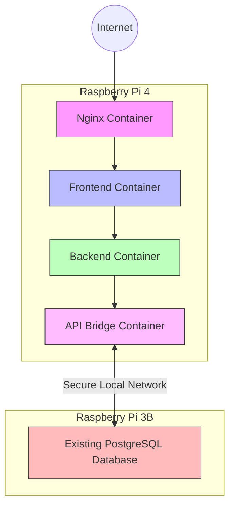

## 3. Container Specifications

### 3.1 Frontend Container

**Purpose**: Serve the React application with the chatbot interface.

**Specifications**:
- Base image: `node:18-alpine`
- Port: 3000 (internal)
- Volume mapping: `/app/src` for development
- Key packages:
  - React 18.x
  - React Router
  - Axios for API calls
  - Chat UI component library

**Key Components**:
- Chatbot interface
- Message history
- Basic responsive layout
- Health query submission form

### 3.2 Backend Container

**Purpose**: Handle API requests and process chatbot queries.

**Specifications**:
- Base image: `python:3.11-slim`
- Port: 8000 (internal)
- Volume mapping: `/app` for development
- Key packages:
  - Django 4.x
  - Django REST Framework
  - OpenAI Python client

**Key Components**:
- Django application with REST API
- Chatbot query processing
- OpenAI API integration for natural language processing
- Communication with API Bridge for database access

### 3.3 API Bridge Container

**Purpose**: Securely forward database requests to the Raspberry Pi 3B.

**Specifications**:
- Base image: `python:3.11-slim`
- Port: 8080 (internal)
- Volume mapping: `/app` for development
- Key packages:
  - FastAPI or Flask
  - Requests
  - Cryptography libraries
  - Connection pooling

**Key Components**:
- Lightweight API service
- Request signing and authentication
- TLS encryption
- Connection pooling
- Error handling and retries
- Response caching

### 3.4 Nginx Container

**Purpose**: Serve as a reverse proxy and handle SSL termination.

**Specifications**:
- Base image: `nginx:alpine`
- Ports: 80, 443 (exposed to host)
- Volume mapping:
  - `/etc/nginx/conf.d` for configuration
  - `/etc/letsencrypt` for SSL certificates
  - `/var/www/html` for static files

**Key Components**:
- Nginx configuration for routing
- SSL certificate handling
- Static file serving
- Proxy configuration to frontend and backend

## 4. Data Model

### 4.1 Core Entities

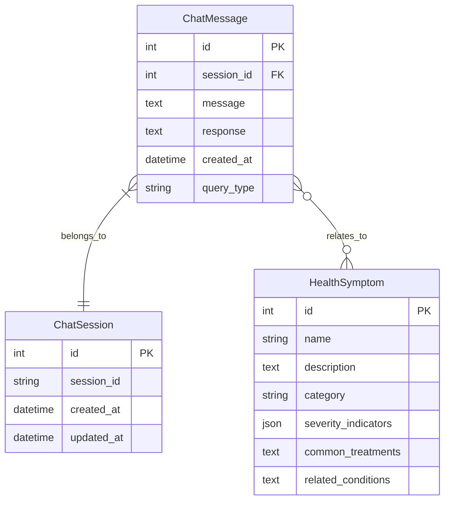

#### HealthSymptom
- `id`: Primary key
- `name`: Symptom name
- `description`: Detailed description
- `category`: Category of symptom
- `severity_indicators`: JSON field with severity information
- `common_treatments`: Text field with treatment suggestions
- `related_conditions`: Text field with related conditions

#### ChatSession
- `id`: Primary key
- `session_id`: Unique session identifier
- `created_at`: Timestamp
- `updated_at`: Timestamp

#### ChatMessage
- `id`: Primary key
- `session`: Foreign key to ChatSession
- `message`: User message text
- `response`: System response text
- `created_at`: Timestamp
- `query_type`: Classification of query
- `related_symptoms`: Many-to-many relationship to HealthSymptom

## 5. API Specifications

### 5.1 Endpoints

```mermaid
graph LR
    Client[Client]
    
    subgraph "API Endpoints"
        chat[POST /api/chat/message]
        symptoms_list[GET /api/symptoms]
        symptom_detail[GET /api/symptoms/{id}]
    end
    
    Client --> chat
    Client --> symptoms_list
    Client --> symptom_detail
    
    style Client fill:#f9f,stroke:#333
    style chat fill:#bbf,stroke:#333
    style symptoms_list fill:#bbf,stroke:#333
    style symptom_detail fill:#bbf,stroke:#333
```

#### Chatbot API
- `POST /api/chat/message`
  - Purpose: Submit a user message and get a response
  - Request Body:
    ```json
    {
      "message": "What are the symptoms of a common cold?",
      "session_id": "optional-session-id"
    }
    ```
  - Response:
    ```json
    {
      "response": "Common cold symptoms typically include...",
      "session_id": "generated-or-reused-session-id",
      "related_symptoms": [
        {
          "id": 1,
          "name": "Runny nose",
          "severity": "mild"
        },
        {
          "id": 2,
          "name": "Sore throat",
          "severity": "mild"
        }
      ]
    }
    ```

#### Health Symptoms API
- `GET /api/symptoms`
  - Purpose: Get a list of all symptoms
  - Query Parameters:
    - `category`: Filter by category
    - `search`: Text search in name/description
  - Response: Array of symptom objects

- `GET /api/symptoms/{id}`
  - Purpose: Get details of a specific symptom
  - Response: Detailed symptom object

### 5.2 Authentication

For the MVP, authentication will be minimized:
- No user authentication required
- Simple API key for backend services (passed in headers)
- Rate limiting based on IP address
- Secure communication between Raspberry Pi 4 and 3B

## 6. Integration Patterns

### 6.1 Frontend to Backend Communication

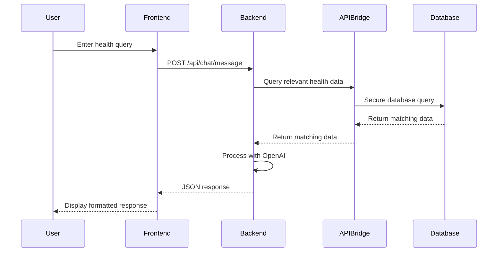

- RESTful API calls using Axios
- JSON payloads
- Error handling with status codes
- Polling for long-running operations

### 6.2 API Bridge to Database Communication

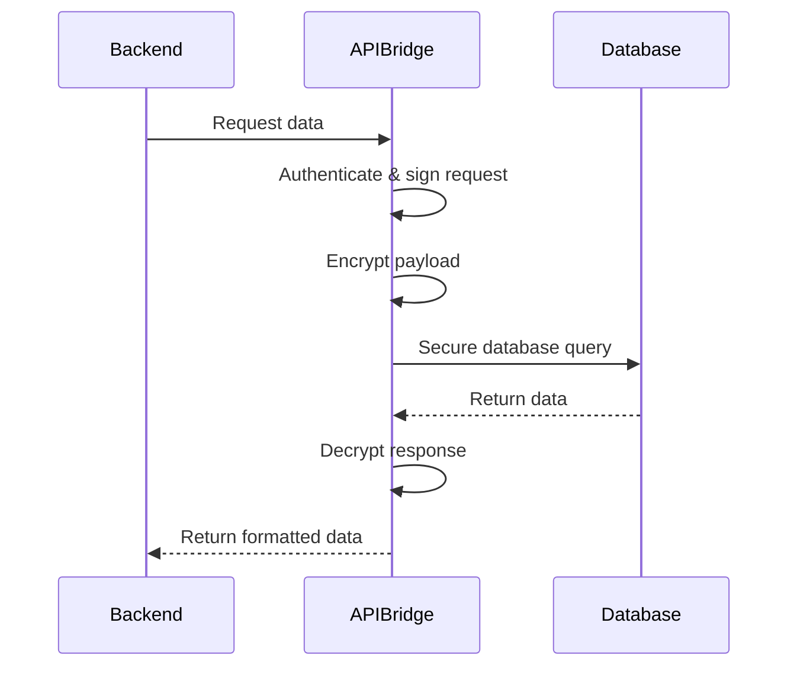

- Secure connection over local network
- HMAC request signing
- TLS encryption
- Connection pooling
- Query parameterization

### 6.3 OpenAI API Integration

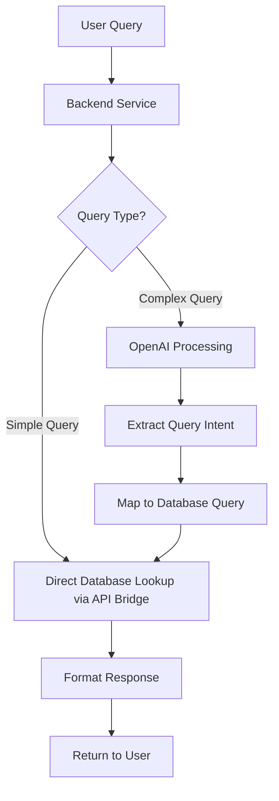

- Asynchronous requests to avoid blocking
- Prompt engineering for health-related queries
- Error handling and fallback mechanisms
- Rate limiting and token usage monitoring

## 7. Network Configuration

### 7.1 Docker Network

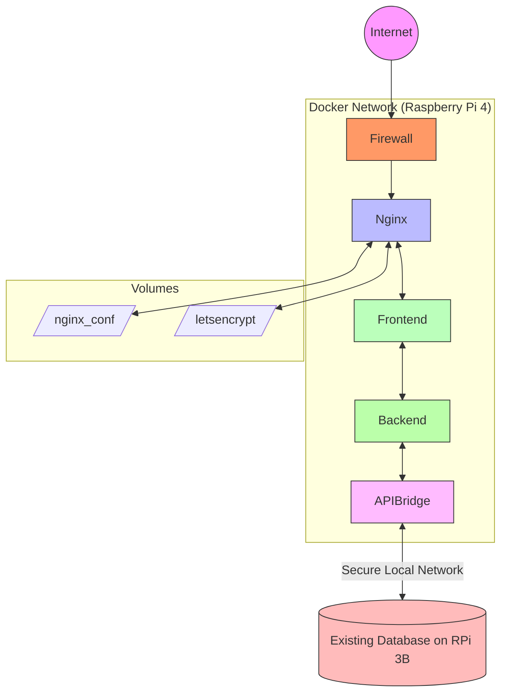

- Bridge network for container communication on Raspberry Pi 4
- Named volumes for configuration persistence
- Port mappings:
  - 80:80 (HTTP)
  - 443:443 (HTTPS)
- Secure communication channel between Raspberry Pi 4 and 3B

### 7.2 Security Considerations

- Basic HTTPS with Let's Encrypt certificates
- Container isolation
- No unnecessary ports exposed
- Regular OS and container updates
- Encrypted communication between Raspberry Pi devices
- IP restrictions for inter-device communication

### 7.3 Network Security Between Raspberry Pi Devices

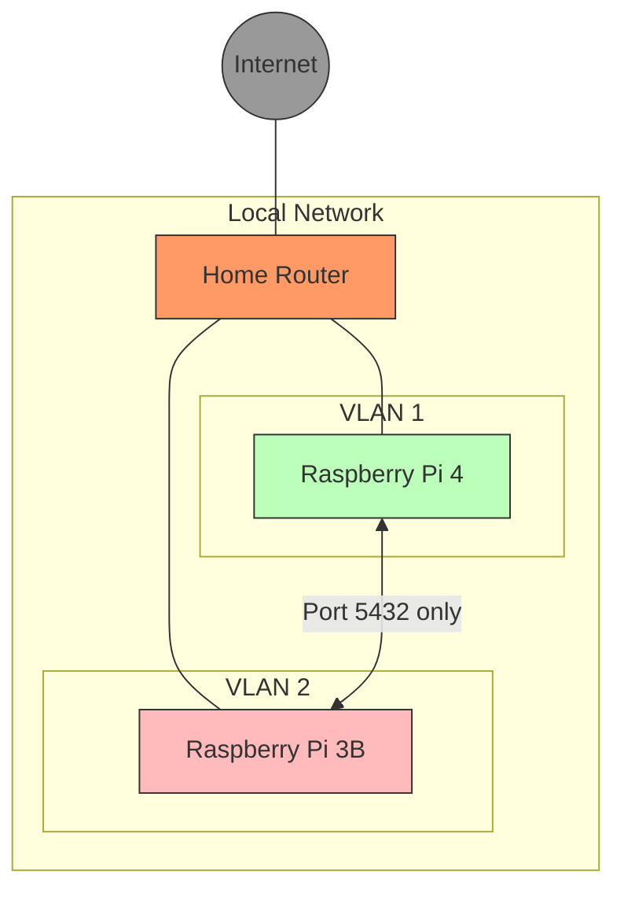

- Firewall rules restricting communication to specific ports
- IP-based access control for database
- Optional VLAN separation for enhanced security
- Monitoring of connection attempts

## 8. Deployment Process

### 8.1 Initial Setup

1. Configure network security between Raspberry Pi 4 and 3B
2. Ensure database on Raspberry Pi 3B is accessible from Raspberry Pi 4
3. Install Raspberry Pi OS on the Raspberry Pi 4
4. Install Docker and Docker Compose on Raspberry Pi 4
5. Clone repository and set up environment variables
6. Generate SSL certificates
7. Build and start containers

### 8.2 Docker Compose Configuration

```yaml
version: '3.8'

services:
  nginx:
    image: nginx:alpine
    ports:
      - "80:80"
      - "443:443"
    volumes:
      - ./nginx/conf:/etc/nginx/conf.d
      - ./nginx/certbot/conf:/etc/letsencrypt
      - ./nginx/certbot/www:/var/www/certbot
      - ./static:/var/www/html
    depends_on:
      - frontend
      - backend
    restart: always

  frontend:
    build: ./frontend
    volumes:
      - ./frontend/src:/app/src
    depends_on:
      - backend
    restart: always

  backend:
    build: ./backend
    volumes:
      - ./backend:/app
    depends_on:
      - api_bridge
    environment:
      - OPENAI_API_KEY=${OPENAI_API_KEY}
    restart: always

  api_bridge:
    build: ./api_bridge
    volumes:
      - ./api_bridge:/app
    environment:
      - DATABASE_HOST=${DATABASE_HOST}
      - DATABASE_PORT=${DATABASE_PORT}
      - DATABASE_USER=${DATABASE_USER}
      - DATABASE_PASSWORD=${DATABASE_PASSWORD}
      - DATABASE_NAME=${DATABASE_NAME}
      - API_KEY=${API_BRIDGE_KEY}
    restart: always
```

## 9. Development Guidelines

### 9.1 Local Development Setup

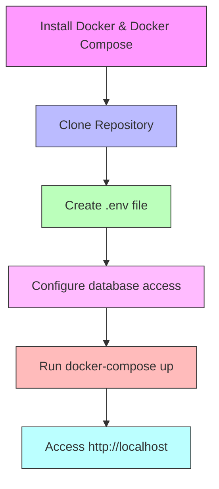

1. Install Docker and Docker Compose on development machine
2. Clone repository
3. Create a `.env` file with required environment variables
4. Configure database access parameters to point to your local database or test database
5. Run `docker-compose up` with development configuration
6. Access the application at `http://localhost`

### 9.2 Code Organization

#### Backend Structure
```
backend/
  ├── core/               # Django project core
  ├── health_assistant/   # Main application
  │   ├── api/            # API endpoints
  │   ├── models/         # Database models
  │   ├── services/       # Business logic
  │   └── tests/          # Unit tests
  ├── scripts/            # Utility scripts
  ├── requirements.txt    # Python dependencies
  └── Dockerfile          # Container definition
```

#### Frontend Structure
```
frontend/
  ├── public/             # Static assets
  ├── src/
  │   ├── components/     # React components
  │   ├── services/       # API services
  │   ├── hooks/          # Custom React hooks
  │   └── styles/         # CSS/SCSS styles
  ├── package.json        # Node dependencies
  └── Dockerfile          # Container definition
```

#### API Bridge Structure
```
api_bridge/
  ├── app/                # Main application
  │   ├── main.py         # Entry point
  │   ├── api/            # API endpoints
  │   ├── core/           # Core functionality
  │   ├── security/       # Security functions
  │   └── config.py       # Configuration
  ├── requirements.txt    # Python dependencies
  └── Dockerfile          # Container definition
```

### 9.3 Testing Strategy

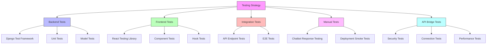

- Backend unit tests with Django's test framework
- Frontend component testing with React Testing Library
- API Bridge security and connection testing
- Integration tests for API endpoints
- Manual testing of chatbot responses
- Simple deployment smoke tests

## 10. MVP Roadmap

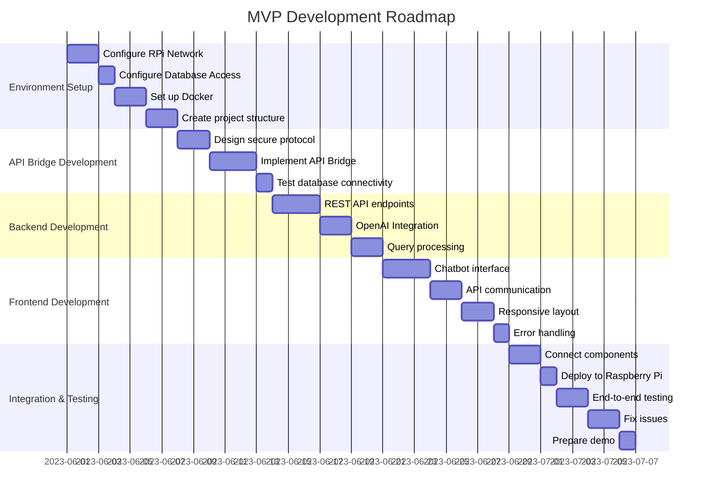

1. **Week 1**: Environment setup
   - Configure network between Raspberry Pi 4 and 3B
   - Set up database access on Raspberry Pi 3B
   - Set up Docker environment on Raspberry Pi 4
   - Create initial project structure

2. **Week 2**: API Bridge and Backend development
   - Implement API Bridge for secure database communication
   - Create REST API endpoints
   - Integrate with OpenAI API
   - Develop health query processing logic

3. **Week 3**: Frontend development
   - Build chatbot interface
   - Implement API communication
   - Create responsive layout
   - Add basic error handling

4. **Week 4**: Integration and testing
   - Connect frontend, backend, and API Bridge
   - Deploy to Raspberry Pi 4
   - Test end-to-end functionality
   - Fix issues and prepare for demo

## 11. Future Considerations

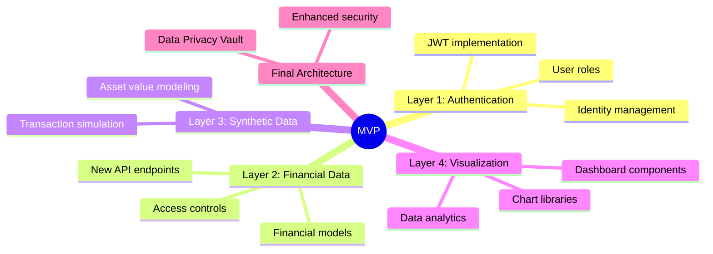

The MVP architecture is designed to enable future extensions for subsequent layers:

1. **Authentication and Authorization** (Layer 1)
   - User authentication system
   - JWT token implementation
   - User role definitions

2. **Financial Data Access** (Layer 2)
   - Financial database models extension
   - Additional API endpoints
   - Data access controls

3. **Data Visualization** (Layer 4)
   - Integration of visualization libraries
   - Chart generation services
   - Dashboard components

As these layers are implemented, the architecture will evolve with enhanced security measures and additional containerized services. 