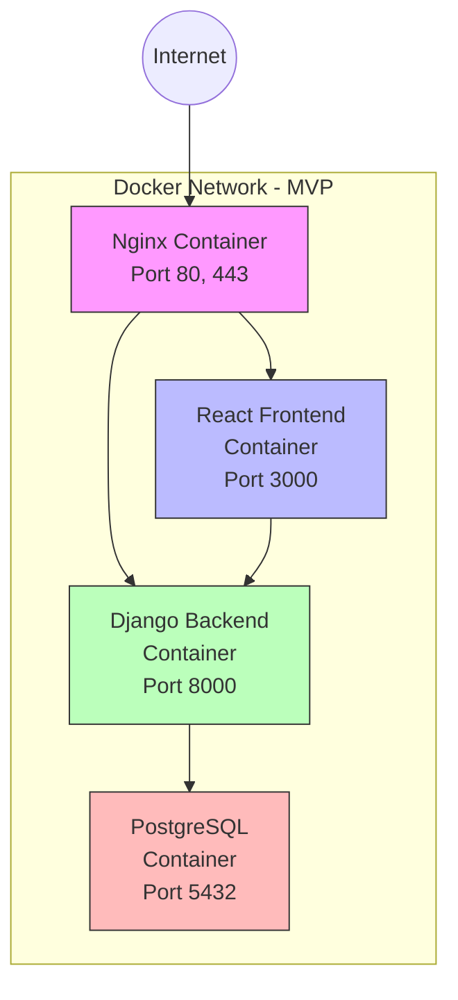

# Personal Database Assistant - Product Requirements Document

## 1. Product Overview

### 1.1 Vision
Create a secure, internet-accessible interface to an existing offline personal database, providing AI-powered analytics, document processing, and email integration capabilities while maintaining strict security separation between the offline database and the internet-facing components.

### 1.2 Problem Statement
Users need secure access to their personal financial data, assets, and documents from any internet-connected device without compromising the security of their sensitive information. Current solutions either lack adequate security measures or provide insufficient functionality for comprehensive personal data management.

### 1.3 Objectives
- Develop a secure architecture using two Raspberry Pi devices (3B for database, 4 for web application)
- Implement a fully containerized application stack with Docker on the internet-facing Raspberry Pi 4
- Create a data privacy vault for protecting sensitive personal information
- Build AI-powered interfaces for natural language querying and document processing
- Integrate with email systems for automated document processing
- Provide comprehensive financial dashboard and analytics capabilities

## 2. Target Users

### Primary User: Personal Finance Manager
An individual who manages their personal finances, assets, and related documents and needs secure, convenient access to this information.

**User Characteristics:**
- Values data privacy and security
- Has various financial assets and accounts to manage
- Needs to analyze financial data and track expenses
- Processes and stores financial and personal documents
- Wants to extract insights from financial history
- Prefers natural language interaction for complex queries

## 3. User Stories

### Financial Management
- As a user, I want to query my financial data using natural language so that I can find information without knowing specific database query syntax
  - **Acceptance Criteria:**
    - System accepts natural language queries about financial data
    - System correctly interprets the intent of the query
    - System returns accurate results from the database
    - Results are presented in a readable format
    - System provides error messages for queries it cannot understand

- As a user, I want to visualize my spending patterns by category so that I can identify areas for budget optimization
  - **Acceptance Criteria:**
    - System generates pie charts showing spending by category
    - System generates time-series charts showing spending trends
    - Charts are interactive and allow drilling down into subcategories
    - Data can be filtered by time period (monthly, quarterly, yearly)
    - Visualizations can be exported in common formats (PNG, PDF)

- As a user, I want to track my assets and their values over time so that I can monitor my net worth
  - **Acceptance Criteria:**
    - System maintains a record of all user assets with current values
    - System tracks historical valuations of assets
    - System generates net worth reports and charts
    - Assets can be categorized by type (property, vehicle, investment, etc.)
    - System allows manual updates and automatic value fetching where applicable

### Document Management
- As a user, I want to upload various types of documents so that information can be automatically extracted and stored
  - **Acceptance Criteria:**
    - System accepts common document formats (PDF, DOC, DOCX, JPG, PNG)
    - OCR processing successfully extracts text from documents
    - System extracts key metadata (dates, amounts, entities, etc.)
    - Extracted data is associated with appropriate database entities
    - Original documents are stored securely and remain accessible

- As a user, I want documents to be automatically categorized and tagged so that I can find them easily regardless of their subject matter
  - **Acceptance Criteria:**
    - System automatically assigns relevant categories to uploaded documents
    - System generates appropriate tags based on document content
    - Users can add/modify categories and tags manually
    - Documents can belong to multiple categories
    - Search functionality supports filtering by category and tags

- As a user, I want to search documents using natural language so that I can find specific information across all my stored documents
  - **Acceptance Criteria:**
    - System accepts natural language search queries for documents
    - Search results include document names, relevant excerpts, and match confidence
    - Search works across document content and metadata
    - Results are ranked by relevance
    - Search supports filters for document type, date range, and categories

- As a user, I want to view document relationships so that I can understand connections between different pieces of information
  - **Acceptance Criteria:**
    - System identifies potential relationships between documents
    - System visualizes document relationships in an intuitive format
    - Users can manually define relationships between documents
    - Related documents are suggested when viewing a specific document
    - Relationship types are categorized (e.g., "related to," "continuation of," "response to")

### Email Integration
- As a user, I want the system to process emails from various accounts so that important information is extracted automatically
  - **Acceptance Criteria:**
    - System integrates with multiple email providers via API
    - System extracts key information from emails (dates, contacts, actions, deadlines)
    - Extracted information is categorized by type and importance
    - System identifies and flags emails requiring action
    - Users can define custom rules for information extraction

- As a user, I want to search and analyze email contents across all topics so that I can find specific information and track communications
  - **Acceptance Criteria:**
    - System provides comprehensive search across all email contents
    - Search results show relevant email snippets with highlighting
    - Search supports filtering by sender, date range, and labels
    - System generates analytics on communication patterns and topics
    - Users can save common searches for quick access

- As a user, I want emails to be automatically categorized and linked to relevant documents and database records
  - **Acceptance Criteria:**
    - System automatically categorizes emails by topic and content
    - System identifies relationships between emails and existing documents
    - System links emails to relevant database records when appropriate
    - Users can manually adjust categorization and linking
    - System learns from user corrections to improve future categorization

- As a user, I want to receive notifications about important emails requiring action
  - **Acceptance Criteria:**
    - System identifies emails containing action items or deadlines
    - System sends notifications through the application interface
    - Notification frequency and criteria are user-configurable
    - Notifications include email summary and suggested actions
    - Users can dismiss or snooze notifications

### System Management
- As a user, I want to access my data securely from any internet-connected device so that I'm not restricted to my home network
  - **Acceptance Criteria:**
    - System is accessible via standard web browsers
    - Access requires secure authentication
    - Interface is responsive and works on mobile devices
    - Connection uses HTTPS with strong encryption
    - Session timeout occurs after period of inactivity

- As a user, I want sensitive data to be specially protected so that even if the system is compromised, my most critical information remains secure
  - **Acceptance Criteria:**
    - Sensitive data is stored in the Data Privacy Vault
    - Access to sensitive data requires additional authentication
    - Sensitive data is never cached on client devices
    - System logs all access attempts to sensitive data
    - Users can define which data categories are considered sensitive

## 4. Functional Requirements

### 4.1 AI Chatbot Interface
- Natural language processing for database queries
- Context-aware conversations about financial data and assets
- Custom knowledge base connected to personal data
- Secure query execution against offline database
- Response generation based on query results

### 4.2 Financial Dashboard
- Default visualizations (predefined reports)
- Dynamic visualization generation based on natural language requests
- Category management system for expense classification
- Data filtering capabilities (date ranges, accounts, categories)
- Export functionality for reports and visualizations

### 4.3 Email Integration
- Gmail API integration for multiple accounts
- Email metadata indexing and search
- Label-based filtering and organization
- AI-powered email analysis and summarization
- Automatic extraction of financial information from emails

### 4.4 Document Processing
- Document upload and OCR capabilities
- Intelligent data extraction from documents
- Classification system for different document types
- Validation workflow before database insertion
- Document search and retrieval functionality

### 4.5 Data Privacy Vault
- Tokenization of sensitive data in main database
- Encryption for stored sensitive information
- Purpose-based access controls for sensitive data
- Comprehensive audit logging of all access requests
- Data minimization and retention policy enforcement

## 5. Non-Functional Requirements

### 5.1 Security
- Separation between internet-facing application and database
- Network-level security with VLAN separation
- Application-level security with API keys and request signing
- Encryption for all data at rest and in transit
- Comprehensive access controls and audit logging

### 5.2 Performance
- Response time for standard queries under 2 seconds
- Document processing completed within 5 minutes of upload
- Support for at least 10,000 financial transactions
- Support for at least 1,000 documents
- Smooth operation on Raspberry Pi hardware specifications

### 5.3 Reliability
- System availability of 99.5% (excluding planned maintenance)
- Automatic recovery from failures
- Data backup mechanisms
- No data loss during system failures
- Graceful degradation during component failures

### 5.4 Usability
- Intuitive user interface requiring minimal training
- Responsive design working on mobile and desktop browsers
- Clear feedback for all user actions
- Accessibility compliance with WCAG 2.1 AA standards
- Consistent design language across all interfaces

### 5.5 Maintainability
- Containerized architecture for easy updates
- Component isolation for independent scaling and maintenance
- Comprehensive logging for troubleshooting
- Automated health monitoring
- Documentation for all system components

## 6. System Architecture Requirements

### 6.1 Hardware Components
1. **Database Server (Raspberry Pi 3B)**
   - PostgreSQL database installation
   - Data Privacy Vault implementation
   - API-only access from authorized devices
   - No direct internet connectivity

2. **Web Application Server (Raspberry Pi 4)**
   - Docker and Docker Compose installation
   - Container hosting capabilities
   - Internet connectivity with secure configuration
   - Sufficient storage for container images and data

### 6.2 Containerized Components
1. **Frontend Container**
   - React/TypeScript implementation
   - Responsive UI for multiple device types
   - Data visualization capabilities
   - Secure API communication

2. **Backend Container**
   - Django application with REST Framework
   - Business logic implementation
   - External service integration
   - Authentication and authorization

3. **Celery Worker Containers**
   - Background task processing
   - Document processing pipeline
   - Email processing capabilities
   - Scheduled task execution

4. **Redis Container**
   - Message brokering for Celery
   - Caching layer
   - Session storage
   - Pub/Sub for notifications

5. **Nginx Container**
   - SSL termination
   - Reverse proxy configuration
   - Static file serving
   - Request routing

6. **Monitoring Container**
   - Container health monitoring
   - Resource usage tracking
   - Log aggregation
   - Alert system

### 6.3 Network Architecture
- Separate VLANs for application and database servers
- Firewall rules restricting communication
- SSL/TLS for all external communications
- Local network security for inter-device communication

## 7. Data Requirements

### 7.1 Data Entities
- Users and authentication information
- Financial accounts and transaction history
- Assets and valuations
- Categories and tags for classification
- Documents and extracted metadata
- Email records and extracted information

### 7.2 Data Privacy Classifications
1. **Public Data**
   - Regular application data in main database
   - Names, non-sensitive details

2. **Protected Data**
   - Moderately sensitive information
   - Addresses, contact details
   - Basic encryption requirements

3. **Highly Sensitive Data**
   - Maximum protection with advanced encryption
   - Financial account details, tax information
   - Stored in Data Privacy Vault

### 7.3 Synthetic Data for Demo
- Realistic financial transaction patterns
- Multiple years of history
- Various asset types with realistic valuations
- Sample documents and emails
- Clearly marked as demo data

## 8. Integration Requirements

### 8.1 External APIs
1. **OpenAI API**
   - Authentication requirements
   - Rate limiting considerations
   - Cost management
   - Prompt engineering specifications

2. **Gmail API**
   - OAuth 2.0 authentication
   - Permission scopes required
   - Polling frequency
   - Data extraction specifications

### 8.2 Internal Communication
1. **Raspberry Pi Communication**
   - REST API over local network
   - API key authentication
   - IP restriction
   - HMAC request signing

2. **Message Queue**
   - Redis-based queue
   - At-least-once delivery guarantee
   - Error handling and retry logic

## 9. Security Requirements

### 9.1 Authentication and Authorization
- Secure user authentication system
- Role-based access control
- Session management
- Password security policies

### 9.2 Data Security
- Encryption at rest for all sensitive data
- Encryption in transit for all communications
- Key management procedures
- Regular security audits

### 9.3 Container Security
- Minimal base images
- Non-root container users
- Resource limitations
- Regular security scanning
- Read-only file systems where possible

### 9.4 Network Security
- Firewall configuration
- VLAN separation
- MAC address filtering
- Intrusion detection

## 10. UI/UX Requirements

### 10.1 User Interface
- Responsive design for multiple device types
- Consistent design language
- Intuitive navigation structure
- Clear data visualization
- Accessible interface elements

### 10.2 User Experience
- Minimal clicks for common operations
- Clear feedback for all actions
- Appropriate loading indicators
- Error messages with actionable information
- Guided workflows for complex operations

## 11. Deployment and Operational Requirements

### 11.1 Container Management
- Version control for container images
- Automated container health checks
- Restart policies for failed containers
- Update procedures
- Resource monitoring

### 11.2 Backup and Recovery
- Regular automated backups
- Data retention policies
- Recovery procedures
- Testing of backup integrity

### 11.3 Monitoring and Logging
- Container health monitoring
- Resource usage tracking
- Centralized logging
- Alert system for critical issues
- Performance metrics collection

## 12. Testing Requirements

### 12.1 Security Testing
- Penetration testing of web interface
- API security testing
- Container security scanning
- Network security validation

### 12.2 Functional Testing
- Unit testing for all components
- Integration testing for system flows
- End-to-end testing of user scenarios
- Performance testing under expected load

### 12.3 Compatibility Testing
- Browser compatibility testing
- Mobile device testing
- Network condition testing

## 13. Success Metrics

### 13.1 Technical Metrics
- System uptime (target: 99.5%)
- Average response time (target: < 2 seconds)
- Document processing accuracy (target: > 95%)
- Security audit pass rate

### 13.2 User Experience Metrics
- Task completion rate
- Time to complete common tasks
- User satisfaction scoring
- Feature utilization tracking

## 14. MVP and Incremental Development Approach

### 14.1 Minimum Viable Product (MVP)

The MVP will focus on providing a simple, internet-accessible chatbot interface to query health symptoms data from the database with minimal features required to demonstrate value.

#### MVP Features
1. **Internet-Accessible Frontend UI**
   - Simple React-based frontend with chatbot interface
   - Basic responsive design for different devices
   - Minimal styling focused on functionality

2. **Health Symptoms Data Retrieval**
   - Chatbot capable of understanding queries about health symptoms
   - Connection to database to retrieve relevant health data
   - Simple response formatting for readability

3. **Backend Implementation**
   - Basic Django REST API without authentication
   - Single endpoint for chatbot queries
   - Simple integration with PostgreSQL database

4. **Infrastructure**
   - Minimal Docker container setup (Frontend, Backend, Database)
   - Basic network configuration
   - Simple deployment process

#### MVP Non-Features
- No authentication or authorization
- No data privacy vault
- No document processing
- No email integration
- No financial data visualization
- No complex security measures (beyond basic HTTPS)

#### MVP Acceptance Criteria
- Chatbot can understand and respond to basic health symptoms queries
- System can retrieve relevant health data from the database
- Frontend is accessible from the internet
- Interface is usable on desktop and mobile browsers
- Basic Docker containerization is implemented

### 14.2 Incremental Feature Layers

Following the successful implementation of the MVP, features will be added in distinct layers, each representing a new release:

#### Layer 1: Authentication and Authorization
- User authentication system implementation
- Group creation in Django backend
- Role-based access control
- Secure session management
- User registration and login interface
- API security with JWT tokens

#### Layer 2: Financial Data Access
- Endpoints to retrieve financial data
- Authorization checks for financial data access
- Basic financial data presentation in UI
- Query parsing for financial questions
- Financial entity modeling
- Transaction history retrieval

#### Layer 3: Synthetic Financial Data
- Data generation framework for financial information
- Realistic transaction patterns
- Asset value simulation
- Income and expense modeling
- Account balance history
- Data consistency and relationships
- Demo mode toggle in UI

#### Layer 4: Financial Data Visualization
- Integration with visualization libraries
- Dynamic chart generation based on chatbot queries
- Spending analysis graphs
- Asset value tracking charts
- Income vs. expenses visualization
- Time-series data presentation
- Export functionality for graphs

### 14.3 MVP Architecture Simplification

For the MVP, the architecture will be simplified as follows:

1. **Hardware Components**
   - Web Application Server (Raspberry Pi 4) only
   - Local database on the same device (simplified for MVP)

2. **Containerized Components**
   - Frontend Container (React with chatbot interface)
   - Backend Container (Django with symptom data API)
   - Database Container (PostgreSQL with health data)
   - Nginx Container (for web serving and basic routing)

3. **Network Architecture**
   - Basic Docker network
   - Single port exposure (443) to the internet
   - Simplified firewall rules

### 14.4 Development Timeline

1. **MVP Development: 4 Weeks**
   - Week 1: Environment setup and database design
   - Week 2: Backend API development
   - Week 3: Frontend chatbot interface
   - Week 4: Integration and testing

2. **Layer 1 Development: 3 Weeks**
   - Authentication and authorization implementation

3. **Layer 2 Development: 4 Weeks**
   - Financial data access implementation

4. **Layer 3 Development: 3 Weeks**
   - Synthetic financial data generation

5. **Layer 4 Development: 4 Weeks**
   - Financial data visualization

## 15. Appendix

### 15.1 Technical Stack
- **Containerization**: Docker, Docker Compose
- **Backend**: Django, Django REST Framework, Celery
- **Frontend**: React, TypeScript, React Bootstrap, Plotly/Chart.js
- **Database**: PostgreSQL, pgcrypto
- **Web Server**: Nginx
- **Caching/Messaging**: Redis
- **External Services**: OpenAI API, Gmail API

### 15.2 Glossary
- **DPV**: Data Privacy Vault
- **VLAN**: Virtual Local Area Network
- **OCR**: Optical Character Recognition
- **HMAC**: Hash-based Message Authentication Code
 