## Índice

1. [Descripción general del producto](#1-descripción-general-del-producto)
2. [Arquitectura del sistema](#2-arquitectura-del-sistema)
3. [Modelo de datos](#3-modelo-de-datos)
4. [Especificación de la API](#4-especificación-de-la-api)
5. [Historias de usuario](#5-historias-de-usuario)
6. [Tickets de trabajo](#6-tickets-de-trabajo)
7. [Pull requests](#7-pull-requests)

---

## 1. Descripción general del producto

**Prompt 1:**
You are a senior product manager and a senior business analyst. I will explain you my business idea and we will refine it untill I am OK. Only then we will start the documentation phase of the project.

**Prompt 2:**
First I have an existing database. You can find all the needed details in @database_documentation . I want to use this database in my new project. This database is on my personal NAS on my local network on a Raspberry Pi 3B and will not be connected to internet. The new software will be on another Raspberry Pi 4 on my local network. It will be the only one connected to internet. These 2 Raspberry pi will not be connected by hardware one with each other. 
The project idea is the following, I want an internet accessible software that can provide the following services:
1. get an AI chatbot with a similar interface to chatgpt that can access my database and answer my questions. e.g: list me all the bills from the month of march 2025 for my  flat in FuerteVentura
2. I want to have several tabs in this software, one of them is a financial  dashboard. I want to chat with the AI and ask him to create figures, charts or tables from the database. e.g: Look at the bank accounts of BBVA and the bank account of Bankinter for the month of March 2025 and create for each of them a pie chart with my income and outcomes. Then create for each of them a chart to represent my outcomes by category (food, leasure...). So I also want to be able to enter personnal categories or add some items to existing categories. I will also need default graphs like the YTD incomes and outcomes for each bank account. So I will need in this tab to have two parts, one with the default graphs and one with the dynamic graphs I ask to the AI.
3. I want another tab to manage my emails from gmail. I have several accounts. I want to ask specific questions about my emails to the AI and it can answer to me. e.g: Look into my emails labeled Aubervilliers and tell me if there are any new message or message from my bank. So I will also need to have listed all the existing labels (by email account) to help my. I will need to be able to use filters for labels and date to filter the emails.
4. Finally I want a tab that will allow me to create instances into my database from an imported document (PDF or image formats). Here is the main idea:
1. there  will be a form with: 
 1.a. a text field for the name of the document
 1.b a dropdown list to select which type of document is imported (health bill, asset bill, CV, tax...)
 1.c. a document downloader that will read if needed the document to get  info depending on the document type
2. there will be a validation part after the form is sent to validate what data will be sent to the database. If the validation is given by the user then the instance is created in the database

**Prompt 3:**
     I like the suggested architecture. We will use it. Now we are clear on that part there is an essential point to take into account. Generate a PRD with a simplified MVP only to retrieve the health symptoms from the database. Add the other features in the next releases.

---

## 2. Arquitectura del Sistema

### **2.1. Diagrama de arquitectura:**

**Prompt 1:**
You are a senior software engineer with stong knowledge in backend and infrastructure. Using @personal_database_assistant_prd.md I want you to provide me with a detailed architecture for the MVP phase. Generate a file called MVP_architecture.md in the same folder.

**Prompt 2:**
Update this file so that you provide me with mermaid format for each graph

**Prompt 3:**
Add in this file the architecture related to the connection with my existing Raspberry pi B and tis docker containers with the database

### **2.2. Descripción de componentes principales:**

It has been generated directly in the PRD

### **2.3. Descripción de alto nivel del proyecto y estructura de ficheros**

**Prompt 1**:
from @personal_database_assistant_prd.md generate me a high-level description of the MVP as well as its file structure. Generate a markdown file in the same folder 

### **2.4. Infraestructura y despliegue**

It has been generated directly in the PRD

### **2.5. Seguridad**

**Prompt 1:**

**Prompt 2:**

**Prompt 3:**

### **2.6. Tests**

**Prompt 1:**

**Prompt 2:**

**Prompt 3:**

---

### 3. Modelo de Datos

I an using an already existing one from my Raspberry Pi 3B, here is the mermaid diagram

```mermaid
erDiagram
    %% Core User entity
    User ||--o{ Asset : owns
    User ||--o{ BankAccount : has
    User ||--o{ Document : has
    User ||--o{ InsuranceContract : insures
    User ||--o{ Bill : billed_to
    User ||--o{ UtilityContract : subscribes_to
    User ||--o{ Tax : pays

    %% Administrative models
    Document ||--o{ FileDocument : has
    Document {
        int id PK
        int user_id FK
        string name
        string type
        json comment
    }
    
    InsuranceCompany ||--o{ InsuranceContract : provides
    InsuranceCompany {
        int id PK
        string name
        int phone_number
        string site_app_company
    }
    
    InsuranceContract ||--o{ FileInsuranceContract : has
    InsuranceContract {
        int id PK
        int company_id FK
        string type
        int real_estate_asset_id FK
        int transportation_asset_id FK
        int person_id FK
        string contract_number
        date starting_date
        date ending_date
        boolean is_insurance_active
        string personal_email_used
        json annual_price
        json coverage
    }
    
    %% Financial models
    Bank ||--o{ BankAccount : operates
    Bank {
        int id PK
        string name
        string address
        int postal_code
        string country
    }
    
    BankAccount ||--o{ BankCard : issues
    BankAccount ||--o{ BankAccountReport : has
    BankAccount ||--o{ FileAccount : has
    BankAccount ||--o{ Mortgage : finances
    BankAccount ||--o{ Asset : linked_to
    BankAccount {
        int id PK
        int bank_id FK
        int titular_id FK
        string name
        string IBAN
        string BIC
        date starting_date
        date ending_date
        date closing_account_date
        boolean is_account_open
        json value_on_31_12
    }
    
    BankCard ||--o{ FileCard : has
    BankCard {
        int id PK
        int bank_account_id FK
        string name
        boolean is_active
        string card_number
        date ending_date
        date CCV
    }
    
    BankAccountReport ||--o{ FileAccountReport : has
    BankAccountReport {
        int id PK
        int bank_account_id FK
        date date
    }

    %% Health models
    HealthBill ||--o{ FileBill : has
    HealthBill {
        int id PK
        string company_name
        int client_name_id FK
        string bill_name
        date date
        float total_price
        boolean is_paid
        boolean is_asked_by_us
    }
    
    Product ||--o{ FileProduct : has
    Product {
        int id PK
        string name
        boolean natural
        boolean child_use
        boolean adult_use
        string min_age
        string source_info
        date date_info
        string composition
        string interests
        json comments
    }
    
    Symptom ||--o{ FileSymptom : has
    Symptom }o--o{ Product : treats
    Symptom {
        int id PK
        string name
        boolean child
        boolean adult
        json comments
    }
    
    %% Real Estate models
    Asset ||--o{ FileAsset : has
    Asset ||--o{ Bill : generates
    Asset ||--o{ UtilityContract : has
    Asset ||--o{ HollydaysReservation : has
    Asset ||--o{ Tax : subject_to
    Asset {
        int id PK
        int owner_id FK
        string nickname
        string address
        int postal_code
        string city
        string country
        date buying_date
        int buying_price
        boolean has_on_going_mortgage
        boolean is_rented
        boolean is_our_living_house
        int tax_management_id FK
        json details
        json results_by_year
    }
    
    Bill ||--o{ FileBill : has
    Bill {
        int id PK
        int asset_id FK
        string company_name
        int client_name_id FK
        string bill_name
        boolean is_tax_deductible
        boolean is_location_commission_bill
        date date
        float total_price
        float tax
        float price_without_tax
    }
    
    CoproManagementCompany ||--o{ CoproManagementContract : provides
    CoproManagementCompany {
        int id PK
        string name
        string personal_email_used
        string site_app_company
        string comments
    }
    
    CoproManagementContract ||--o{ FileCoPro : has
    CoproManagementContract ||--|| Asset : manages
    CoproManagementContract {
        int id PK
        int company_id FK
        string contract_number
        int asset_id FK
        date starting_date
        date ending_date
        boolean is_management_active
        float monthly_price
        int year
        json annual_expenses
    }
    
    HollydaysPlatform ||--o{ HollydaysReservation : handles
    HollydaysPlatform ||--o{ FileHollyDaysPlatform : has
    HollydaysPlatform {
        int id PK
        string name
        string personal_email_used
        string site_app_company
        string comments
    }
    
    HollydaysReservation ||--o{ FileHollyDaysReservation : has
    HollydaysReservation {
        int id PK
        int platform_id FK
        int asset_id FK
        string reservation_number
        date entry_date
        int number_of_nights
        date end_date
        string renting_person_full_name
        string renting_person_dni
        string renting_person_direction
        string renting_person_postcode
        string renting_person_city
        string renting_person_region
        string renting_person_country
        float price
        boolean received_bank
        float cleaning
        float commission_platform
        float commission_other
        text comments
    }
    
    Mortgage ||--o{ FileMortgage : has
    Mortgage ||--|| Asset : finances
    Mortgage {
        int id PK
        int asset_id FK
        string name
        int bank_account_id FK
        date starting_date
        date ending_date
        json rate_renegociations
        json annual_interests
        json annual_capital_refund
        json capital_due_end_of_year
    }
    
    RentingManagementCompany ||--o{ RentingManagementContract : provides
    RentingManagementCompany {
        int id PK
        string name
        string personal_email_used
        string site_app_company
        string comments
    }
    
    RentingManagementContract ||--o{ FileRenting : has
    RentingManagementContract ||--|| Asset : manages
    RentingManagementContract {
        int id PK
        int company_id FK
        string contract_number
        int asset_id FK
        date starting_date
        date ending_date
        boolean is_management_active
        json annual_results
    }
    
    Tenant ||--o{ FileTenant : has
    Tenant ||--|| Asset : rents
    Tenant {
        int id PK
        int asset_id FK
        string first_name
        string last_name
        int phone_number
        string email
        string id_type
        string id_number
        string bank_account_IBAN
        string bank_account_recipient
        date rental_starting_date
        date rental_ending_date
        int deposit_amount
        boolean is_actual_tenant
        boolean has_guarantee
        json comments
    }
    
    UtilitySupplier ||--o{ UtilityContract : provides
    UtilitySupplier {
        int id PK
        string name
        string personal_email_used
        string phone
        text comments
    }
    
    UtilityContract ||--o{ FileUtility : has
    UtilityContract {
        int id PK
        int supplier_id FK
        int user_id FK
        string personal_email_used
        int asset_id FK
        string service
        string contract_number
        date starting_date
        date ending_date
        int year
        float monthly_price
        float payment_1
        float payment_2
        float payment_3
        float payment_4
        float payment_5
        float payment_6
        float payment_7
        float payment_8
        float payment_9
        float payment_10
        float payment_11
        float payment_12
        float installation_price
        date date_installation
        boolean is_active
        text comments
    }
    
    %% Tax models
    TaxManagementCompany ||--o{ TaxManagementContract : provides
    TaxManagementCompany ||--o{ Tax : manages
    TaxManagementCompany {
        int id PK
        string name
        string personal_email_used
        string site_app_company
        string comments
    }
    
    TaxManagementContract ||--o{ FileTaxManagement : has
    TaxManagementContract {
        int id PK
        int company_id FK
        string contract_number
        date starting_date
        date ending_date
        boolean is_contract_active
        json annual_price
    }
    
    Tax ||--o{ FileTax : has
    Tax {
        int id PK
        string name
        string tax_type
        int real_estate_asset_id FK
        string real_estate_tax_type
        int transportation_asset_id FK
        int year
        int person_id FK
        boolean is_tax_management_company_used
        int tax_management_company_id FK
        float yearly_price
        string personal_email_used
        string site_app
    }
    
    %% Transportation models
    TransportationAsset ||--o{ File : has
    TransportationAsset ||--o{ InsuranceContract : has_insurance
    TransportationAsset ||--o{ Tax : subject_to
    TransportationAsset {
        int id PK
        int owner_id FK
        string type
        string brand
        string model
        string registration_number
        date buying_date
        int buying_price
        boolean has_been_bought_new
        boolean has_on_going_credit
        boolean has_on_going_leasing
        date last_itv_date
        date next_itv_date
        json comments
    }

```

---

### 4. Especificación de la API

**Prompt 1:**

**Prompt 2:**

**Prompt 3:**

---

### 5. Historias de Usuario

**Prompt 1:**
You are now a senior product manager and a senior project manager. You have a strong knowledge of best practices to write user stories. You will use @personal_database_assistant_prd.md to generate  all the needed user stories with acceptance criteria regarding the MVP phase. These user stories will be created in the root folder in a new folder called User_stories. This file will be called MVP_user_stories.md. You have to generate all the usual and also all the unlikely user stories related to these features.

**Prompt 2:**
Great now I want you to add user stories for backend dev related to the development of the backend for MVP phase:
1. API and connection with the database (RPI4 to RPI3)
2. Nginx setup
3. internet connection access to the RPI 4
And all the other backend processes needed in the development.
Create a new markdown file for these stories

**Prompt 3:**

---

### 6. Tickets de Trabajo

**Prompt 1:**
as a senior product manager  I want you to generate from the files @Backend_MVP_user_stories.md and @MVP_user_stories.md  a backlog that will take into order the backend work to setup everything first and then go the the other user stories.

**Prompt 2:**
Now create a new folder called tickets and inside it generate one markdown file by ticket representing the ones inside @MVP_Product_Backlog.md. Follow the best practices in ticket creation to do so. 

**Prompt 3:**
Now I want you to generate a new mardown file with a table that will keep track of all the tickets done or not. So the table should be structuresd as follow:
column 1: ticket ID
column 2: ticket name
column 3: ticket staus (with an emoji done or not done)
column 4: comment (only if needed)
Add this file in the tickets folder and find the corresponding name for it
---

### 7. Pull Requests

**Prompt 1:**

**Prompt 2:**

**Prompt 3:**